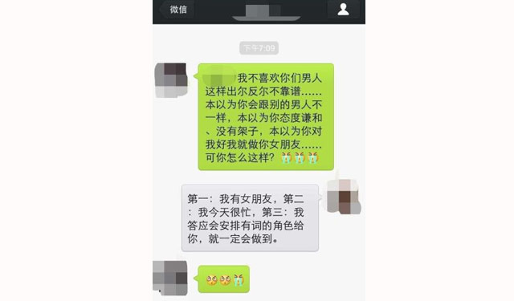

4月12日上午，袁咏仪在微博晒出一张短信记录，似与剧组“潜规则”有关，袁咏仪评论称“剧组生活真的多姿多彩”。

在这张信息截图上，某女称“我不喜欢你们男人这样出尔反尔不靠谱……本以为你会跟别的男人不一样，本以为你态度谦和、没有架子，本以为你对我好就做你女朋友……可你怎么这样？”对方回应：“第一：我有女朋友，第二：我今天很忙，第三：我答应会安排有词的角色给你，就一定会做到。”

这类新闻真真假假，读者也就看个热闹，真要搞清内幕也不容易。但是娱乐圈这类事情不停发生，应该是不争的事实。

这不算是什么大新闻。“潜规则”也算是娱乐圈的招牌了，几个月没有类似的消息，那才不正常。所谓的“潜规则”就是指年轻漂亮的艺人（一般是女性）与剧组的实权人物（制片人或导演）性交易，换取出演更重要角色或更多的戏份。

卖淫是指以牟利为目的，通过出卖自身肉体，满足他人性需求的交易。有人将性交易的范围定得极宽，认为一切性行为都是交易，婚姻只不过是只向一人出售而已。显然绝大多数夫妇情感上并不愿意接受，爱情中毕竟存在愿意为对方牺牲这种“非营利行为”。或者说，为了牟利而发生性行为，到最后长久呆在一起，剧组的女艺人和导演真结了婚，再八卦的媒体也不好意思指控他们是卖淫嫖娼。

剧组里的潜规则，是爱情，还是卖淫？我想多数人会倾向于后者，事实上也是如此，剧组散了，关系可能也随之结束。女艺人如愿一片而红，别人求她出演，可能也就不需要潜规则了，手头有筹码的人，不受他人胁迫。剧组里多数艺人只能等人赏机会，一个丫环，一堆姑娘争，给谁演都一样，导演好色，陪他上床的那个不仅拿到了机会，还增加了几句台词。这不能推出剧组的每个姑娘都会这么做，但是这么做的姑娘赢面大倒是真的。

作为一个支持性交易合法化的人，我不会指责剧组里的潜规则，这种交易不仅在剧组里有，有权力的地方，某些稀缺资源的地方，就有。在新闻里，情人往往是腐败官员的标准配备，往往官越大情人越多；跟剧组很像，不同的是，官员倒台之前，没有媒体曝料。相比较而言，剧组还算是敢做敢当的：我淫荡，我性交易，可媒体曝料我也只能自认倒霉。

卖淫是最古老的行业，谁也消灭不了，这是有道理的。导演（或官员，或一切强势者）什么都不缺，房子几十套，茅台几百件，送钱也嫌烦，就看中你的肉体，有人愿意出售，就加入了这古老的行业。能禁止的，就是一手收钱，一手交货的古典式卖淫，绕个弯，转一手的卖淫，永远禁不了。

人是自己身体的主人。这似乎是人人皆知的常识，用来读书、做家务、扶起倒地的老人，没人会反对。用来卖淫、被潜规则，接受的人就不多了。这时候，人好像不是自己身体的主人，而是他人的，怎么用，得靠他人的赞同。这挺可怕的，只要口一开，走向奴役是必然的。

舆论对娱乐圈并不友好，是由诸多因素构成的，一是曝料比奉承更有市场，二是绝大多数明星没有让媒体禁声的后台，三是此地确实潜规则多，各类绯闻层出不穷，为主流道德所不喜。

就是在这样强大的压力下，潜规则并未停止，这说明，人为了自己的利益，他人的多数意见完全可以不顾，主流道德算得了什么？这在道德控看来，固然是无耻。他人上床，观众愤怒，这实在有点无聊，所以我认为得到另一个结论更有意思，那就是，你没有办法改变人性中你认为低劣的一面：不能让它变得无私，不能让它吃苦在前，享受在后，无法让它先天下之忧而忧，后天下之乐而乐，无法让它像爱自己的孩子一样爱别人的孩子。因此，剧组里的潜规则，总有“恬不知耻”的艺人去实践。有权力的人面前，总会有漂亮的异性准备进行性交易。

与潜规则式的性交易比。妓女妓男，反而诚实得多。我想，既然性交易无处不在，那么，何必去禁止诚实的从业者呢？
