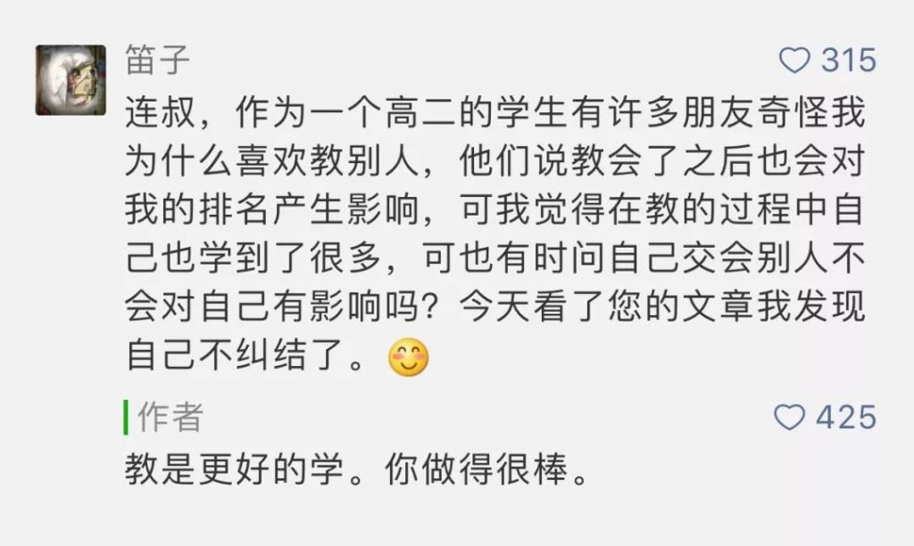

最好的学习方法，是复述。看完一本书，你能把要点转述给听众，基本上就掌握了。

从婴幼儿开始，学习就是通过一遍遍的复述（模仿）完成了。

我们看到一段自己喜欢的文字与观点，会抄录，为了信息的准确，还尽量100%复述，一字不多，一字不少。这似乎没增加任何东西，但是通过更多器官的投入，比单纯的看与听，多了手写，多了默念，多花了精力，重要的信息在脑子里印象更深。

有些孩子天赋更高，很早掌握了这种学习方法，比如昨天这孩子的留言：

这么做的好处是：

1、教别人的时候，自己的知识不仅不会失去，还可以更精进。

2、可以上升到更重要的阶层。是的，任何一个群体最后都会形成等级。一个聪明的、愿意传授知识的人，一定会在上等阶层。

3、以后在学习上更容易得到同学的帮助。

人人应该学习这种纯粹收益的做法，这才是信息社会的正确做法。

信息社会是个熟词，但它真正的意思是什么？未必有很多人明了。石器时代、农耕时代，都有信息，为什么不叫信息社会？

唯一的区别，就是信息的传播速度，原来的信息传播慢，就是人走马跑的速度，一项新发明、新技术，中国传到欧洲，可能得花几百年，甚至因为交通隔绝，永远无法传递，最后湮灭。那时有限的信息极为昂贵。

现在的新发明、新技术，传播的边际成本趋近于零。我写一篇文章，1个人看，10万人看，100万人看，我花的成本是一样的，你也可以免费获得。你得到知识，我并不会失去知识。

我们现在已经处于这样一个伟大的时代，全球的大脑是联网的，今天，一个天才的灵光一动，明天，就变成所有人大脑里的信息，我们已经联网进化了，信息的传播速度与复述速度，每一秒都在改变这个世界。

会分享知识，会欣赏他人进步，不再是可有可无的优点，而是必须具备的技能。你不这么做，就切断了联络与交流，好比自我禁闭，你那点所得，与全球大脑的创新速度比，算什么？一粒沙子的亿分之一？

好观念，一定要传达到足够多的人，否则，当坏观念占据总数时，社会的崩溃就不可控。比如吧，有市场常识的人知道，大派福利收买民众的政策最后一定造成贫穷，收税太重一定破产，这两者往往同时出现，蜡烛两头烧。这政策只要一开动，持有坏观念的人数多到一定程度，就无法逆转了，只能等耗尽财力。

所以，人藏着好观念，最后是害自己。信息不流动，就失去信息的价值。

前几天有篇文章被删了，但它已经转载到了其他地方，所以很容易看到。有些读者打抱不平：没署你的名，有的还改得乱七八糟，也都活得好好的，出处反而删了。好意我心领了，但我想，这不挺好吗？文章写出来就是让人看的，就是为了传播，尽管拿去用吧。

我这么说，不是说别的写作者得像我一样，我不是标准，而是说我现在是无所谓的，他人愿意复述，就是在学习，复述后更好了，那说明水平高，恭喜他。

我愿意像留言的那孩子一样，喜欢分享，在每天的写作过程中，在与你的互动过程中，我自己是在学习，我已经得到想得到的。

信息与物质不同，给并不会消失，给会得到更多。不要怕别人得到，不要怕别人免费得到。保持给的能力，说明你一直没落后。

推荐：[讲理规则](http://mp.weixin.qq.com/s?__biz=MjM5NDU0Mjk2MQ==&mid=2651628016&idx=1&sn=f9cc3d346e19c2497cdb9a5d79bd9e42&chksm=bd7e25ee8a09acf849429a3bb13361ef1e377a0fa67fa5bb918213ea9fdcf247538cf578756c&scene=21#wechat_redirect)

上文：[不怕别人变好](http://mp.weixin.qq.com/s?__biz=MjM5NDU0Mjk2MQ==&mid=2651628353&idx=1&sn=40f179914c910d3d049f9082451fb0ea&chksm=bd7e275f8a09ae49529fddce7be8064976515f4d88054681bf8407ec4b7feee3af6ffb3a3441&scene=21#wechat_redirect)
