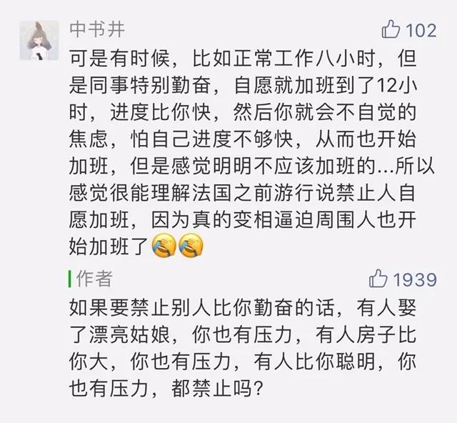

Theodor Severin Kittelsen，Soria Moria Slott

“如果你想要说服别人，要诉诸利益，而非诉诸理性。”本杰明·富兰克林如是说。

仔细分析，或者倒回来想，这其实揭示了一个很可怕的人性，它永恒存在，存在于你我身上，那就是：一个人如果能够得到利益，他将放弃理性。即使这个利益是短期的、损害他人的、甚至让世界毁灭的，他也无所谓。

曾经有人留言说，他希望中国发生战争，他推断，这样房价就会降到他买得起的价位。这种想法极其残忍，毫无理性，但他就是喜欢，天天盼望，你也只能摇头叹气。当然，你也不会害怕，战争不是他盼得来的，一个人失去理性的瞎想，以此污染自己的思考力，受害的只是他自己（最多祸及自己的孩子），这让他更弱，更容易被淘汰掉。

所以，我们也不必太怕人性的弱点，当一个人吃的苦头告诉他，短视与非理性只能损害自己的利益，那么，他就会建立理性的长远目光。人性弱点存在的价值，在于让我们发现人性的优点，能被纠正的弱点，是优点的燃料。善恶同源，有时指的就这回事，同样为了满足私欲，有人去偷去抢，损害他人的私欲，这是恶；有人去创造去生产，通过增加他人的利益获得报酬，这是善。人们不敢盗窃抢劫，那是他们从小就知道，这将招致惩罚，等着自己的是警察与监狱。同时你也可以在新闻中看到，一些原本守法有序的地方，由于法律的突然消失，可以为所欲为而不受惩罚，那么，人性恶就迅速复苏蔓延，小偷强盗马上多了。

暂时的失控，并不是最可怕的。9个懒汉结伙抢劫1个富人，9个嫉妒的笨孩子欺负1个聪明的孩子，我们知道，那无法持久，终将被惩罚纠正，并不会因为损害者多，受害者少，就赋予其正当性，我们必然站在公序良俗这一边。但是，如果谁票多谁就有正当性，事情就不一样了，9个嫉妒的笨孩子，他们欺负1个聪明孩子，是民意的选择，1个富人不想被抢劫，还违背了法律，懒汉们的抢劫受到鼓励，自然没人愿意勤快地生产。

昨天有条留言很有意思：

在任何一种有竞争关系的群体中，班级、公司、单位，包括家庭，都是最优秀的那个（群）人胜出，他们的基本素养就是勤奋、爱思考、效率比别人高，不一定体现为工作时间比别人长，但是结果一定比人好，就像学霸往往最早完成了作业。

被优秀者辗压的人，有嫉妒，有怨气，有压力，那是人性，他们摆脱这种困境的方式有两个，一是变得更优秀，压力变成了动力，二是接受更次的待遇，我确实不如同事，接受低一点的收入，定位清楚了，也可以平静下来。怕的就是，不应该有的票选出现了，优秀者被惩罚（这是票选的必然），那对个人与国家来说，都将进入万劫不复的退化过程，就像法国，是出了巴斯夏这样伟大经济学家的国度，人们的创造力与理解力是没问题的，沦落到巴斯夏现在不认识，那就是因为动不动就让懒汉们投票决定要不要抢富人。

永远不要羡慕别人可以尽情释放人性之恶，不管这个别人是法国人还是美国人，或是任何一种人。要比优秀者跑得更快，而不想着把他的腿打断，这样才能进步。

推荐：[孩子跟谁姓？去谁家过年？](http://mp.weixin.qq.com/s?__biz=MjM5NDU0Mjk2MQ==&mid=2651625520&idx=1&sn=958f316f32961d067ffc784d51997fce&chksm=bd7e1c2e8a0995387d92d4f08529df5a6d33521577c85176070970a8b4801886e0dba74439e0&scene=21#wechat_redirect)

上文：[得罪人的价值](http://mp.weixin.qq.com/s?__biz=MjM5NDU0Mjk2MQ==&mid=2651635036&idx=1&sn=dc7feca5a04b92f589b4e484b6819599&chksm=bd7e39428a09b0543706d72e0478e5692633075fce6d506a10818308ad4fcd80b4b8a124259a&scene=21#wechat_redirect)
