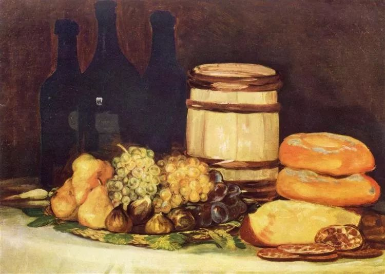

  

Francisco Goya，Still life

  

我开工了，虽然公司其他同仁延后一周正式开工，但不妨碍我按计划复工。  

  

很遗憾，我们过了一个黑天鹅春节。所谓的黑天鹅，就是指根本想不到事情会有多坏，我们永远不会期待它出现，但它可能总会在我们一生的某个时刻出现，以检验我们的韧性。扛过去，则从个人到国家，都会更坚强。

  

新型冠状病毒感染肺炎疫情1月31日已由WHO宣布“构成国际关注的突发公共卫生事件”，当我们知道最坏的事情发生时，最坏的时刻就已经过去。官员是否失职，科学家是否违反科学伦理，民众是否反应过度侵犯他人权利，已无法隐瞒，都会一一得到检讨，这些都有助于进步，虽然下一次黑天鹅事件来袭时，人们一样有慌张失措的阶段（不然就不是黑天鹅），但这次增加的韧性一定会起作用。

  

我在客家地区过的春节，客家人以好客、热情著名，过年气氛原本很浓，但疫情一宣布，大家几乎马上改变传统习惯，取消了聚会与宴请，人人宅在家中，不给别人添麻烦。全国其他地区，风俗不同，但反应相同。这种反应就是宝贵的资产，说明人们并不害怕知道坏消息，告诉我们实情和科学的防疫方法，大家做得好，不知道才人心惶惶。下次还有疫情，这种十多亿人“自我隔离”的效率，将会更快度过难关。

  

我这个假期，反而过得清静，每天看一看微信的疫情最新消息专题，足够了，花不了多少时间。其他信源，基本不看。由于恐慌，由于恶意，由于知识的不足，过度情绪多，假消息多，这是难免的，你会看到各种争吵，甩锅及伪科学，看了徒增烦恼。这样浪费生命，想想一线的医护人员与病人正在与病魔斗争，很不应该吧。

  

我认为，正常生活就是胜利。所以假期就是看书（比原计划多看了一些）；跑步；由于36+12饮食法在假期与老一辈的生活习惯冲突，调整为16+8饮食法（16小时禁食，8小时摄食），其实不过就是不吃早餐，执行得很和谐，春节的体重只略微增加。

  

当然，作为还要对一家小公司负责的人，我原本应该为接下来的经济形态忧虑。但是还好，我一贯的谨慎经营在这时起了作用。由于长期读报表，看过太多失败案例，知道公司生存的残酷性。整体来看，公司的半衰期为10年，10年时间衡定地消失掉一半的公司，这是规律，能活过50年的公司，3%而已，相当于没有。

  

自成立公司那天起，“小，活，美”就是我的信条。“小”就是务实，不盲目追风口、上规模；“活”就是活下去，不要死于乐观期的自大，也不要死于悲观期的自卑，能活到51年就是伟大胜利；“美”就是能为客户创造价值，就是公司几个人，大家都能逐年活得更美好。公司年终总结，我想不出什么愿景和情怀，也不愿意想，我最满意的就是每年可以告诉同仁，余粮备得充足，今年年景再差，我们也可以活得好。

  

在这段非常时期，应该感谢那些继续为我们服务的商人，即使感觉价钱贵一些，可是考虑到成本飞涨，人家的利也很薄，指望别人亏本奉献，短期或许可以，不出几个月，就会耗光存粮，迎来倒闭潮，连锁反应引发的经济瘟疫，比新冠疫情更加厉害。保持健康有利于我们度过疫情，身体健康防病菌；有些市场经济常识的观念健康有利于防贫穷。

  

昨晚出门散步，看到几间咖啡馆和餐厅已经在营业，顾客寥寥，希望它们能够撑住，希望更多企业能够撑住。

  

最希望防疫一线的医护人员及病人撑住，早日回归正常生活，你们正常了，整个世界才能够正常。

  

一起加油吧。
