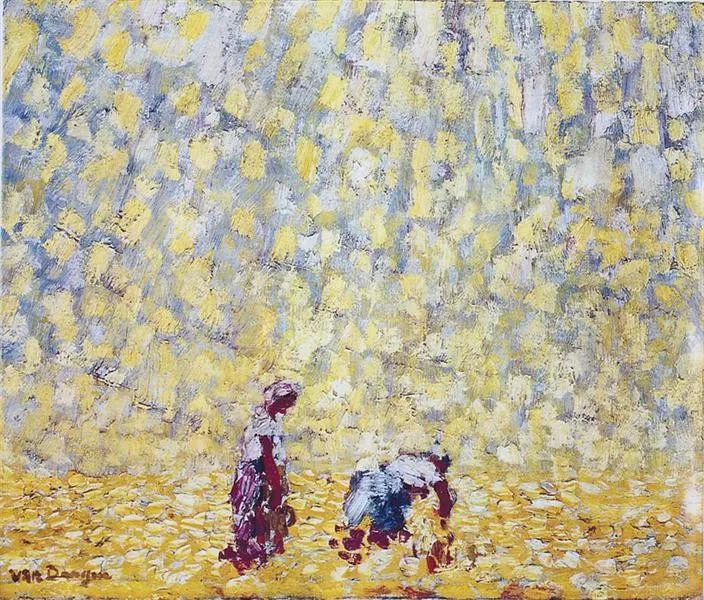

  

 凯斯·凡·东根，割捆机

  

我在人生很早的时候，不到20岁，对佛道很感兴趣，可以通宵读老庄和佛经。有次去偏远的乡村找好朋友玩，他家边上有座寺庙，我冒失地找方丈谈经，大和尚挺客气，陪我这个愣头青闲扯半天，还一度以为我要出家。

  

我哪里会出家。我天天忙着给连太写情书呢。  

  

我的意思是，我的人生有点倒回来，青少年时，人生看得很淡，并不是悲观绝望的淡，而是人仰望星空的那种淡，是冬天在海边散步的那种淡，到了30来岁，人生态度才浓烈起来，但这种浓，又没有非得到什么的浓，就是一种尽力的浓，结果如何，看天意——这又回归到了淡。我得感谢青少年时淡的底色，所以不会浓得那么辛苦，可有可无，可行可止。  

  

去年仔细重读老子，一页页背诵。背到第27章时，那熟悉的文字，背了忘，忘了背，这次突然有了全新的意思，感觉它将半生的许多经历串起来了，我抄了几句，放在书桌上，每天早上默诵一遍：  

  

“是以圣人常善救人，故无弃人；常善救物，故无弃物，是谓袭明。故善人者，善人之师；不善人者，善人之资，不贵其师，不爱其资，虽智大迷。”  

  

大意是这样的：一个知道世界本质的人善于挽救人，不会遗弃任何人；善于救物，他眼里没有废物，这就是内在的大智慧。如果你是一个善人，那么其他善人就是你的老师，那些不善之人，是供你领悟的资源，不尊重老师，不爱护资源，再聪明都会迷失。  

  

这化解了一切冲突。仇恨、对立、厌烦似乎失去了力量。它们照样会产生，但你意识到它们是“善人之资”，你就不会害怕与恐惧，反而会细细体察它们想要传递的信息。

  

在老子的哲学里，善与不善，不仅存在于我与他之间，更存在于我自身之内，内在的冲突化解了，就能体现到放松、成长与快乐。用现代心理学的术语来说，你接纳了世界与自我，这种接纳不是强忍硬扛，而是发现种种“不善”的价值，“不善”转化成了“善”。你经受的创伤，你遇到的阻碍，你学习时的遗忘，你努力时的挣扎，甚至人生最终点的死亡，都能给你力量。  

  

这让我想到铃木俊隆论述学习时的一个说法，一个人想成为佛陀一样伟大的人，他可能以为最聪明的人学得最快，轻轻松松就能坐禅。其实并不是，那些觉得比较困难的人，各种动心杂念，反而让他不停地探究禅的深意。资质好，可能是陷阱，资质不好，也能成为资源。这想法与老子殊途同归。  

  

我们努力生活，认真学习，得出的结论也与他们相同，我们的力量往往产生于阻力最大时，在我们不那么聪明时，只要苦苦坚持，突然那么一刻，心窍全开，玲珑剔透，美妙极了。只要经历过这么一次，那么，工作时的累，读书时的倦，思考时的苦，这些“不善”，都会得到我们的善待，因为它们将带来真正的成长。  

  

这种从被动到主动的转折点，可以说是学习与成长的关键，像是从乘客变成了司机，车与旅途，都由自己开展了。人与人的区别，或许就由这个点，开始出现，并且迅速拉开距离，站在原地的人，很快见不到开足马力的远行者了。

  

所以，人要主动追求那些能给自己带来一点难度与阻力的学习，保持“不聪明”的新鲜体验，会遗忘，会出错，会退步，甚至会生气，这些都是你的资源。作为一个中国人，得到这种资源的最好办法，莫过于学习从构词到语法都与中文完全不同的英文，别害怕生涩与不适，那正是我们需要的。

  

  

**▼点** **阅读原文** **，****用懂你英语创造成长的资源！**
