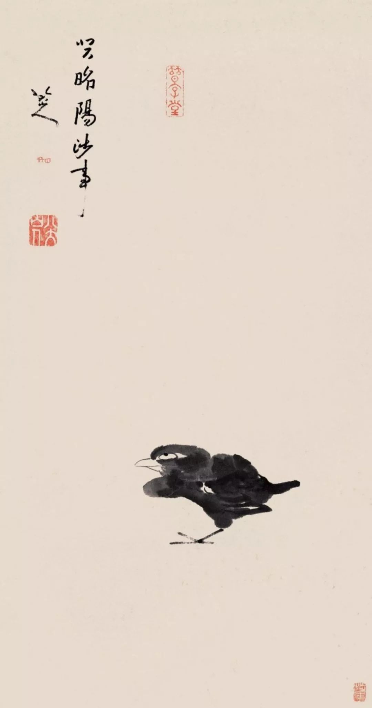
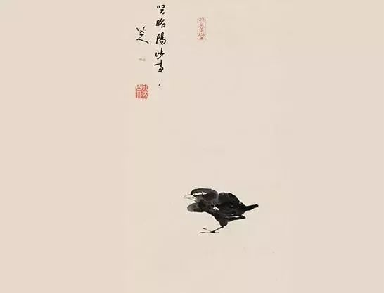

  

上图是朱耷的《孤禽图》。我很喜欢的一幅作品。  

  

朱耷是明末清初的大画家，号八大山人。小时候我一直以为八大山人是八个人。据说他是朱元璋的后代，所以明朝灭亡他特别不高兴，画作里就有不合作精神。这幅《孤禽图》，若大画面，只有一只翻白眼的愤怒小鸟，也可以叫做《不鸟图》。  

  

我感兴趣的不是朱耷的家国仇恨，对于现代人来说，明与清的更迭，就像翻一张日历，没什么感觉了。而是朱耷画作的现代感，以最少体现最多。天地之间只剩一只白眼，这白眼就等于天地。

  

小鸟本是很普通的物种，我现在窗外有一堆小鸟在唱歌。但一只鸟倾注了画家的专注，寄托了特殊情感，也就不再普通。身边万物，是我们精神的折射，我们专注于一件事，再小的事，画小鸟这么小的事，却成了我们身体与精神的一部分。  

  

今天是第118期“下周很重要”，画下你要专注的小事，一本书，一顿饭，一席聊天，一次远足，虽是小事，只要你郑重其事，便有深长意味，人也慢慢安静，仿佛湖水重新清澈。  

  

推荐：[具体的爱，可防精神病毒感染](http://mp.weixin.qq.com/s?__biz=MjM5NDU0Mjk2MQ==&mid=2651637486&idx=1&sn=f9da6c87bb00b76953e90637f521c58c&chksm=bd7e42f08a09cbe6f52d3337cae9e1e433c8f55c454e167a5d7ecc011cb4ca4ff2f946416a7f&scene=21#wechat_redirect)  

上文：[新加坡最令我赞叹的防疫经验](http://mp.weixin.qq.com/s?__biz=MjM5NDU0Mjk2MQ==&mid=2651637580&idx=1&sn=22c9f856dd1be37414b6af4542ebac06&chksm=bd7e43528a09ca4467621f7e9de5b6c25443bf35cd83e80f1e2c954b53d9242a2b95746e646c&scene=21#wechat_redirect)
