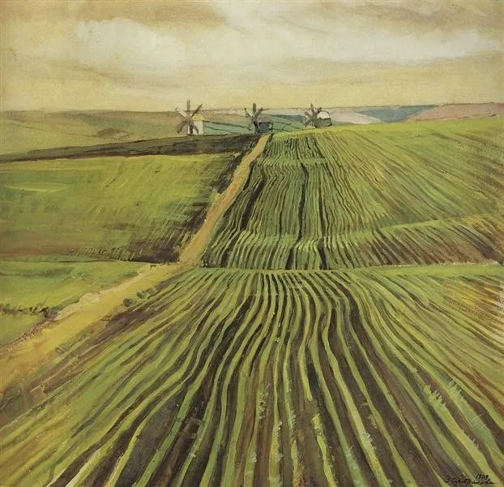

  

塞莱布里阿库娃，绿秋

  

有小朋友要进入媒体，问我意见。  

  

我开玩笑，第一当然是建议你不做这行。

  

如果真想做，作为曾经的媒体人，我也愿意把对这行的意见说一说。

  

媒体是有天然缺陷的。这点我年轻时并不知道，年纪越大，感触才越深。媒体天生猎奇，所以它喜欢报道小概率事件，无论好坏，它都要寻找“人咬狗”的极端事例，写大概率的“狗咬人”，太平常了，没人看。

  

为什么有些事会越传越邪门？或者说，为什么人有造谣的冲动？那是因为这样才更具有传播性，谣言具有病毒一样的感染性，真相却没有。

  

在媒体里体现出来的世界，往往不是真实的，需要读者用概率加以还原，可这又很难，因为情感是天生的，人容易瞬间被生动的细节打动，或被某个词语的情感倾向带偏。但概率判断却是后天习得，不主动学习，一生也没有这个技能。很多媒体人，本身也缺乏概率常识，他们最后往往也害了自己，经常眼泪汪汪，情绪亢奋，却失去了对真实世界的判断。

  

投资界有句调侃的话：什么叫投资专家？就是那些比普通投资者错得更离谱的人。这句话也适合于媒体人，他们往往比普通人更不了解真实世界。

  

我现在不得不看新闻时，那些特别巧妙的、特别激愤的、特别煽情的，我往往要留个心眼，一是很有可能是假的；二是很有可能只是局部真实，却是小概率事件，你不能说它假，它却可以误导你得出错误结论，这比假新闻的危害更大。

  

那些以细节描述见长的、感情丰富的文人，如果去报道新闻，那往往是灾难性的。他不自觉地增加戏剧性、抓取最有冲击力的细节，玩虚构的套路，但他又真诚地以为自己在报道真相。

  

大学的新闻系，我强烈建议增加概率为必修课，写新闻的人，自己先判断一下事件的概率。一条新闻之前，最好也有概率警示，比如：我描述的悲惨事件，发生率为万分之一，几乎不可能发生在你身上。

  

人类社会，离不开新闻，某种意义，每个人都在报道新闻。骗我们最多的，往往也是新闻。想成为一个负责任的人，或者避免被骗，人人都应该学一点概率。当然了，学了概率，愿意进媒体的人，会少很多。那也没什么不好的，专心写虚构作品就是了，自欺欺人，自我感动也会少很多。

  

除了假新闻，各类庞氏骗局，偏方秘术，“听我一个朋友说”式的证明，都是欺负人不懂得概率。所以，学点概率很重要，大学没学，也要自学。

  

推荐：[创业，少一点套路，多一点信赖](http://mp.weixin.qq.com/s?__biz=MjM5NDU0Mjk2MQ==&mid=2651632373&idx=1&sn=fcdeb53f06d8244b5579f42021ef1d53&chksm=bd7e36eb8a09bffdc491fb348661dd72e21caf037d0d7cc1e02afde1597858cc63d5e6676acb&scene=21#wechat_redirect)  

上文：[说说大理书记市长被查处，别当无底线的“硬核”长官](http://mp.weixin.qq.com/s?__biz=MjM5NDU0Mjk2MQ==&mid=2651637531&idx=1&sn=e8475d00d2c64eed8ba69aa6a96ab042&chksm=bd7e43058a09ca1362a16e5b933f7688d79b7b76eb74027c995f324014c0a793fa7cf34eaacd&scene=21#wechat_redirect)
