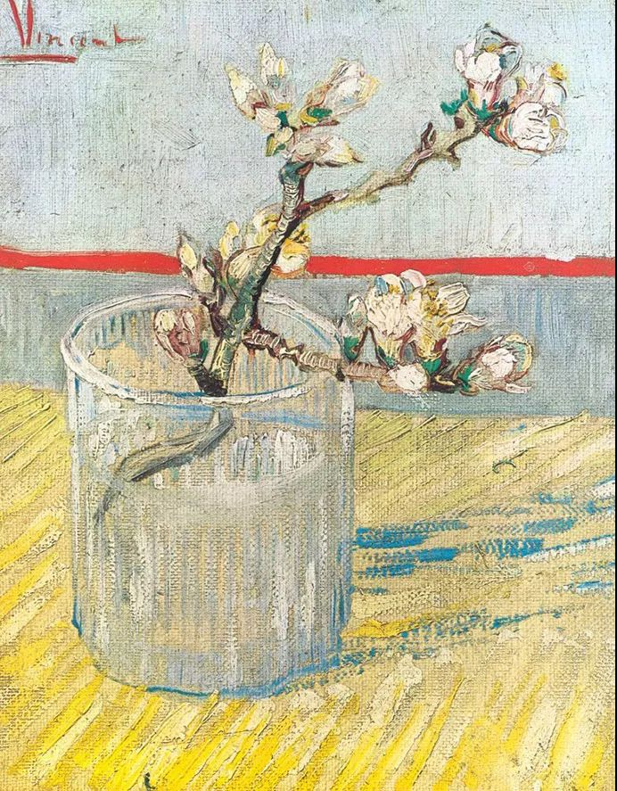

梵高

  

我们会对医生护士好吗？  

  

废话！当然。肯定会得到这个答案。现在医护人员最受尊重爱戴，人们不吝啬把赞美倾泻给他们。

  

但是疫情结束以后呢？那一天很快会到来，人们回归正常生活，医生护士不再是谈论焦点，我们慢慢忘掉他们此时的无畏与专业。这是记忆的规律。在那个时候，我们会对医生护士好吗？答案就没那么肯定了。

  

现代医疗有两个“弊端”，将永远存在：

  

一是成本高昂。大到尖端医疗设备的发明生产，新药的研制，耗资惊人。小到医生个人的成长，教育成本不是小数字。看电视剧就知道，无论中西，富人家的孩子，读医学院是首选。并非穷人家不爱这个职业，主要是承担不起昂贵的教育费用。穷孩子咬紧牙关当上医生，也被认为是阶层跃升，命运有了大转折。  

  

二是疾病和死亡最终一定胜出。除了极少数的幸运儿，无疾而终，一觉不醒。绝大多数人生命的最后阶段，是在医院度过的，穷尽一切手段，宣告不治。  

  

这两个因素结合在一起，则形成不好的消费体验：我花了很多钱，人还是死了。  

  

人的理性，可以压抑，进而理解这种“不好”感觉。成本高的商品与服务，享受的价格一定高。否则，别人为何要那么努力地精进？本质上就是为了收入与地位高一点。努力与懒惰的结果一样，没人会努力。理解这点，需要市场经济的常识。

  

而任何一次治疗，都是不同的。同样的病，你好了，我没好，可能是你体质好，心态好，医生水平高，用的设备也先进。甚至纯粹就是运气好。同样的流感，年轻人轻松自愈，却吹灭老年人微弱的生命烛火。每个人，每个年龄段，每种状态，治愈率都不同。理解这点，需要一点概率常识。

  

一个理想的社会，当然人人有市场常识与概率常识。  

  

可惜这样的理想社会并不存在。以后也不会存在，无论如何教育，有市场常识与概率常识的人，只会有一部分。决策者，精英阶层有，那就是谢天谢地的好事，国家必将繁荣。

  

很多人永远不会有这些常识，即使受了大学教育，也没有。从这点来看，医生并不是一个好职业。你提升医术的成本高，那是你的事。你要用医术挣我的钱，我就得骂你。至于医疗的价格怎么才合适呢？那得由我这个病人说了算，免费最好。我这个愿望不能实现？原因自然是政府无能，医生黑心。平时大量的仇医舆论，就是这种无知驱使的。一些偏执的人，仇医舆论听多了，有伤医杀医的行动，也就不稀奇了。  

  

前不久，有人卖口罩，即使只是收了合理的利润，也被举报和处罚，叫好的人还挺多，理由就是这个时候你还赚钱，真是坏了良心。不为赚钱，人家像你一样，躺在家里骂人，不挺舒服，为何要受累呢？没人受累，口罩从哪里来？还好普通口罩，技术含量低，生产起来容易，中国这个生产魔王，很快也就让口罩不那么稀缺。  

  

但医生不是口罩，不是说有就有的。当医生普遍心生倦意，觉得地位与收入都不体面，有点正常人物质上的想法，就得被攻击。这就会影响医生的供给，想当医生的人变少，好医生也变少。  

  

我觉得，现在防疫一线的医护人员，也不要只送高帽子，这些他们已经够多了，以后被骂，也不能拿出来对冲，不如趁大家爱他们，在这精英与民粹都一致的奇妙时刻，简单粗暴地给他们猛提一大截工资。这也是最好的激励与教育，做得好的人，首先应该体现在收入上。这么想，这么做的人多了，就是一个好社会。

  

推荐：[恭喜，老师有了惩戒权](http://mp.weixin.qq.com/s?__biz=MjM5NDU0Mjk2MQ==&mid=2651636279&idx=1&sn=0c033b3472b0235c1c1bd317831588f5&chksm=bd7e46298a09cf3f0e7da0d91457281cfd02bfabc241461fab32af84426f6b4c2cdf621bec57&scene=21#wechat_redirect)  

上文：[再说股市，多一只眼看中国](http://mp.weixin.qq.com/s?__biz=MjM5NDU0Mjk2MQ==&mid=2651637443&idx=1&sn=21b7d7353970ad2bc0c21bb7c5832717&chksm=bd7e42dd8a09cbcba2a315faf8819d2f52ea55109ed6098f7698d1e53211c95d31799172303d&scene=21#wechat_redirect)
