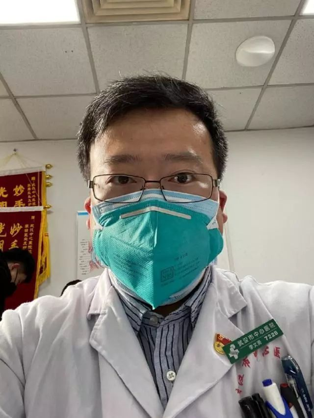

  

但愿你，李文亮医生，得安宁  

但愿你的妻儿，你的父母，终得安宁  

但愿你，以十数亿计的你，终得安宁

  

但愿人们不再那么容易遗忘，直到下次灾难才想起你  

但愿历史不要那么残忍，让不想成为英雄的人成为悲剧英雄

但愿你的悲剧唤醒羞耻感、责任感与崇高感

  

但愿有错的人愿意认错

但愿他们不再争功诿过  

但愿他们的眼睛还有流泪功能  

但愿他们的心还能悔，还能痛  

但愿他们像哀悼自己的儿子一样哀悼你

但愿你能原谅他们

但愿你不想原谅也不要勉强自己

  

但愿病人更快康复  

但愿官员更有担当，像有气节的士大夫，像有格局的政治家

但愿医生更有尊严

但愿人们不再势利，疫时谄媚医生，平时却伤害医生

但愿正常一点，如四季轮转  

  

但愿我们温柔  

但愿我们有同理心，能够穿穿别人鞋子

但愿我们知道数字后是人，符号后是人  

但愿我们知道别人像我们一样有血有肉

但愿我们不被恐惧驱使  

但愿我们的爱不只是口水

但愿我们的行为没有恶意

但愿我们不再有意无意地歧视武汉人、湖北人和病人

但愿我们保护他们的权利如同保护自己的权利

  

但愿每一个小人物都不必为大时代牺牲  

但愿每一个大人物都记得自己曾经是小人物

但愿岂曰无衣，与子同裳

但愿圣人常善救人，故无弃人

  

但愿你救自己  

但愿你爱自己

但愿你爱家人  

但愿你爱爱你的人

但愿你为爱负责  

但愿你尊重医生，却很少看医生

但愿你维护自己的身体健康

但愿你维护自己的观念健康

但愿你维护自己的财务健康

  

但愿你知人生短暂，如露如电  

但愿你知人有旦夕祸福

但愿你从今天起，从这一秒起珍惜人生

但愿你知明天是未知  

但愿你不再说我从明天开始  

  

但愿你常锻炼  

但愿你身形健康  

但愿你多吃蔬菜  

但愿你在阳光中散步看风景

但愿你和亲爱的人多聊天

  

但愿有幸与你擦肩而过，李文亮医生，毕竟我们在同一座城市共处三年

  

但愿不再但愿  

但愿还能但愿

  

但愿你今日节哀  

但愿你走出悲伤  

但愿你从此更美好，更强大  

但愿你我懂得这从此是我们的义务

但愿你我用这种方式告慰李文亮医生
