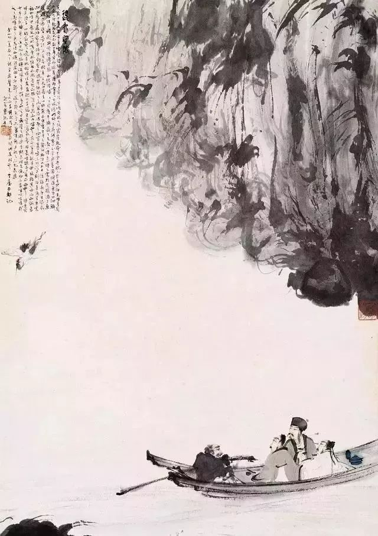

傅抱石，赤壁舟游图

  

很多人想在财务自由后不工作，天天休息。这一个月的生活，证明这种梦想不成立。只有在工作时，休息才值得期待，一直让你休息，工作反而成为美味。  

  

这道理，是经济学里的“边际效应递减”，在书本里或许不能理解，理解不深，实际经历过，想忘也忘不了。

  

走出危机，并非某种手段用得越多越好，超出了边际，只会起反作用。比如适度的恐惧，人的这种本能，对觉察危险有帮助，但过度恐惧，却成了严重的心理疾病。

  

一个高明的管理者，知道“正常”有着非凡的治疗能力。欧内斯特·沙克尔顿，一个失败的探险者，一个最成功的危机领导者，深谙此点。他的南极探险船“坚忍”号为冰所困时，开始了漫长的等待，为了防止队员们心理崩溃，他做的第一件事就是当作船只仍在移动，要求所有人按部就班开展日常工作，包括看起来是无用功的刷洗甲板和船身。

  

我们是我们自己的管理者，你是船长也是船员。在这个非常时期，开始去寻求“正常”，在恐惧与愤怒之外，唤醒其他情绪，就像这位朋友做的：

  

  

即使出不了门，也可以练俯卧撑，定下次数，要求自己每天必须做到。让你操心的计划，能克忧愁。完成一个有点难度的计划，必然愉悦。顺便说一声，其实力量增长也很快，20年前我练俯卧撑，从一组不到20个，进阶到一组200个，可能也就用了一年。现在多年没练了，但一组50个，还是毫无问题的。我前年开始练引体向上（家里有条件也可做），从开始绝望地挂着一动不能动，到一组10下，也只花了一年多时间。生活中有很多这种踮脚去够的美妙事情，一个个列出来，去试一试，很多事情，试一试就成了，就像跑1万米，不试永远不会成，这能让我们多元，让我们有韧性。

  

上期的“下周很重要”，是1月11日的事，想不到一个月发生了这么多事。上次写到苏东坡，似乎冥冥之中有天意，他那样一个在灾难之中总能找到生活乐趣的人，很适合成为当下的生活榜样。

  

今天是第116“下周很重要”，我们回归正常，订个计划，就命名为“我的苏东坡计划”吧。

  

推荐：[你的前身是苏东坡](http://mp.weixin.qq.com/s?__biz=MjM5NDU0Mjk2MQ==&mid=2651637076&idx=1&sn=69024861311512790382190d0545ce1d&chksm=bd7e414a8a09c85ce9f94fccce4fab65aac6549d0dc1e9b032d3b418f51094627f27e1e1fa0c&scene=21#wechat_redirect)  

上文：[爱是什么？](http://mp.weixin.qq.com/s?__biz=MjM5NDU0Mjk2MQ==&mid=2651637350&idx=1&sn=222eee648f1c7db206997d77239874ad&chksm=bd7e42788a09cb6e007c604c3a7ebf25735587fd98c9a0917a2e15ce41064ca98937d34869c8&scene=21#wechat_redirect)
