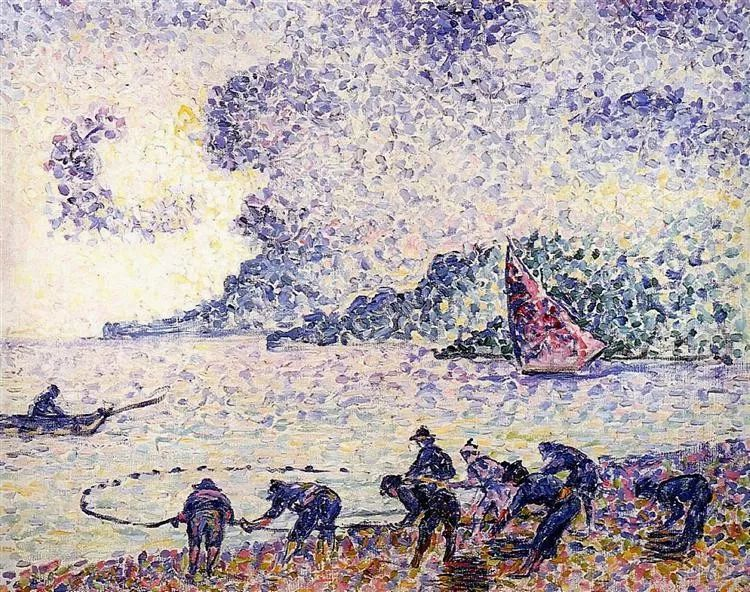
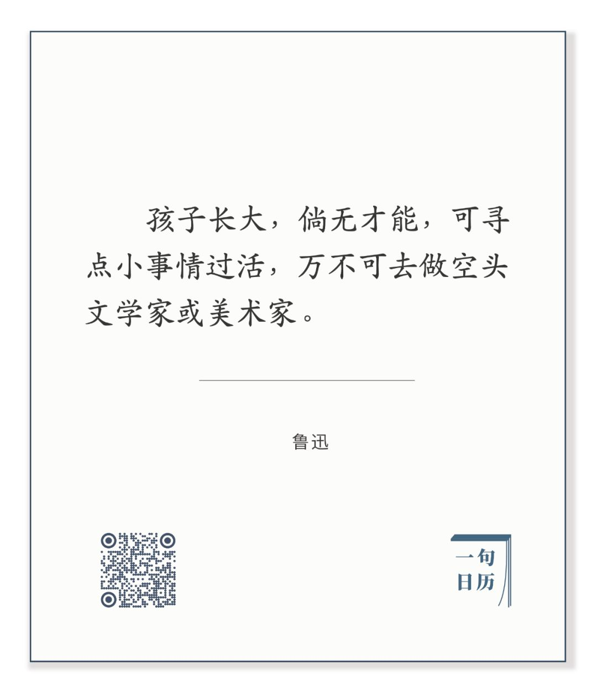

  

Henri-Edmond Cross，Fisherman

  

鲁迅先生弃医从文，要用文字救中国人。这是他最著名的典故。  

  

几天前，有人说，鲁迅先生是对的，学医救不了中国人，要用文字。这不睁眼说瞎话吗？现在防疫一线救中国人的，不全是学医的？非常时期，朋友圈的鲁迅一下多了起来，可好像对防疫没起什么作用。

  

鲁迅先生自然是了不起的，但我觉得，他也是被误解得最多的。那些动不动暗示自己是鲁迅传人的，国民性的帽子随便扣，从见识到人品，都差得太远，画虎不成。

  

学鲁迅要学全套，以免走火入魔。所以鲁迅先生下面这句话，更反复学习：  

  

 长按二维码可关注  

  

这里的美术家，是泛指艺术家。  

  

文学艺术，是非常凶险的行业，因为大多数从业者的结局是两个，一是穷，二是装，别说拯救中国人的精神，自己的精神先出了问题。鲁迅先生这点做得好，真诚且富裕。学鲁迅的人，至少先学他勤奋工作，收入体面，把家人照顾好。很多人是倒回来了，先自封为鲁迅，然后别人就要照顾他。我看，这不是爱鲁迅，这是爱特权。

  

文学艺术，有很强的主观色彩。你偏认为自己文艺好，别人也拿你没办法。人人说你水平差，你却说世人呆，后人才能欣赏你。水平越差的人，搞了文艺，就越偏执，他若有了文联作协的证书，那一辈子没救了，从此脸色凝重，嘴里不再有人话，一有风吹草动，不是“中国人的劣根性”，就是“中国人没救了”。这就是鲁迅先生所说的“空头”文艺家。  

  

学点好坏标准比较客观的工作，才是正道。医生好不好，自己说不算，同行病人说了算。这个工作就比文艺好。很多工作，水平实在上不去，差一点，也在创造价值，一个做包子的，只有50分，可还是包子，不得不吃，也有热量，不会毒死你。文艺只有50分，那比病毒还讨厌，看了精神受伤。  

  

中国经济比较发达的地区，这些中国的力量与希望所在，你会发现，这里的人，说空话的少，做实事的多，人人把自己的“小事情”做好，繁荣就来了。能凭小事情过活，其实不是鲁迅先生所说的“倘无才能”，反而是真才能。发达的市场经济，分工越来越细，做的都是小事情，今天做得不好，明天市场就淘汰你，这样竞争出来的人，实实在在，坚定可靠，精神强大。  

  

市场经济，除了创造财富，更能创造人才，是一所永远的大学。经由市场洗礼的人，有耐心，能吃苦，善改良，不停进化，因为好坏的标准由客户和市场决定，人不能驼鸟，只有更客观，更理性，才有活路。

  

我自己算是搞文字的，但我最怕跟文艺人士合作，不靠谱的比例太高了。修正错误，优化流程，准时有序，合规合法，合情合理，这些该做的事，由于繁琐无趣，对他们来说，比登天还难，还是扮演鲁迅来得轻松有趣。  

  

孩子，要听鲁迅的话，把小事情做好，这比什么都重要，这样才能防疫，才能成长。  

  

推荐：[如何谋杀一个青年](http://mp.weixin.qq.com/s?__biz=MjM5NDU0Mjk2MQ==&mid=2651622864&idx=1&sn=e5d82f8d30253d1c215e956fab9318b3&chksm=bd7e09ce8a0980d8dab5c8f1a2d3ffc7e7c7f9844f5d15a2659618e7cade6d4f360d75b8d9ad&scene=21#wechat_redirect)

上文：[判断房子价值的基本原则](http://mp.weixin.qq.com/s?__biz=MjM5NDU0Mjk2MQ==&mid=2651637306&idx=1&sn=d41e5694cf498a18984561ff0ca749bc&chksm=bd7e42248a09cb3216f0316afdeac41892461225b0e8d96aea328e626a6412f8a070fabe13aa&scene=21#wechat_redirect)
