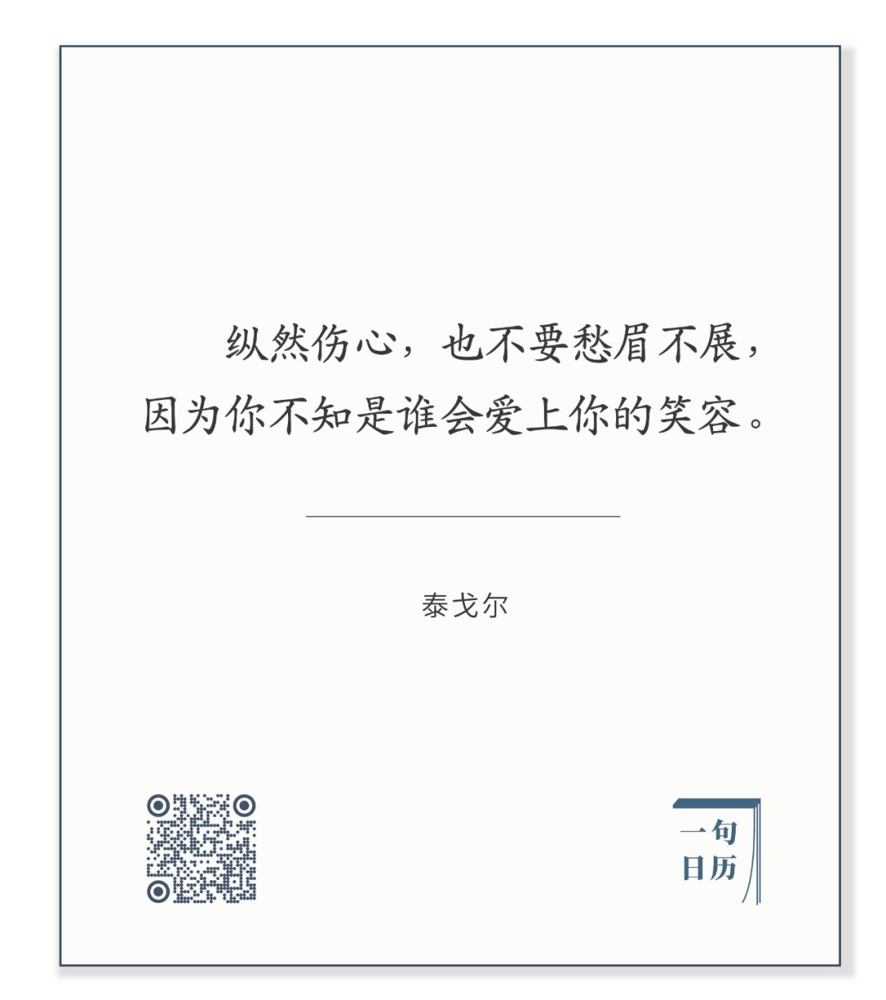

  

泰奥多尔·居丹，肯特海滩

  

这次新冠疫情，新加坡的表现得到了大家的赞赏。  

  

截至当地时间2020年2月25日，新加坡已有58人从感染中完全康复，并已出院。累计感染人数91人，无死亡病例。

  

新加坡的防疫，表面上云淡风轻，很佛系。

  

总理李显龙在2月8日的演讲中说，“在中国出现的疫情和流感一般，武汉地区以外的致死率不足0.2%，民众无需恐慌。”他建议大型活动暂时取消，以免病毒扩散，但是并不会规定民众一定要留在家中，还是可以照常生活。他希望大家用平常心对待，不要因恐慌大量囤积生活必需品。

  

这么说，是需要勇气的。万一疫情得不到控制，将威信尽失，出现执政危机。取巧的政客，宁愿将问题说得很严重，可以左右逢源，控制住了，我的功劳，控制不住，不可抗力。

  

新加坡政府安抚国民保持平静时，本身的防疫效率却很高，早在1月3日，就开始对来自武汉的游客测体温，是最早反应的国家，并随着疫情的变化，不停调整政策。其自SARS后着手建立的防疫预案及追踪机制，高效而严谨。

  

当然，有人说，新加坡是小国，又处于热带，防疫有天然优势。这没错，不过，有天然优势还做不好，那得到的批评也会更严厉。

  

对我来说，上面的一切固然都好，但印象最深刻的，来自新加坡贸易与工业部长陈振声一段被泄露的谈话录音，他痛批那些效仿香港人囤积厕纸的新加坡人，称之为“愚蠢”且“丢人”，香港人蠢没有关系，因为中国内地会罩着他们，而新加坡不能蠢，我们只能靠自己。全世界可以没有脑子，新加坡人不能没有脑子，因为别人觉得我们蠢，就不会和我们做生意，那等于自杀。

  

私下的谈话，直接而放松，泄露出来后，舆论有些批评。可也正因为少了小心翼翼，反而让人知道新加坡的抗疫为何要追求又佛系又高效，这样难度系数大很多，但这恰恰可以证明：我们做得比别人好，我们不过分干扰国民的日常生活，还把疫情防住了。疫情是个意外，但在意外中太慌张，是会丢分的，镇定地把事情处理好，意外的危机就成了意外的宣传，可以建立国家品牌。

  

这种情景，泰戈尔用诗描述过：

  

长按二维码可关注

  

我一定要有尊严地把事情处理好。这是不是防疫经验？当然是，这可适用于处理一切危机。有这种尊严感，自然不甩锅，不争功，更不会偷懒与失职。

  

中国自古以来，有点追求的士大夫，其实都想有这样的静气，遇事慌乱，哭天抢地，那是能力与修养不够的体现。很多人可能已经忘掉这种传统，反而追求情绪极端化，你看他朋友圈或社交媒体，上一条还在秀自己的大餐名酒，下一条就是世界末日；五分钟后，又暗示别人他已经财务自由，功成名就，你还来不及点赞，他却开始一把鼻涕一把泪地感叹国将不国。这从逻辑到事实，都不能自洽。我觉得这样既不利于防疫，个人形象也很糟糕。

  

一定要有“别人都可以没脑子，我一定要有脑子”的追求，有这根弦，自然会做得好一点。

  

推荐：[妈宝男不是小宝贝，是大祸害](http://mp.weixin.qq.com/s?__biz=MjM5NDU0Mjk2MQ==&mid=2651625822&idx=1&sn=80863866f120f02dfa8ef31b165320c1&chksm=bd7e1d408a099456faad018ef914e937b7fb01182efec0d616c6c921b5cf7443875ee2ecc487&scene=21#wechat_redirect)

上文：[人为何有造谣的冲动？](http://mp.weixin.qq.com/s?__biz=MjM5NDU0Mjk2MQ==&mid=2651637555&idx=1&sn=d492d54ac6eaac39e91d2d2acb33d092&chksm=bd7e432d8a09ca3b42cabf043b683f2f194ce13cfee1e4b9d0b8ae017269698bc99cfd9e8457&scene=21#wechat_redirect)
