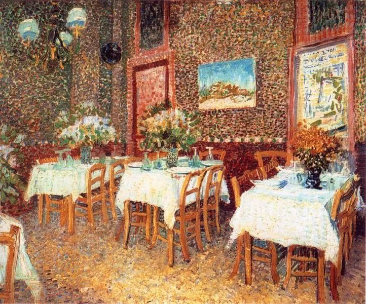

Vincent van Gogh，Interior of a Restaurant

  

中庸之道，是中国人的传统价值之一，也是中国人输出的价值之一，富兰克林认为人应该遵守的13美德，其中就有中庸。  

  

中庸，朱熹解释为“不偏不倚、无过无不及”，其实也可以说是实事求是。做人做事，这是很好的标准。当然，人是情绪动物，这是大脑的结构决定的，信息进入大脑，先交情绪处理，再交理智判断。在情绪这个环节，往往或偏或倚，或过或不及，此时的结论，往往是错的。不经过训练，或者知识匮乏，信息很难到达理智。人的教育过程，就是不停增强自己的理智力量，你比别人更快脱离情绪，更早到达理智，用孔子的话来说，达到君子的境界，因为“君子中庸，小人反中庸”。

  

在疫情中，人的情绪普遍亢奋，易走极端，极端恐惧，极端冲动。

  

长江日报早在1月25日，就有一则报道：四十多岁的周先生每天反复量体温，大年三十晚上泡脚后测出体温有点高，在家嚎啕大哭。七旬老父亲抱着他说，“不担心你得肺炎，就怕你是精神出了问题！”老人及时拨打了心理热线求助。

  

当时我在开车，连太花枝乱颤念了这条新闻，我听成“钟先生”，心想，好嘛，编段子消遣我。

  

疫情这段时间，其实很多人的行为类似周先生。比如早期所谓的“硬核”封路，舆论还一片叫好，那种事态继续蔓延，交通很快就会崩溃，全中国沦为一片片孤岛。那时候公安部的反应很快，敢于作为，指出这是违法行为，严辞警告：“对未经批准擅自设卡拦截、断路阻断交通等违法行为，要立即报告党委、政府，依法稳妥处置，维护正常交通秩序。”

  

现在开始回程了，有人发现自己进不了自己的住所，自己一个健康人，怎么权利就任意被他人剥夺了。这点，北京政府的应对也挺好：北京人社局于1月31日在肺炎疫情防控新闻发布会上表示，随着返工期到来，针对北京小区或村庄对外来人口采取“封闭措施”情况，不应采取“一刀切”做法，没有确诊病例的人口，没有明显发烧咳嗽症状等，应让外地人口自由进入小区。

  

迎合情绪，走极端，这是容易的，无论你是侵犯公民合法权利，还是随意发布不靠谱的消息，导致人民抢购双黄连，或能得到热烈支持，或收获了流量与关注。但这种事情搞多了，疫防不住，却要担心像周先生一样，就怕“精神出了问题”。

  

听从防疫专家的建议，保护自己并不是难事，此时，应该考虑怎么努力恢复正常生活，开始尝试安全状态下的学习与工作。有位妻子留言抱怨丈夫，说他在家情绪已经失控，和父母吵，和孩子吵，闹到晚上出去钓鱼，回来情绪好了，她责怪他不懂事，不响应号召，安静在家呆着。我的建议是，他是一个健康人，出门又守防疫规矩，钓鱼让他精神健康，那应该让他去钓鱼，我们总要这样一步步回归正常生活的。政府也没号召你在家里关出精神问题，根据自己家的状况作调整，才是自己的责任。

  

是时候平静一点了，争取回到“不偏不倚、无过无不及”的中庸之道。在疫情中，完全不在乎，是反中庸，惊吓过度，事事搞极端，也是反中庸。

  

推荐：[凌晨5点的秘密](http://mp.weixin.qq.com/s?__biz=MjM5NDU0Mjk2MQ==&mid=2651628657&idx=1&sn=78839c2d4d983a944022bef82b3738af&chksm=bd7e206f8a09a979a99f575e586705adc5d55dc70d6c2f89108a4de8252ec4560b7a64497354&scene=21#wechat_redirect)  

上文：[当我们知道最坏的事情发生时，最坏的时刻就已经过去](http://mp.weixin.qq.com/s?__biz=MjM5NDU0Mjk2MQ==&mid=2651637223&idx=1&sn=e2e8449269041eb0f78b0810ea5480a1&chksm=bd7e41f98a09c8efaab2dbfb8dfc5f8c5373c73452f8a4a47c6ae2b992166c6b7efebafada6d&scene=21#wechat_redirect)
