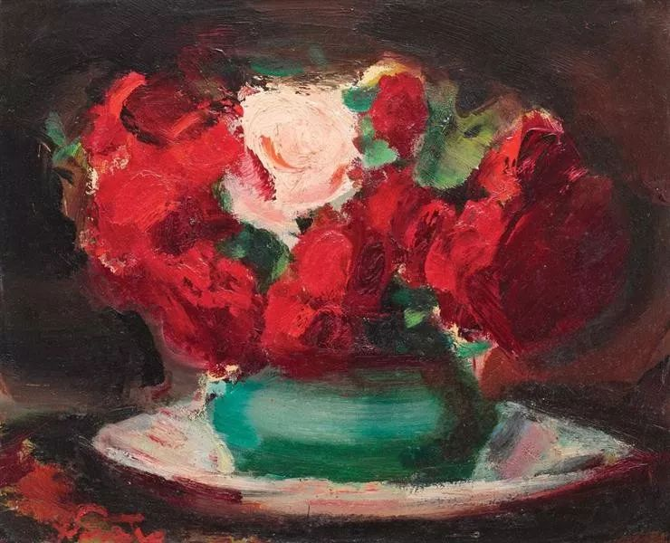

Francisc Sirato，Red and Pink Roses

  

爱是什么？

  

有了清晰的定义，爱才不会错。就像法条有严格的边界，法官才能解释你是否守法。

  

爱不是占有。占有是人的一大追求，占有名表、豪车与美宅，都让人快乐。但人无法占有，最典型的是父母爱孩子，你最后却要鼓励（或者说忍受）他去爱另一个陌生人，不吃醋，也不心碎。  

  

爱不是沉迷。游戏，赌博，酒精，甚至毒品，都是更好的沉迷，甚至可以廉价地提供一个应有尽有的虚幻世界。  

  

爱不是索取。一旦你答应爱我，好像就成了我的奴隶，我的佣人，要助我虚荣，要给我钱花。  

  

但爱又是占有，占有其他一切，财富，才华与光荣，就为了证明我配得上你，这生都不要离开我。如果有来生，来生我还会努力。  

  

爱也是沉迷。沉迷你的青春，沉迷你的皱纹；沉迷你的肉体，沉迷你的心灵；沉迷到你慢慢渗透成我整个人生，沉迷到合二为一。  

  

爱更是索取。给我更多，更多让我更饥饿，我要更更多。像大海永远向大河索取。  

  

这不是和是，这既不是也是，让人迷惑，需要爱的定义将它统一起来。  

  

爱是用我的更好让你更好。它是一个没有终点的成长系统。

  

人容易知足，食品早已过剩，虚情假意也可暂时过瘾。  

  

人容易虚无，毕竟都会死，肉身一瞬，看起来永恒的宇宙，最后也会复归于无。都会清零，不如一直是零。

  

爱让我远离这一切。  

  

我不再知足，别人有的，我当然能有，别人没有的，我也要能有，因为这样你能过得更好。爱上你，就没有认输这个选项了。“只要我们相爱，过得差点也行”，这么耻辱的话，怎么可能对你说出口？听到更不是安慰，想一下都是犯了爱的死罪。  

  

我不再虚无，正因为生命是一瞬间，我们这瞬间的相逢，才不容易，它应该注满永恒，正如一段有限的线条，可以隐藏无限的点。  

  

凡是能让我更好的，我都愿意接受，我不再怕烦，不再逃避，我敢决定，我敢竞争，我为你健康，为你聪明。在这过程中，我不是获益最大吗？我走到了自己的想象力之外，走到蛋壳之外，来到你身边，而你，也经历了这个旅程。幸会。  

  

亲爱的，情人节快乐。
