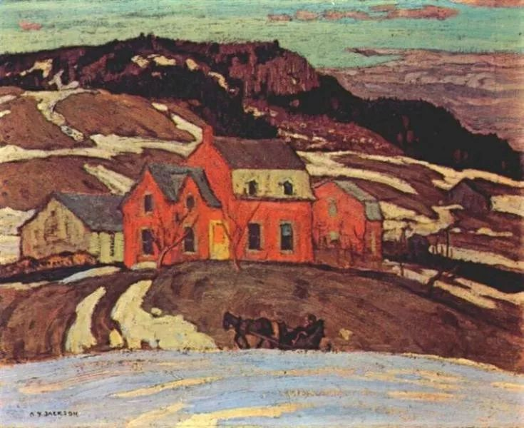

  

A.Y. Jackson，Early Spring

  

疫情之后，房价会如何？这是近几天多起来的读者问题。  

  

房价最终是经济的体现，经济发达则房价高。判断疫情对房价的影响，得先判断疫情对经济的影响。

  

有极端悲观者，认为中国经济从此将垮掉。如果你是一个容易悲观的人，最近密集接受坏消息的轰炸，可能会有这种假想：几个月后，企业大规模倒闭，企业主先倒霉；这产生大量的失业，再过一段时间，失业者耗尽积蓄，发现自己的命运是和企业主捆绑在一起的，开始还不起房贷，生活费都成问题；而政府由于没有企业可以收税，国库空虚，失去救援民众的能量。

  

这种情况发生，房价当然一泄千里，覆巢之下，每个人的蛋都要摔破。但它不会发生。即使疫情不结束，一个月后，农民戴着口罩种田，工人戴着口罩生产，两三个月后，政府急迫地鼓励（极端的甚至强制）企业开工，生存问题升格为第一问题，毕竟，只要持续饿，死亡率是100%，比新冠肺炎厉害多了，两害相权取其轻。

  

何况，疫情很快将会结束。它对中国经济的影响，只是一个短期冲击，长期来看，只是一个小波澜。在这个短期内，你的企业撑得住，你的积蓄用不完，你甚至会获得优势，因为不幸的倒闭者让出了市场份额。这样，我们可以得出结论：疫情对房价的影响是短期的，改变不了大趋势。

  

短期内，有些负债率极高的房企，不得不亏本抛售，有些赌徒式的购房者，也只能割肉，可能会有一些便宜捡，不过那是零星事件。

  

而疫情中出现的一些变化，对房价的助推作用，过比较长的一段时间后，才会显现。

  

一是货币投放的增加。灾难之后，用货币放水刺激经济，这是现代政府的标准动作（在这里不探讨是否符合市场规律，只描述现实）。目前为止，政府投放的货币，以万亿计了。后续还有更多。钱增加得快，物增长得慢，价格就得涨，尤其是好物，涨得更快，好房子，就是好物中的好物。

  

二是观念的改变。所谓的租售同权出台后，很多人欢呼，以为不用当房奴了。可是一个租户，在这次疫情中，假期归来，被挡在小区大门之外。不少地方出台政策，对有房户与租户区别对待，租户进不了房，酒店又都停业，一下变成了流浪者。这种政策，当然不合理，简单粗暴，反映出极低的管理水平。不过，倒也让人清醒地知道，有房与无房，是两个阶级。在灾难之中，先被动的，先受害的，是无房阶级。这次很多人会下决心拥有自己的房子。 

  

安心拥有你的房子，或者，认真开始实行你的购房计划。有自己一间房子，再小，都更能保障自己的安全与权利。繁荣时，可升值，灾难时，可避难。

  

推荐：[储蓄永远是富人思维](http://mp.weixin.qq.com/s?__biz=MjM5NDU0Mjk2MQ==&mid=2651635450&idx=1&sn=b7204aeb7e2353ec557a2163c6c96423&chksm=bd7e3ae48a09b3f22dd4bdd263161cf0683cc45cb03fc8f92c8cb4b9742b7e5f423591d9d7f8&scene=21#wechat_redirect)  

上文：[从免疫力到生产力，开始竞争](http://mp.weixin.qq.com/s?__biz=MjM5NDU0Mjk2MQ==&mid=2651637277&idx=1&sn=b624f4578f76dc5f0abea93584d14c8f&chksm=bd7e42038a09cb15402ee4ba4fc1708c11c72eb0b16cf3a9543cdb9036860c2b3547fcb81ba5&scene=21#wechat_redirect)
