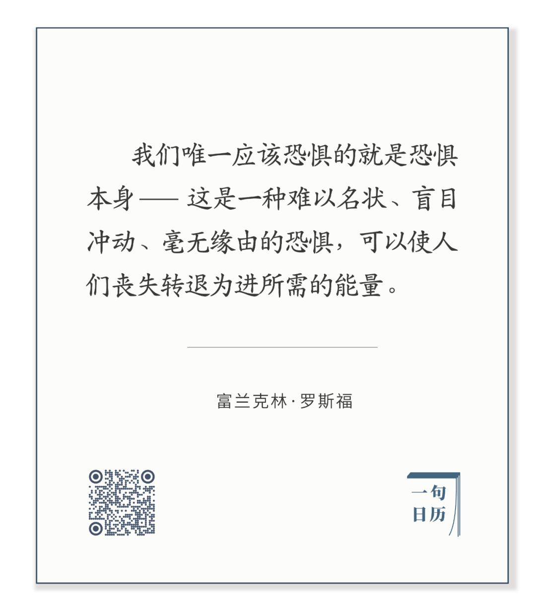

每当有危难发生，下面这句话都应该拿出来念一下：  

长按二维码可关注  

  

仔细分解罗斯福这句话，它给你的知识是有限的，甚至是你已有的，但又具有非凡的力量。  

  

人很奇特，很复杂。既容易绝望，又可迅速生出希望；既阴，又阳；是天使，也是魔鬼；可慈悲，可残忍；一会特立独行，一会乌合之众；今天懦夫，明天英雄；可载舟，亦可覆舟；有耐心建金字塔，却无耐心查证一条传言。人们会感谢、记住一些大人物，就在于他在危难时刻，将人们从恐惧的逃跑带到镇定的战斗。这力量通过文字与记忆，成为人类永远的力量来源。有些人成为领袖，像罗斯福这样，知道自己的职责就是得给民众信心。更典型的领袖模板，可能是丘吉尔了，二战英国能撑下去，没有他的三寸之舌天天给英国人信心，三个小岛，有一百个理由投降纳粹。

  

就像这次疫情中的钟南山院士一样，同样的话，同样的防疫常识，从他嘴里说出来，人们就放心了。不需要罗斯福那样的警句，大白话、聊家常也行，只要重要人物没有缺席，人们就更少恐惧。

  

人是自己的主人，一切都要回归到个体，放在小环境里，你也会影响身边几个人，你是你家庭里的领袖。你面临的问题和罗斯福丘吉尔一样：如何给自己、给他人信心，不要僵死于恐惧之中。只要你喜欢恐惧，生活永远不缺恐惧。最害怕贫穷的，不是穷人，而是时时担心失去财产的富翁。

  

疫情期间，你的朋友圈可能有这样的人，一天能刷几十条，怼天怼地，那些不靠谱的谣言，他最信、最爱转，而正面一点的消息，他最怀疑，最不信。把所有精力都用来害怕与生气。

  

是疫情有那么恐怖吗？我不觉得，现代医学对付这疫情，还是有办法的。是政府太无能吗？也不是，这次疫情应对，得到了WHO与美国卫生部长的赞扬，至少不差（为防杠，提醒一下，这不是说不需要监督，不是说政府事事都对）。作为个人，把防疫措施做好，等疫情过去就是了。  

  

你此时变成一个无限传播恐惧的朋友圈公害，并不是因为疫情，是因为你从来都没有安全感，你可能缺爱、缺关怀、缺实现，你用疫情证明不安全感是对的，你渴望疫情越恐怖越好。这就像你恨一个人，他的缺点你宣扬，他的优点你不信，这样才可以源源不断地为恨提供燃料。

  

每个人的身体，每个人的心理，都会生病，没有100%健康的人，如果这次疫情测出了你有嗜好恐惧的心理疾病，那也是收获，平时症状不明显，未必意识得到。比起新型冠状病毒感染肺炎，这种心理疾病好对付，只要有自觉，就好了一半，有自觉就有自制，自制就是抗体，你的嗜好恐惧就发作不了，释放出来的注意力，放在美好的事物上，你产生输出爱的能力，你才能不缺爱。

  

你可以尝试一下，今天不在朋友圈发任何一条疫情坏消息（如果难度太大，你就只发一条），你明天的感觉一定会更好。

  

推荐：[别让领导适应你](http://mp.weixin.qq.com/s?__biz=MjM5NDU0Mjk2MQ==&mid=2651634112&idx=1&sn=cfd7a54cb76389c39f2a8ebb9b296884&chksm=bd7e3dde8a09b4c8e11a6ef9363c49c400641f089dd20e015dbdb3ba75ebf07215977c356ee8&scene=21#wechat_redirect)  

上文：[股市与未来的经济](http://mp.weixin.qq.com/s?__biz=MjM5NDU0Mjk2MQ==&mid=2651637234&idx=1&sn=ad20e268fbd535fe3f48513746b5a395&chksm=bd7e41ec8a09c8fa6cadbd389ab42ddfa97873d1dc699f83e48baf01eb2e078c591244602a93&scene=21#wechat_redirect)
