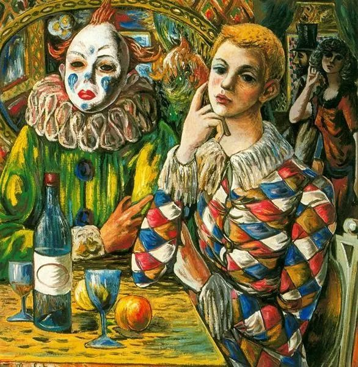

Rafael Zabaleta，Harlequin and clown with mask

  

连岳：  

  

因为这次疫情，我爸妈他们推迟上班。天天待在家，门都不出。这可能是一个好的机会，因为妈妈终于有比较对的时间陪我了！

  

但是妈妈和爸爸比较容易吵架，基本上两个人聊会天都能特别地较真。我爸就更不用说了，简直就是一个大小孩。长不大的小孩，我甚至觉得我有时比他还要成熟。天啊！摊上这样的爸爸真是醉了，天天教育我要先好的学习，自己却老是带坏头，经常对妈妈发脾气，我也有样学样虽然我知道这样做是不对的但是我还是忍不住不向妈妈发火。

  

今天你知道发生了什么吗？我点外卖没有点我爸的份因为他在睡觉，我也不太想点他的份，然后他一起床就在怪我这件事。说着说着又骂我妈怎么过年的买的花现在都凋谢了还不去扔掉是要摆到年十五吗？知不知道什么叫花开富贵我妈非常的无语回了一句你自己也可以倒掉啊！我爸就非常生气地说你就只会天天对着手机和朋友聊天，让你倒个花有那么难吗？他一发起脾气感觉全家人的气氛都不好。

  

我真的搞不懂为什么我妈会忍他到今天，我曾经鼓励过我妈和他离婚，但是我妈拒绝了我！她应该还是爱他的，但是他对她的爱根本不及我妈对他的爱。天啊！这样的男的简直就是毒瘤！我身边比较亲近的朋友他们的爸爸也是这样，唉！好无语！这简直影响到了我的婚姻观，我好担心我以后的老公会这样，我的小孩会和我经历一样的家庭，不过如果我真的遇到这样的渣男我一定要离婚，我不要生活在我不想要的生活里。

  

祝开心。

  

一个被就快要自己爸爸气死的高中生

  

* * *

  

高中生：  

  

经历都是有价值的，好的经历自然不用说，坏的经历，只要一个人没有被它击倒，也有价值。就像感染新冠肺炎，很糟糕，但治愈的人却有了抗体。  

  

有些父母暴躁的孩子，成为温柔的人，那就是因为他们在成长过程中产生抗体，有了觉醒，这种比例虽然不高，但也不低，不是不可能完成的任务。他们的蜕变过程，像你一样，开始也曾模仿父亲的坏脾气，后来走出这坏模样。当你不再重复一切坏模样时，你就是好模样。  

  

所以你从今天开始，就可以对妈妈温柔一点。长大不是以后的事情，长大是现在的事。你在心智上比你父亲成熟，你的情绪控制能力成为他的老师，你和妈妈温柔互动，这也会影响他，也许，他的一生，没有见过好模样，才成为这副可悲模样。  

  

你给他你的好模样，可以帮助他成长。这不是说他一定会成长，而是说任何人一生都保有成长可能，年纪大的人患了新冠肺炎，也能治愈，精神的治愈力也同样一生存在。  

  

假如你的父亲看到这封邮件，他的反应可能有三步。他瞬间习惯性地发怒，觉得女儿背叛了自己。不会成长的人，也就停留在这一步。会成长的人，则会继续走，在怒气消失后，他隐隐知道自己不对，尤其有了温柔模式对比，反省更容易产生。然后，他来到第三步，开始改变自己的行为模式。

  

最坏的结果，你父亲只停留在第一步。那也没什么可沮丧的，只要你从此成为一个改变者，就行了。人生的一大使命，就是成为改变者，从改变自己开始，再改变家人，朋友，直到全世界，你让别人变得更好。没有意识到这使命，也在改变他人与世界，只不过是让别人变得更坏，以至于人们像厌恶病毒一样厌恶他，即使自己的孩子，也厌恶他。

  

爱是温暖的回忆和价值观的共鸣，血缘不会必然产生爱。

  

这次疫情，无法外出，原来的逃避手段全没了，家人必须长期相处。如果彼此间不是那么爱，那么心底的伤痛与怨恨都会被唤醒，被放大，在小小的空间里回响与激荡，逼迫着人回答这个问题：我们这么害怕疫情，这么珍惜生命，这生命，要用来做什么？  

  

答案显然不是用来吃野生动物，不是用来浪费，不是用来无谓的争吵，不是用来伤害他人，更不是用来让自己的老婆自己的女儿心碎，不是用来渣。

  

生命是用来创造，用来成长，用来爱。

  

我们希望我们的父亲做到。这希望是正当的，但他们做不做，无所谓的。  

  

因为我们自己可以做到。  

  

祝开心。

  

连岳  

  

推荐：[害怕成功的人](http://mp.weixin.qq.com/s?__biz=MjM5NDU0Mjk2MQ==&mid=206406842&idx=1&sn=9efca07cd96330a3c0bc83f353351725&chksm=2f3f00a4184889b2ef4baef98622659e2615cad46c002f17df192d9572af6f7abd5460e9a8cf&scene=21#wechat_redirect)  

上文：[但愿……](http://mp.weixin.qq.com/s?__biz=MjM5NDU0Mjk2MQ==&mid=2651637257&idx=1&sn=dcc3f2e0f2cde9bdb1a97be4df13bdf4&chksm=bd7e42178a09cb01ecf6e26b29e0df2cf802e5359c844aeb9da5d34bcc1795497e16184537a3&scene=21#wechat_redirect)
