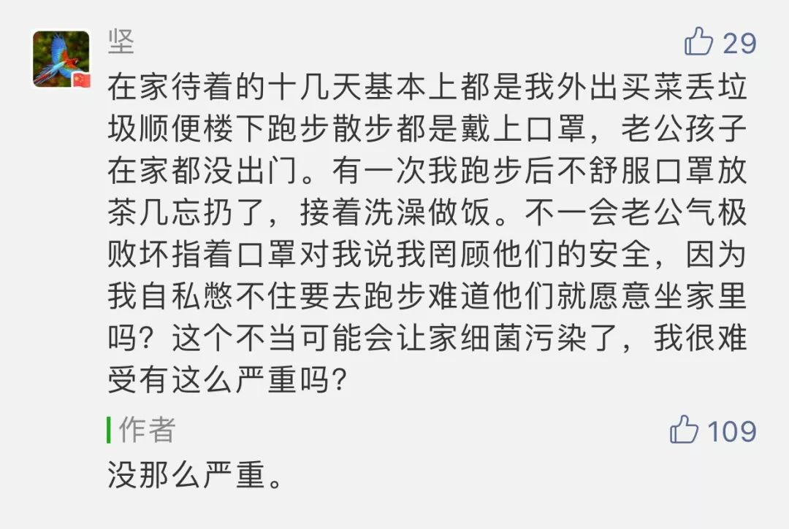

昨天的一条留言，让我意识到不少人可能心理已处于不太健康的状况：  

  

  

这位丈夫已经反应过度，而且在争夺控制权，体现为借由“占理”的小事无限上纲，贬低对方。

  

这不是说留言中的丈夫是坏人，不过指出这是一种常用的策略，先扣对方一个帽子，或者先给自己戴上花环，自以为有了道德优势，然后我说的全有理了。这是逻辑错误，但却具有极强的误导性，对不顾事实，只想求胜的人，太有吸引力。在与家人的冲突中，用得还最多，因为家人会忍我们，我们就不顾他们感受。如果我们真爱家人，不应该陷入到这种悲剧中。  

  

总有人说，非常时期，反应过度是好的。这不成立，既然知道过度，怎么可能好？这只是给自己的失控找理由，你认为过度好，就会越来越过度。过度是不好的，就像过度给你吃药，药是对的，你也会吃坏。过度不利于心理健康，过度也没有成本意识。  

  

为了隔离期的心理健康，我有几条居家建议：  

  

一、用大数据指导自己，意识到我们处于可控的安全之中。截止昨天，全国非湖北省的病死率为0.16%，这病的杀伤力不比流感强多少。湖北的病死率相对高，因其医疗资源抵抗不了疫情冲击有关，举国之力支援后，也会迅速改善的。有了这个大背景，个别案例（即使确实悲伤、痛心）就不至于让你恐惧。  

  

二、不要有被迫害妄想症。你老觉得政府要害自己，什么事都撒谎，这不能证明你是一个好的批评家，只能证明自己是病人。这样也让自己寸步难行，你觉得什么都是谎言，那你怎么行动？放轻松，换你去掌管政府，你也希望尽快战胜疫情的，放任疫情对你有什么好处？没有。  

  

三、在家生活要有规律。我有近20年在家工作的经历，最大的体会就是规律能够帮自己，否则，坚持不了1年。在隔离期，想睡就睡，想吃就吃，毫无规律，几天内就会崩溃，你更无聊，更疲惫，一肚子无名火，无关紧要的小事就会引发大争吵。几点起床，几点睡觉，做多少事，规律不要乱。

  

四、设置各自安静的静默期。房子小，人多，总有人在眼前晃，电视、音乐、游戏声整天响，什么事也做不了，老觉得被侵入，怒气会越来越重。每天约定几个时间段，家里保持安静，各自找个地方静静地呆着做自己的事，不许互相打扰。

  

五、把每天的任务量化，打坐多少次，俯卧撑多少次，看多少页书，这让你的心理聚焦。顺便说一下，阅读（那种把一本都是字书看完的、深度一点的阅读）最能击败孤寂，阅读甚至会让你喜欢独处，人的大脑有美妙的信息刺激，不胡思乱想，心理自然更健康。如果你原来没有阅读习惯，现在刚好试试读完一本书，你肯定有辛苦的感觉，可它刚好可以消除你的无聊感。

  

六、采取轮值制度，一人管一天家，你也穿穿我的鞋子，这样，避免立场不同的互相指责。

  

七、除了政府已经禁止外出，还是得出去散散风。出门戴好口罩，与人保持足够距离，科学得很，一点不可怕，身体健康了，更有利于防疫。再说了，散步回来进小区，还要测体温，多安全。

  

太激动、太悲愤，于己于国，都没什么帮助。尽力让自己正常化，更有利于防疫。  

  

推荐：[少年，我们一起来学永恒的技术](http://mp.weixin.qq.com/s?__biz=MjM5NDU0Mjk2MQ==&mid=2651634020&idx=1&sn=ed9d09a50f52fc7bc572720311c682c4&chksm=bd7e3d7a8a09b46c54d5fa308a799b90702a9d37ea989fe5cc97e3698dd32baf2e27877d5e19&scene=21#wechat_redirect)  

上文：[疫情都经历了，当然要收获心理健康](http://mp.weixin.qq.com/s?__biz=MjM5NDU0Mjk2MQ==&mid=2651637240&idx=1&sn=84597be8ac7bdd419a8bb2ae9f57212a&chksm=bd7e41e68a09c8f0ba3c55920bdb02d4906765bf69191f160280cb2f8f577c0b6e8d0f235e84&scene=21#wechat_redirect)
