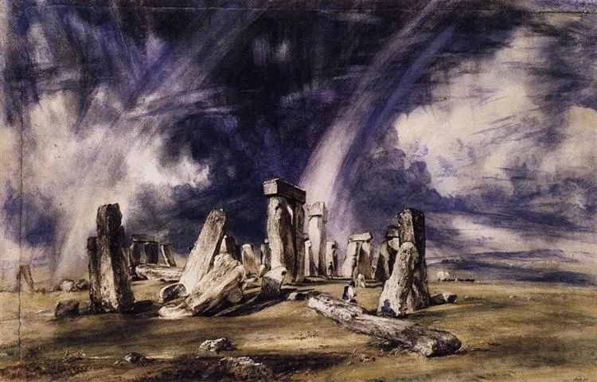
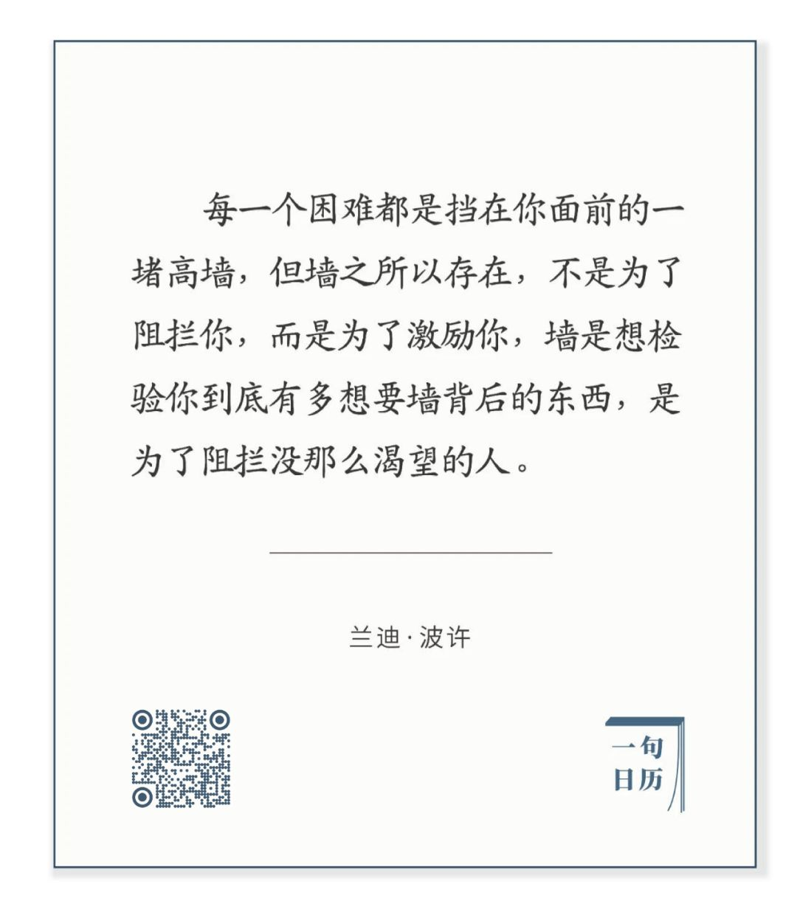

John Constable，Stonehenge

  

好的东西，得到很难，但失去容易。

  

保护了上千年的精美瓷器，摔碎只要一秒钟。

  

巴菲特说过，建立信用可能要半辈子，失去它却只要一瞬间。

  

这就是所谓的熵增。代表着混乱、无序、毁灭的熵，它才是最强大的力量。

  

从宇宙的角度，人类社会的任何一件事，任何一个人，都是奇迹。最混乱的房间，里面也有熵减，最懒散的人，他身上也有熵减。生而为人，就是一个奇迹。只是我们身处奇迹当中，看得习惯，难免会忘了奇迹的力量。

  

一个人要从熵增走向熵减，只需一念，他决定收拾房间，他决定今天从懒散的状态里振作起来，想到就可做到。这种力量，我们体验过无数次。这就是创造奇迹的力量。人不需要成为超人，人本身就是超人。

  

只是真的成就，比收拾房间，比一天振作，难多了。但也不是难很多，可能 难1000倍，今天的1念养成1000念，难事就成易事。在新的层次上，你发1念，就有1000念的功力，再养大1000倍，这是多么可怕的增长速度？  

  

好的事情，做起来都显得慢。坚持10天，已经疲惫，熵增如高墙一样挡在前面，但事情好像还是原样。这让很多人沮丧，并且放弃。其实你要开心，虽然你也沮丧，你也疲惫。可你深知这沮丧和疲惫将帮你淘汰竞争对手，正如下面这句话所说：

  

长按二维码可关注  

  

不困难的事不值得做，做一件事若没有困难出现，这件事就无收益，它无法诱发出你原来没有力量，困难让你无中生有，一本万利。  

  

今天是第120期“下周很重要”，写下计划就有压力，根据你的经验，很多计划无法100%完成，总会被困难打折。只要记住，这压力、这困难、这沮丧、这不完美，其实都是你的好朋友，你就能够放松地坚持。

  

推荐：[那重要的一天，终会到来](http://mp.weixin.qq.com/s?__biz=MjM5NDU0Mjk2MQ==&mid=2651637721&idx=1&sn=7eabdd20e3be62b0a5df5b2f969f84aa&chksm=bd7e43c78a09cad14460c030135f3dbd7d4bbe2ca1291c8a765962c05c41b1cffc52110b1558&scene=21#wechat_redirect)  

上文：[6月疫情或结束，但要提防另一个严重问题](http://mp.weixin.qq.com/s?__biz=MjM5NDU0Mjk2MQ==&mid=2651637821&idx=1&sn=73edc831a5b83167c572ca976933e879&chksm=bd7e4c238a09c5350a119464c5a585c2f85c94bda63ff72483db099309ef756b280896833d71&scene=21#wechat_redirect)
