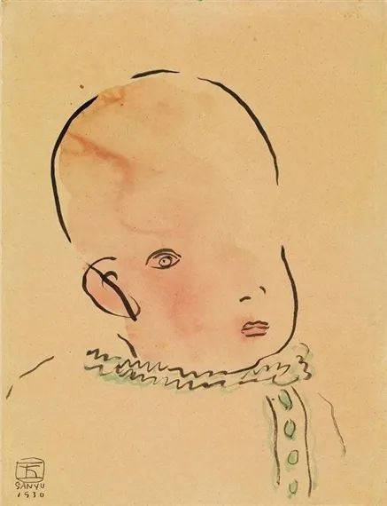

常玉，宝贝  

  

连叔，你好，很抱歉，打扰了。

  

今年我要小升初了，这可能是所有大考中最不起眼的的一个考试，但是它会改变你的一生，妈妈总说：“你考上了一个好的中学，就会考上一个好的大学，可是在5年级的时候我发现我的父亲出轨了，我不敢说出去，只能自己憋着，只记得那段时间晚上睡不着，什么都不想说，头发也是大把大把的掉，后来实在坚持不下去了，就给我最信任的舅妈说了，后来舅妈不知道怎么办，就把这件事情告诉了外公，外公给我的父亲发消息，后来他找我了，他说：“我在初中的时候就喜欢那个阿姨……。”听他说我在2岁的时候，妈妈在老家那边，我的父亲也出过一次，当我妈妈发现的时候是要准备离婚的，可是，当时我的妈妈没有工作，如果离婚了，我就只能跟父亲，妈妈为了我就没有离婚，在我很小的时候我的父亲就对我的母亲拳打脚踢，我全都看在眼里，我被他用雨伞、拖鞋……打过，我至今忘不了。

  

每次出去的时候总是装的有多么的和蔼可亲的，可是我不想陪他演，我玩的时候他跟我说，你怎么还在玩这种的话，当我在房间里写作业，上网课，时间久了他就会来说你怎么怎么样啊，玩可以的，没有让你学这么久之类的话，最近我经常的失眠，，盯一个地方不动，动不动就会哭，觉得自己没有前途。所以我上网找了个测试抑郁症的，测出来的是中度抑郁症，我不太敢相信，我不知道这是怎么了，现在很喜欢孤独，喜欢伤感的音乐。我这是怎么了？

  

十二

  

* * *

  

十二：

  

前天晚上我们约定，我今天专门回答你的问题。但愿你今天的感觉比前晚好一点。

  

我告诉你一个秘密，时间有魔力。我们觉得伤心痛苦，当时好像一点办法都没有，你就给自己一点时间，过几天，可能就好了，人的韧性也是很强的。我建议你不要听伤感的音乐，尤其在心情低落时，那等于做了一个错误的决定，它会把你伤心的情绪放大，歌词作者为了押韵，什么糊涂话都可以写出来，你当真就输了。

  

在低落的时候，反而要听听开心的音乐，看看春天的萌芽与鲜花，让他人的笑容感染一下，这世上很多美好之事，注定会让我们心情变好，你可根据你的经验，列出5件或10件美好之事，心情低落时，就挑其中一两件做一做。抑郁症的判断是很专业的事，网上自行测试，基本不靠谱，你又只是6年级的小朋友，做这些测试也超出你的能力，很容易把正常的情绪起伏测试成病态，这个不真实的结果又败坏现实生活，让你以为测试是对的。

  

小升初，是人生的第一次压力测试。你第一次知道一件事很重要，做不好有些麻烦。记得我当时有几晚故意把自己熬到半夜12点，把一些会的功课抄来抄去，却回避难题，自己却以为累了就能长成绩——很蠢吧？不过，毕竟是孩子啊。你在备考中，要避免犯我当年的错误，把精力更多放在补强那些自己薄弱的、不会的知识点上，这样压力才会越来越小。

  

我小升初没考好，只能去市区次好的中学。当时条件很差，无论刮风下雨，我每天拎着饭盒，走一个多小时的路去读书，冬天时，手和耳朵都生冻疮，初中三年也挺努力，中考又没考好，上不了市区的好高中，只好回到100多公里外的老家县城上高中，同班一位女生，成绩好，跑步快，人又漂亮，我怎能不悄悄迷恋她？她现在是我太太。人生总有不如意，不管我们还只是孩子，也会让我们尝尝苦头，但你也不知道这些苦头后有什么甜头。满怀信心与期待走下去才是最关键的。

  

人处于危机，有压力，喜欢寻找替罪羊，将失利归罪于它。当然，它现在不可能真是一只羊，将是一个人，一件事。你那个对婚姻不忠的爸爸，现在就是你小升初考试的替罪羊，你讨厌权威丧失的他，可以转移自己的压力。当然，这无法真正释放你的压力，小升初如愿了，你这压力才会消失。

  

孩子成长的第一个关键点，就在于发现原来神一样的父母，不过是普通人，甚至还有这样那样的缺点与过失，这时候容易犯的错误是全盘否定他们。你认为父亲在婚姻上不忠，那他一切情感表达上都是假的。真实的人性并非如此，人是复杂的，真与假，好与坏，黑与白，慈悲与残忍，往往同时体现在一个人身上。而在我看来，他对你的关心也是真的，如果对你的一切关心都是演的，他细致、周密与持久的演技骗过了一切人，那么，他的婚外情可能就难有人发现。比如，他让你学习久了玩一会，玩久了别忘了学习，这都是正常的、有用且真实的提醒，你认为他在装，那就会浪费很多精力去恨他，这不利于你的成绩提升，刻意反着来，那就更糟糕。

  

这时候主动权在你身上，你必须成长到人生的更高级阶段，判断出一个人对自己的提醒，是否有利于自己。有利的话，即使是自己讨厌的人，也接受。不利的话，即使是自己喜欢的人，也不接受。这点非常难，我现在都不敢说自己做得好，太多人一辈子都做不到，失去许多成长机会。你爸建议你在学习与玩之中找到平衡，这就是有利于你的建议，你能平静接受，这个能力就让你领先了，不仅领先你的同龄人，还领先很多成年人，你将生活的苦头转化成了甜头。你可以的。

  

祝开心。

  

连岳

  

推荐：[我最想要的命运礼物](http://mp.weixin.qq.com/s?__biz=MjM5NDU0Mjk2MQ==&mid=2651637977&idx=1&sn=0baa477c7fb983d221d1c69f79eb4fa6&chksm=bd7e4cc78a09c5d18981ea5328f3ddde675ad3e0a0e047b120e884a28534c61f2ecf2a600b68&scene=21#wechat_redirect)

上文：[阅读两戒](http://mp.weixin.qq.com/s?__biz=MjM5NDU0Mjk2MQ==&mid=2651638085&idx=1&sn=44d7da5b7ec726ae27f763c17844267d&chksm=bd7e4d5b8a09c44d93d926cd94730f03f2e131de338a3d2d9e116eef981f5788b9fb78ecc204&scene=21#wechat_redirect)
