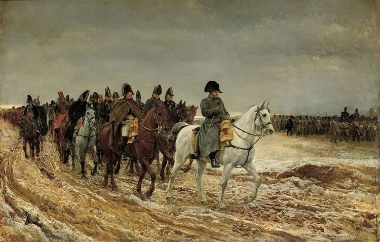
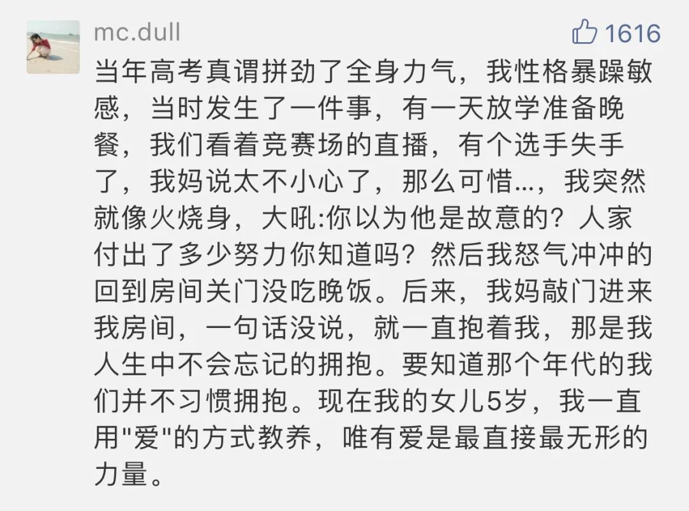

  

Ernest Meissonier，Napoleon and staff returning

  

无论领导有多少类型，对领导力有多少争论，有一个确定的事实是，人类从来需要领导。  

  

一般人对领导最大的偏见是：这事离我很远。为金融危机制订对策的总理；战胜了疫情的院士，他们才是领导，他们才需要了解领导力。他们不知道，自己就是领导。他们也应该掌握领导力，否则就当不好领导。

  

只要人与人产生关系的地方，就会出现领导，就有领导力。领导力是由领导及追随者共同完成的一种“引力”关系。所以，最应该了解领导力的，是普通人，是家长，而不是CEO和国家元首。

  

下面是一位母亲实践领导力的完美之作：

  

  

人们其实更爱当追随者，就像上文的孩子。因来自由与责任往往带来恐惧，追随者可以把这个恐惧转嫁给领导。追随者赋予领导权威地位，甚至将他们神化，比如在小朋友眼里，父母就是神。而神并不好当，神要解决一切问题。问题解决不了，领导者就会变成替罪羊，追随者将背叛他、羞辱他、甚至杀了他。  

  

世上的很多重要问题，是抗解的。它可能需要几年十几年才有答案；它可能永远存在——考试压力就会永远存在——你没有办法消除它。领导面对的，基本上是抗解问题，易解问题我自己会，不需要你领导。  

  

领导此时不能否定问题。上文的妈妈，可以以更凶态度压制女儿的情绪，这是许多拙劣家长（领导）的本能反应。压服了孩子（追随者），问题似乎消失了，一起消失的，还有孩子的能量，以及自己领导力的丧失。这是父母从神变成鬼的过程。

  

领导此时也不能假装有答案。好像你说一通套话，扯一些云里雾里的新名词，抗解问题就会迎刃而解。  

  

领导此时应该马上行动，行动的目的是消除恐惧，缓解焦虑。妈妈马上给情绪失控的女儿一个长久的拥抱，并没有直接对高考发表任何观点，也改变不了高考，但这个行动减少了追随者的恐惧与焦虑，完成了对追随者的赋能，增加了她的韧性，让她不在抗解问题的重压下绝望或不作为。领导力，更多体现在这种微小事件中，一句话，一个眼神，一次拥抱，激发追随者承担自己的责任。通过这种微小的积累，最后不知不觉解决了抗解问题。

  

无论你多么正确，如果事实是增加了恐惧与焦虑，那都是失败的领导，领导者与追随者的结局都不美妙。  

  

领导者很难当，你有双重挑战，你要先消除自己的恐惧与焦虑，再去消除追随者的恐惧与焦虑。但你真的爱追随者，感受得到他的痛苦与挣扎，又并不难当，就像一个妈妈，内心也害怕，但是本能地、坚定地给孩子一个长久的拥抱，就行了。如果再加上有意识培养与训练，领导力自然更加强大。

  

（上次解读了[《儿童心理学》](http://mp.weixin.qq.com/s?__biz=MjM5NDU0Mjk2MQ==&mid=2651637685&idx=1&sn=1bf899226075e34f3e73109eeb3d8fd8&chksm=bd7e43ab8a09cabdcfc4331bd8af31fb962b14a8e7c9ee6bfca349a439f3f39f33b85c88ed82&scene=21#wechat_redirect)，下次将为一对努力的父母解读《自闭症》）
