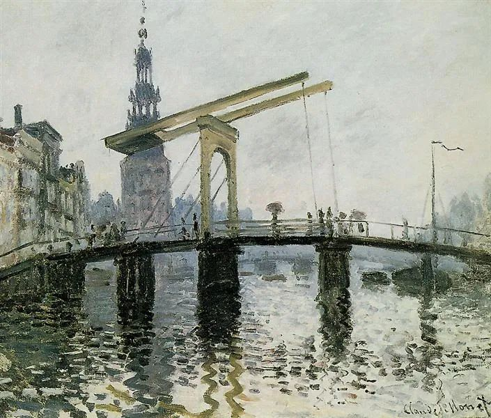

  

Claude Monet，The Bridge

  

美国取代欧洲，成为世界的老大，在大众的印象中，是二战后的事。  

  

早在1867年，二战发生还是70多年以后的事，欧洲还是世界的绝对中心。一个32岁的美国年轻人在欧洲漫游休假，他原是苏格兰人，13岁时随贫穷的家庭移民美国，19年之后，事业已经起步，有了自己的钢结构桥梁公司，买了一些油井，钢铁厂也在不停的改良中——这是他后来商业帝国的主要版图。

  

这个年轻人后来就是改变了美国面貌的钢铁大王安德鲁·卡内基。他在欧洲漫游，当然惊叹欧洲的风景、古迹与音乐，这个角度，与诗人，与其他游客无异。但他本能的企业家角度，预见了美国的崛起：欧洲大陆是安静不变的，美国却极其热闹，人们总在建设些什么。只有企业家会欣赏后者，其他人都不会，因为后者代表着更强大的生产力，从个人到国家，谁的生产力强大，谁的地位就提升，生产力最强大，就是老大。

  

一般人经过烧焦炉，只会快步离开，不美也不舒服。安德鲁·卡内基最著名的生产赞歌却产在烧焦炉边上：通常绿叶只可一片一片地冒出，若有人能将一片绿叶分成两片，那是多大的能耐！对社会的贡献有多大！这就是我们整个民族的重任所在。——请记住这句话，无论你在什么行业，朝阳行业也罢，夕阳行业也罢，有本事将一片绿叶分成两片，提升一倍生产力，你就是老大。给你再好的条件，你生产力弱化，两片绿叶变一片，你终将无足轻重。

  

没做过事情的人，不会有企业家思维，如果他又擅长抒情，那更糟糕，你通过他的眼睛看到的世界，可能是颠倒的。我们，我们的孩子，千万不能去当这种人，自我感动得半死，却对真实的世界一无所知。去做事，知道做事有多难，对生产力有真实的感知，才不会误读真实的信息，才不至于浪费一生。

  

之所以回忆100多年前的卡内基，那是因为在这特殊一年，从个人到公司，再到国家，将回归到最朴素的生产力竞争，某种程度上说，这是疫情迫使我们回到世界的本质，没有危机，没有匮乏，不知道生产力才是王道。一有危机，不少国家的居民就去抢空超市。最早发生的疫情的中国，面对最多未知，中国人的人性也没有更高明，但并没有听说抢购事件（除了有位不靠谱的专家引发的小规模抢购双黄连），那就是因为中国人本能上已经相信中国工厂、中国电商与中国快递的强大生产力。即使开始口罩短缺，也没有人认为会一直短缺。你经历的这事，不是小事，是生产力胜出的大事。

  

23日，政府得出结论，以武汉为主战场的全国本土疫情传播基本阻断。这说明，中国可以进入拼生产力的阶段了，只要生产力恢复，甚至增长，那就不会有困难。如果从民间到官方，还是恐慌与害怕，不敢恢复秩序，不敢工作，那防疫的成果就浪费了。现在把口岸管住，不让疫情输入，中国是世界上最安全的地方，开足马力生产，让市场的引擎轰鸣，一片绿叶迅速分成两片，才是当务之急。

  

疫情之后的中国，有两点要反思：一是对那些贡献生产力的企业家好一点，他们才是国之根本，减税降费相当于提升生产力，应该当成长期的国策，不能干杀鸡取卵的事；二是别再用纳税人的钱养一堆作家了，别以为养着他们就自然是你的吹鼓手，更大可能是享受你的待遇、福利与特权，还要搏一搏反体制的美名。自信一点嘛，做得好，正常人自然会夸你，正常人是多数。  

  

推荐：[在不完美中生存](http://mp.weixin.qq.com/s?__biz=MjM5NDU0Mjk2MQ==&mid=2651628775&idx=1&sn=b95c6ffdcfc33fca051ab6cdb3985375&chksm=bd7e20f98a09a9ef501d384cd30f6684fb6a7ac18495470b34655ebba7224aebdaca8eed9e54&scene=21#wechat_redirect)  

上文：[我最想要的命运礼物](http://mp.weixin.qq.com/s?__biz=MjM5NDU0Mjk2MQ==&mid=2651637977&idx=1&sn=0baa477c7fb983d221d1c69f79eb4fa6&chksm=bd7e4cc78a09c5d18981ea5328f3ddde675ad3e0a0e047b120e884a28534c61f2ecf2a600b68&scene=21#wechat_redirect)
