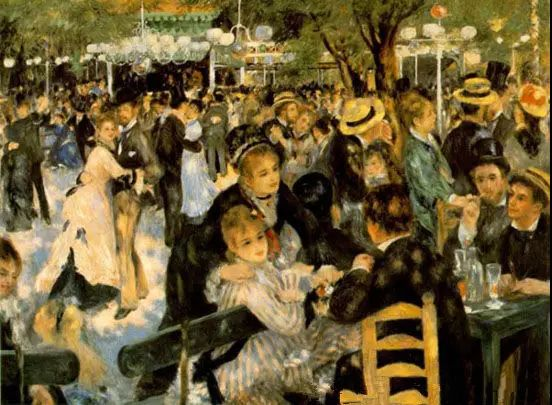

  

雷诺阿，红磨坊舞会

  

有人说，中国人本身的能量还没有释放出来，这个观察很对。  

  

中国是幸运的。它本身是一个规模达到14亿人的大市场；这14亿人又没有传统、语言、文字、理念、生活方式上的隔阂，他们识字率高（意味着学习能力强），喜爱世俗生活（意味着无法发动宗教对立与冲突）；市场内部运转阻力小，效率高。要知道，1804年，全球人口才达到10亿，1927年，全球人口不过20亿。14亿人的潜力自由释放，中国未来之好，是人无法想象的。

  

这几年，有两个政策的调整，有利于释放人的自由。

  

一是全面放开二胎，社会平稳接受，并没有一些专家期待的所有人都生二胎，他们很失望，但我却认为是好事，这说明人不是机器，按一个二胎开关，他一定多生产一个婴儿，人有自己的判断。正因为如此，我认为全面的生育自由很快会到来，也应该到来。

  

生育自由的重点并不是增加人口，而是自由，化解两个极端的人口恐慌。原来害怕人生太多，以为地球承受不了，所以强制人少生，现在有些人恐吓中国人会灭绝，又在怂恿公权力强制人多生。这两个极端是同一种无知，都是对自由的伤害。只要把生育自由还给人们，爱生的人多生，不爱生的人少生不生，生育率会保持动态的平衡，这样就不必控制人们和伤害人们，省下的能量，释放的自由，是社会的大福利，相当于人停止一个坏习惯，不做即获益。这是第一种自由红利。

  

第二个政策是终于拥抱城市化。

  

城市化是经济发展的结果，也是经济继续发展的引擎。很奇特的是，城市只要增加规模，就能得到好处，城市人口增加一倍，就能额外增加15%的收益。无论是从20万增加到40万，还是从200万增加到400万，城市发展史证明它是一个常数。城市人口增加一倍，工资、财富、教育、专利，等等，都额外增加15%，这是巨大的财富。原来有个不利后果是，疾病与犯罪率也会增加15%，但有趣的是，技术发展却改变了这点，至少中国如此，现在在中国的大城市犯罪，分分钟录下来，成功率太低了。而城市有更多医疗资源，对付疾病的能力也更强。

  

城市化的经济效应，只是其显性的好处。隐性的好处更大，它是人发展的熔炉，人的脑袋里有上百亿个大脑细胞，这些细胞间没有化学反应，那脑袋和石头一样。没有人与人足够的交流，大脑的能力体现不出来，交流得越多，新观念，新技术，新机会的刺激越多，人就越聪明。一个天资聪明的人，把他限制在小乡村，他了不起成为一个聪明的农夫，让他自由迁徙到城市，他可能就成了大企业家、大发明家，创造的价值大得多，甚至能够改变一个时代。人的出生地是不公平的，城市化可以消除这种不公平。

  

希望彻底的城市化早点到来，也就是中国人在城市间迁徙不受限制。大家凭能力竞争，凭税收贡献获得相应福利。不要害怕城市变得太大，每个人会自我调节，城市将进化成最合适的规模。人为将之限制住了，那是白白放弃发展机会。让城市自由发展、自由竞争，中国会出现一批先进城市。

  

全球的人才愿意来中国，中国有决心延揽全球人才，这都是值得自豪的事。但同时别忘了，中国本身就有巨大的人才库，给予他们同等的自由，从生育自由到迁徙自由，应给尽给，对外开放，对内更要开放，这样永远不愁缺人才。

  

推荐：[生育的正确理由是什么？](http://mp.weixin.qq.com/s?__biz=MjM5NDU0Mjk2MQ==&mid=2651625834&idx=1&sn=a9e23815803474bd1c842ce97914e89f&chksm=bd7e1d748a099462d8edd5e97d3fe2e9d8f062dbdcd1c6642081198021b7751b90fe931c3b62&scene=21#wechat_redirect)  

上文：[说说外国人永久居留权](http://mp.weixin.qq.com/s?__biz=MjM5NDU0Mjk2MQ==&mid=2651637630&idx=1&sn=9db8d6cb21f82a4de804f475a9f6fd5b&chksm=bd7e43608a09ca76454bb932118c7dd0ba65d6427612c61a31080cff12eaa647c355c872b43d&scene=21#wechat_redirect)
