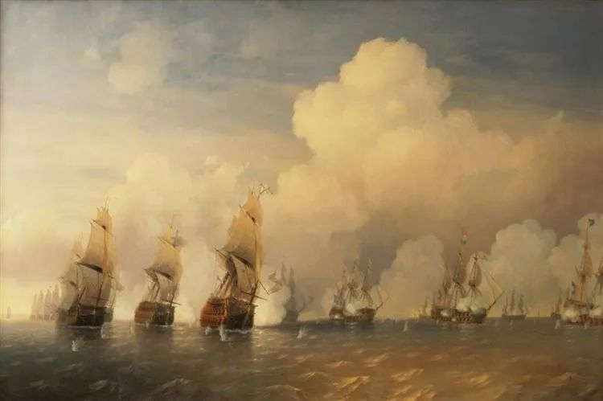

  

Alexey Bogolyubov，Battle

  

疫情会到什么时候？  

  

中国可能接近尾声了，我这几天出去吃饭，餐馆的上座率已经可观。公园里的人也多起来，湖边的垂钓者重新出现。这一切都是好事，那些熬到现在的企业，看得到希望了。但是，如你所知，中国以外的其他国家，疫情开始严重，这意味着，它们的经济要受影响，而中国的经济与它们紧密相关，要彻底复原，那得全球战胜疫情，或许到5月份。一年就这么走完近一半。

  

况且，还要考虑到，有些国家没有战胜疫情的手段，他们只能采取最传统原始的人类抗疫法，听之任之，适者生存。也就是说，全球是否战胜了疫情，最后也是笔糊涂账。社会复归正常，除了接受治疗，产生抗体，精神上更加坚韧也是一部分原因，不再害怕，因为持续的害怕只会把自己的生活与经济毁掉。

  

很多企业的目标，今年已不是盈利，而是生存。不过，一个合格的企业家并不会害怕这个困难，困难本来就是企业经营的一部分，就像疾病与疫情是人类生活的一部分，多不喜欢，它也存在。一有困难，就哭诉、乞怜、自我神圣、悲情营销、甚至要求他人捐款的企业家，我认为，在精神上是不及格的。企业家，就是精神更强大的人，这是没得商量的标准。

  

并不是有公司、有工厂才叫企业家，那些敢于做重大决定的、经历过大额交易的人，都属于企业家。大额交易的标准是什么？我认为一次的成交额至少达到他的年收入，这样市场的起伏才能形成足够的打击。是的，打击，一个人需要打击，市场一次下跌，账面上几个月收入就没了，这样的打击才够大。你不会盼望这种情形出现，在拳击比赛中，你不会盼望对手击中你的面部，但你知道，总会挨几拳，挨了得挺住。

  

有人看中了房子，看中了股票，房子股票品质都挺好，万事俱备，只欠交易。此时，市场突然不再那么一片光明，他就不敢交易了，一点点损失厌恶都会杀了他。巴菲特说，在别人恐惧中贪婪。人人都会说，做得到的人，永远只是精神强大的企业家。这强大的精神，不能靠天生，即使有先天因素，也只是一粒小种子，似有似无，没有后天足够的交易训练，不经历过打击，长不大。

  

你喜欢的东西，市场下跌你买不买？这就像问：你喜不喜欢打折？你当然喜欢。但是标的一大，大到至少你一年的收入，你反而害怕打折了，似乎要原价卖你，似乎要涨价卖你，你才开心。这种业余心态，将错过一切交易，涨了，他后悔没在未涨时行动，希望价格跌回来再买，真跌出机会，他又害怕不敢出手，价格忽然涨回去，他就开始新一轮后悔。

  

成熟的交易者，必然是坚定的，我的判断没问题，市场一定会回归公平的估值；他必然是乐观的，问题会有，但办法一定更多。要对自己的人生负责，要当好一家之主，人必须敢交易，必须坚定而乐观。  

  

推荐：[为何你的眼泪总是没用？](http://mp.weixin.qq.com/s?__biz=MjM5NDU0Mjk2MQ==&mid=2651624249&idx=1&sn=9ba15210d8446a9188dd21203badded0&chksm=bd7e17278a099e31ada2a5952a937454f6eec0abf5679e7a4438fbbca2953010215b756dbca5&scene=21#wechat_redirect)  

上文：[女人需要什么？](http://mp.weixin.qq.com/s?__biz=MjM5NDU0Mjk2MQ==&mid=2651637741&idx=1&sn=10a2c9341056048e12aeed01b3424e99&chksm=bd7e43f38a09cae5dd7a63dbe4606705fc3e36376156ac742e03ef0a01435677be32041cd7c7&scene=21#wechat_redirect)
