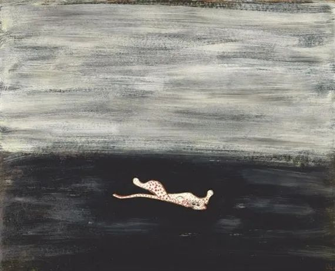
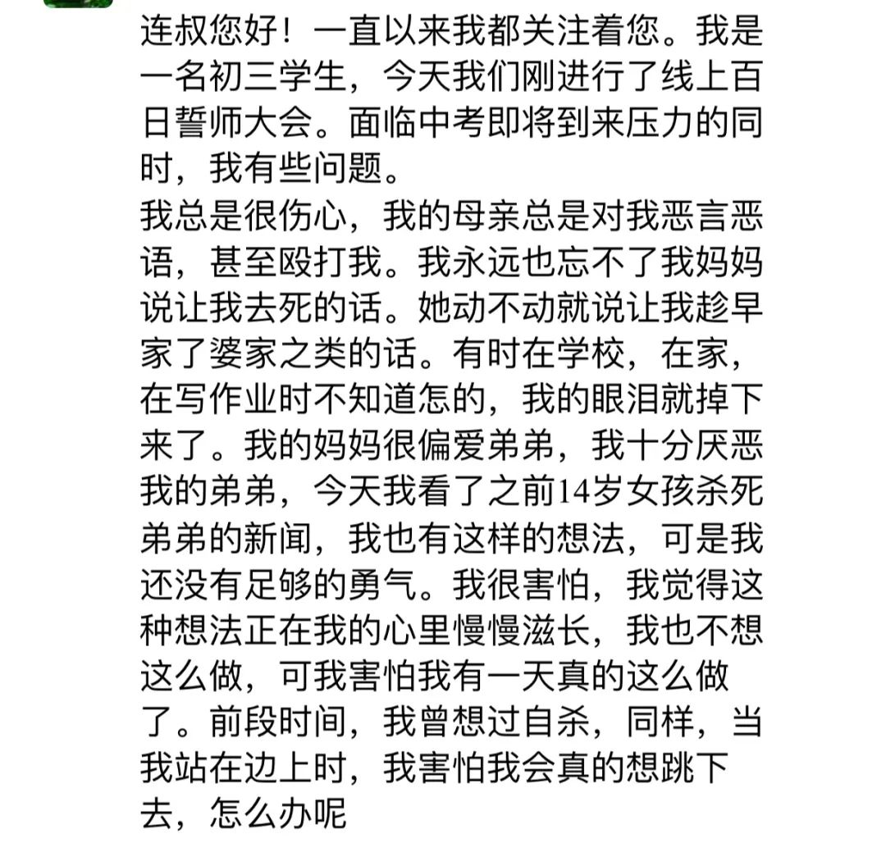

  

常玉，粉豹

  

  

  

  

小姑娘：

  

最近初三和高三的孩子，心理受疫情影响尤其大，本来就面临升学的关键时期，原有的节奏与习惯又一下全部打乱，内心的无名火更加狂乱，稍有刺激就容易发脾气，起恶念。

  

当我们碰到不喜欢的人，心里最原始的念头就是摧毁他。事实上，人类在很长时间里也是如此行事的，慢慢成熟，学会克制与合作，花了很长时间。这种心理进化也会在一个人身上重演一遍，青少年时，更残忍，容易做出伤害他人与伤害自己的事情。

  

真走极端的，当然不多，但是孩子会被这种心理吓坏，觉得自己是少有的坏人，终究会做出伤天害理的事。不会的，你将成长为一个善于合作的、快乐的成年人，时间问题。所以，下次恶念生起，你可以告诉自己，这只是青少年特有的软弱，过几年就消失了，我并不会变成一个坏人。

  

你了解自己这种心理发展过程，将来与你孩子的沟通，也大有帮助。你还是个孩子，这种设想你听来觉得可笑。其实想想可笑的事情，也能治愈。很多父母正是因为忘了成长的经历，或者他们至今无法理解当年的自己，他们与孩子的沟通才会有更多的障碍。他们甚至用青少年的方法对付青少年，变成恶性循环，我比孩子脾气更暴躁，情绪更容易失控，以让孩子顺从自己，从而让问题消失。当好父母，对他们来说，是过于艰难的任务，如果你知道这点（从今天开始，你当然知道了），你反而会对他们有些同情，当他们毫无来由地发脾气，语无伦次，那只是他们的软弱，比如让你“趁早嫁婆家”，翻译一下，就是“我很害怕你，我无法理解你”，她不是威胁你，而是在求饶。

  

我们的情绪，他人感觉得到。你快乐，你身边的人就放松，也会对你微笑，甚至开开玩笑。你不快乐，别人也觉得少惹你为妙，他们无形中建立一堵冷淡之墙。你的坏情绪越激烈，冷淡之墙越强大。

  

在“我他”关系中，我是主导者。你听过“言传不如身教”这句话，绝大多数人认为是说给父母听的，这没错，不过不全面，这话是说给所有人听的，包括孩子，包括你。我与他人建立关系，而我是主导者，那我希望得到什么，我就要用身体、用生活去展现什么，我希望得到爱，我就要展现爱。你看小婴儿，他们这点做得好，他们纯粹给人带来负担，吃喝拉撒都要人照顾，没人爱他，他活不了，为了得到爱，他们微笑卖萌，无保留地爱别人，他们主导建立了一个充满爱的关系。  

  

你要让别人爱你，最快的方法就是你爱自己。当然，爱自己不是自恋，自恋是脱离现实。爱自己可以通过专注于手头的工作实现，比如你读初三，专注于你的功课，不停提升自己的成绩，你会爱这个全力以赴的自己，这个“身教”又开始主导“我他”关系，你收到他人越来越多的爱。  

  

你现在很辛苦，但这辛苦的心理关过了，人生就不那么辛苦了。这一关大家都要过，你来得早一点，这既是不幸，也是幸运，过了就将不幸转化幸运。

  

祝开心。

  

连岳

  

推荐：[女人需要什么？](http://mp.weixin.qq.com/s?__biz=MjM5NDU0Mjk2MQ==&mid=2651637741&idx=1&sn=10a2c9341056048e12aeed01b3424e99&chksm=bd7e43f38a09cae5dd7a63dbe4606705fc3e36376156ac742e03ef0a01435677be32041cd7c7&scene=21#wechat_redirect)  

上文：[人不需要成为超人，人本身就是超人](http://mp.weixin.qq.com/s?__biz=MjM5NDU0Mjk2MQ==&mid=2651637838&idx=1&sn=404bfef34b7dc19c1aa26ea54d447091&chksm=bd7e4c508a09c54620c1d8ec4b1f8a083e8627bdc18fdf003409b6f4f52d1243b788c1eab7c8&scene=21#wechat_redirect)
