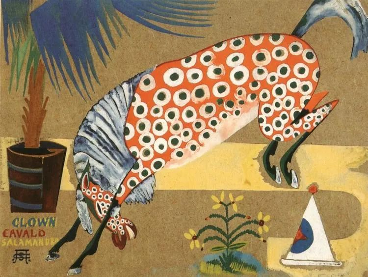

  

Amadeo de Souza-Cardoso

  

连岳叔叔：  

  

早上好！天天看你的公众号，对你很是钦佩，关注你以后，自己对待很多事情的看法都转变了，非常感谢！你相信吗？在这么长的假期以来，我居然会压力大的头疼。我不知道在毕业以后的几年里就这样的矛盾，这样的烦恼比上学时生活费只有十几块更加让人头疼。

  

第一个烦恼是工作，作为一名中学教师，这上岗的两年多我深感这份工作的辛苦与繁琐，我很喜欢孩子的纯真与善良可爱，可是我不喜欢琢磨教案，参加劳什子教科研活动，甚至发现很多教师的素质眼界也很低，看到同单位40岁的老师仿佛就看到了自己的未来，不乐于分享，无知，严厉的自私的自以为是的老师，还要对着十几岁的孩子生气，再加上脸上的几缕皱纹，想想就很可笑和可悲。因为是编制体制，让我对这份工作再三犹豫，不知道自己的理想，真是迷茫糊涂的人。

  

第二个烦恼是爱情，相亲屡屡失败，看到同学的结婚照片时，我那股柠檬精的酸味啊……一方面靠家庭背景普通，一方面是我自身平凡，加上教师工作岗位的接触人群少，年龄的红利让我焦急，我期待和他在大街上大方的牵手，相视一笑；在饭桌上，一起吃着美味可口的佳肴，抿一口红酒，起舞……

  

连岳，我要怎么样调整自己的心态呢？我很想哭，到山里，到小溪边没人的地方大哭一场，好好睡一觉。十分期待的得到你的指导，爱你！

  

Sunflower

  

* * *

  

Sunflower：

  

说到当老师，我可以说是你的前辈。1990年，我20岁时，毕业于一所师专（专门培养中学老师的专科学校），这就一直是我的最高学历。我知道现在当中学老师的门槛高得多，你应该比我当年强。我现在遇见年轻时的自己，甚至不会喜欢他，不算聪明，但却自以为是，脾气不好，也没多大耐心，常常不靠谱，总而言之，就是一身毛病的年轻人。我现在幸而能得到你的钦佩，那意味着，30年后的你，得到现在的你的钦佩，不是难事。未来在我们自己的掌握当中，并不是由我们不喜欢的人掌握。如果我们长成自己不喜欢的样子，那可能是我们其实喜欢那些我们不喜欢的人，亦步亦趋，责任并不在他们。

  

我教过4年书，虽然不在中学一线，但也知道教学确实辛苦与繁琐。在那么短的时间里，我也发现，老师这个职业其实是先苦后甜的，一个笨老师，只要他想，最后也能在学生眼里显得很聪明。一本教材，教第一遍，很辛苦。你重复几次，课堂里的学生永远是第一次学习，而你已经熟悉了一切情节，一遍遍精进后，不再是显得聪明，而是成了真聪明。

  

其实人生都是先苦后甜的，积累自己身资本的过程，是苦的。这个资本不仅指金钱，还有你的健康，你的能力，你的信用，你的稳定性，微小累加到一定量后，有了复利，今天的一天相当于过去的一年，甜就多了。这过程谁都无法略过，皇太子与富二代，他们也得靠自己长出让他人钦佩的品质与成就，继承的基业才能长青。

  

爱情在你的想像中，“相视一笑”“抿一口红酒”。你想得对，但不够，相爱的两人，酒量又好，经常一次喝一两瓶红酒，积累得不够的话，酒钱都能让爱情破产。维护爱情，让自己爱的人活得体面一点，自在一点，背后也是辛苦与繁琐。

  

让你现在厌烦的辛苦与繁琐，没人会喜欢，尤其是年轻人，总以为下一份工作是快乐而轻松的。辛苦与繁琐其实是逃不掉的，越早知道这点，人生越容易幸福。我就是因为在30岁时想清楚这点，才开始认真生活。如果有来生，又能向命运要一件礼物，我希望能在13岁时开始接受辛苦与繁琐。当然，能在30岁时想清楚，已是幸运，我不应要求更多，因为太多人一辈子都想不清楚，他们牢骚满腹，敷衍了事，总是窃喜自己可以偷懒、占便宜，他们不知道，那其实是命运在凌迟他们，一刀一刀，割肉离骨。

  

无论我们做什么，你教书，我写作，这一行必然有的辛苦与繁琐，早做多做，就是建立竞争力的过程，尤其是我们的同行迟做不做，那是追不上我们的。琢磨教案，持续教研，认真教学，就是教师这行必然有的辛苦与繁琐，你要早做多做。这甚至与你爱情相关，这气质，会贯穿你一切言行，你是负责耐烦的老师，体现出来的可爱值就高。教学马虎，误人子弟，别人也有理由推定，你不太可能经营得好爱情与家庭，怎么会愿意和你相视一笑抿红酒？

  

即使我们明天就改行，还是得把今天份的“辛苦与繁琐”做好，这是我们的立身之本。我写完了今天的文章，你也要做好今天的工作。

  

祝开心。

  

连岳  

  

推荐：[想杀弟弟的姐姐，青少年心理那一难关](http://mp.weixin.qq.com/s?__biz=MjM5NDU0Mjk2MQ==&mid=2651637859&idx=1&sn=5fbf9af65be3a887ffdeb5b874271599&chksm=bd7e4c7d8a09c56bf9c5ea86bf036036125efefd2495c6f73d02ff7109606d284dd46b05242c&scene=21#wechat_redirect)  

上文：[足轻重的小事](http://mp.weixin.qq.com/s?__biz=MjM5NDU0Mjk2MQ==&mid=2651637963&idx=1&sn=642f98efe9e083b32ebc5248c172f524&chksm=bd7e4cd58a09c5c3916d94c1ae6599bf1b48fd184899a726fad5c9751ec938b74f7bf09e67c1&scene=21#wechat_redirect)
