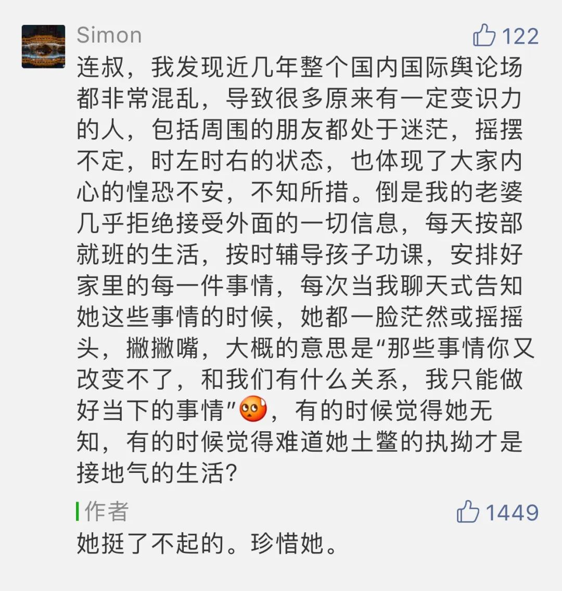

  

Vincent van Gogh，Wheat Field With A Lark

  

我们拥有的一切，都是有限的，时间、精力、金钱、情感。  

  

而向我们索取的，却是无限的，再富的人，不加选择地施舍，也会很快耗尽财产。

  

多数人人生开局，拥有的资源是差不多的，尤其是时间，更是平等，大家活个平均寿命而已，但最后的差距很大，人与人的距离是世界上最远的距离。其中原因，就在于每个人分配自己资源的水平不同，其中最核心的、最基本的就是分配时间资源，时间资源分配得好，产出就高，所得就多。

  

达尔文好像说过一句话：浪费时间的人不理解进化论。这句话即使不是他说的，我也觉得特别好。进化怎么能够浪费自己最宝贵的资源？

  

但是，我们可能完全不知道自己有没有浪费时间。因为可能不知道自己做的事情是否重要。存在这种现象，一个非常勤奋的人，因为做的是一件错误的事，他越勤奋，浪费的时间越多。

  

安德鲁·卡内基刚进入钢铁业时，发现一个奇怪的现象：他的同行们完全凭感觉猜测自己今年是否能够赚钱，有些以为能赚钱的，最后亏了，有些以为亏本的，却赚了。于是要求每道工序测算成本，在业内第一次高薪聘请化学家精确算出原料比例，这些举动都不被同行理解，钢铁厂有化学家，躲在实验室拿高薪，更被视为荒唐的浪费。结果却是别人不要的贫矿，卡内基才知道是富矿，别人浪费的资源，给卡内基创造了丰厚的利润。这又让他有扩大生产规模的实力。生产力从量到质，都碾压同行，不得不成了钢铁大王。

  

一个行业的王者，并非是最早进入的人，而是进化得最快的人。

  

卡内基的成本控制，科学测算，对现代工业来说，是必须做的常识。但在我们具体的生活中，还是很难的技术，甚至很多人并无这个意识，做的事，是对是错？即使对，那对多少？值不值得投入？有人靠猜，有人靠吹。同样的事情，会有完全不同的判断。一个男人不养家，天天喝喝酒，吹吹牛，他在哪里，人家都瞧不起。但是同样的行为，灌完大酒，吹牛的内容如果换成了社会良心，民主自由，寄生虫却能自我感动起来，以为喝醉都是为了苍生。

  

人是非常容易自我欺骗的，自我欺骗的人又偏爱大话题，因为无需成本控制，也无考核标准，全凭我说了算。存心当骗子混饭吃的人，不在我们讨论范畴，一个有点责任心的人，一个正经人，得警惕大话题，为防止这个大坑，我们得格外尊重那些能日复一日把小事做好的人，就像下面这位妻子：

  

  

世界无论怎么变，立足点都是些坚实的小事。回首这次中国防疫，仿佛经历了世界大战（它的意义可能也并不输给二战），巨大的事，但在这个过程中，正经人做的，也仍然是努力工作、照顾好家人、安慰恐惧与悲伤的人、赞美一线的防疫勇士。做好这些小事，保障正常生活，都带来安定、温暖和希望，就像卡内基伟大工厂里的每道工序都在产生利润，汇总起来，正是中国人这次度过疫情危机的大事件。

  

理念之争，可以吵个没完，争几百上千年，往往也变成意气之争，堕落成流氓骂街，而人只有短短的一生，浪费不起，那些能把小事做好的人，照顾好自己家庭的人，才把人生用在了正当的地方。先做好这个小事吧，像上文那个妻子一样，任你八风吹，我只坚定地把家人照顾好。

  

推荐：[我最喜欢谁的意见？](http://mp.weixin.qq.com/s?__biz=MjM5NDU0Mjk2MQ==&mid=2651638068&idx=1&sn=ea0d37e928a0300ef85d0ca1cc70ca18&chksm=bd7e4d2a8a09c43c09ebce22e5694eb2acb7b065ca7ef6b076f7ad79af5380d0e5617de39690&scene=21#wechat_redirect)  

上文：[人是复杂的，在这人性上升级](http://mp.weixin.qq.com/s?__biz=MjM5NDU0Mjk2MQ==&mid=2651638097&idx=1&sn=95df42780081cb1fe4d3caa9355bc3b0&chksm=bd7e4d4f8a09c459c27009c6c03dad10c3e3930fb53e9ab528b7b0bab0f55a12cb0c68e53afd&scene=21#wechat_redirect)
