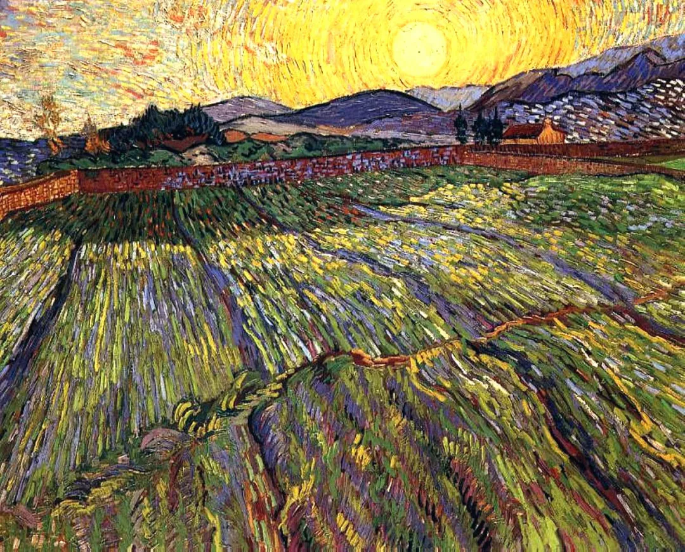

  

Vincent van Gogh，Wheat rising sun

  

面对疫情，各国政府经济上的应对是预料之中的，大幅增加货币供给，也就是大放水。  

  

任何一次经济危机，这都是政府必然的应对。在这点上，各国政府高度一致，比防疫更齐心。如果有政府声称自己不放水，那是因为危机不够大。只要危机够大，则一定会放水。

  

经济危机的产生，有各种原因，有些由意外引发，比如这次疫情。有些就是市场竞争的必然，不停淘汰那些低效的、错配资源的、甚至是不走运的失败者，微观层面上，繁荣期也天天有企业倒闭，只不过不会引起公众的恐慌。只要公众恐慌了，他们就认定政府应该放水。那还能怎么办，顺应民意呗。无论你是哪个经济派别，不管你同不同意，事情就这么发生了。

  

如果企业的财务不健康，产品与服务没有竞争力，放水只不过延缓它的死亡，它还是会死的。所以，我们要倒回来想，要生存下去，自己的产品与服务就要有竞争力，财务要健康，越是经济危机，生存的关键因素就越在自己身上。任何人都是企业家，因为你的家本质上就像企业一样运行，再大的危机，只要你保有工作与现金流，都不是事，甚至有利于你，这时候你才有能力去增持那些优质资产，你的一些竞争者被淘汰了。

  

前几天，有位武汉的读者对我说了件事，她的老板打电话让她去公司紧急处理一件事，她说，我不去，一是没有公共交通，自己的电瓶车又正在充电，走路要花一个小时，可是天气又太冷；再说了，那个原本也不是自己份内的工作。她还挺开心，意思是自己学会了拒绝。只是老板的反应不是很开心，在电话里放下一句话：你看着办吧。但愿她还能保住自己的工作，因为这个老板看起来心还比较软，多数老板的反应应该是：你以后都不要来了。

  

如果同样的事情发生在你身上，你要知道，这是你的机会，条件越是不够，越要想办法完成。疫情期间，常规的经营秩序被扰乱，你可能会临时指派去处理其他事务，此时你展现出来的责任与能力，不仅能让你保住工作，将来一定会有报酬的，目光长远一点。

  

在疫情期间，尤其需要目光长远，至少要远过疫情，这样就不会被短期的波动折磨，危机，对别人来说是危险，对你来说是机会。有句玩笑话说，投资者更爱国。这其实经得起分析，投资就是断定未来回报丰厚，不在乎短期起伏，你不爱一个地方，看衰它，怎么可能真金白银搞投资？你最多心惊胆战短线投机，一有风吹草动就走人。

  

经济危机时，最好的投资是什么？优质的不动产，因为它供给最有限，最好的船最受益于放水。如果你符合这些条件，可以加紧行动：一、你保得住自己的工作（企业）；二、你的标杆率不高，财务处于安全状态；三、你相信中国的竞争力，认为它未来更好。

  

美国的上升期成就了巴菲特，他坚信做空美国是发不了财的。中国的投资者面临最根本的判断：中国是不是处于上升期？答案为否，认为中国什么都烂，越来越烂，那不可能投资，你自然会投资你喜欢的国家；答案为是，认为中国现在即使有不少烂事，却会越来越好，你才可能投得下去。

  

当然，我认为中国处于上升期。愿意用这生押注。

  

推荐：[贩卖焦虑的人那么多，你更不要过分焦虑](http://mp.weixin.qq.com/s?__biz=MjM5NDU0Mjk2MQ==&mid=2651630207&idx=1&sn=5c00609d36ef842da979beb363d44649&chksm=bd7e2e618a09a777afcbd73968e5097bd65ad62d87832a99b914fea54a778f7bed01e8c0d748&scene=21#wechat_redirect)

上文：[把人生用在正当的地方](http://mp.weixin.qq.com/s?__biz=MjM5NDU0Mjk2MQ==&mid=2651638114&idx=1&sn=38b6077b8ea06439a461947115684c9f&chksm=bd7e4d7c8a09c46af366247e00417a67dacb3fcf3291bb18f8ab32681a17fab86cfb849fc847&scene=21#wechat_redirect)
