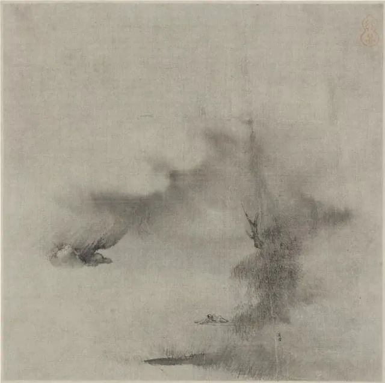

  

梁楷，柳溪卧笛图

  

昨天意外上了微博热搜，非我所愿。

  

昨天文章推送完10分钟左右，连太在书房门口探头问我：有人骂你吧？我说，这样稀松平常的文章，有什么可骂的？评论里有位读者提醒我可能被骂，我也回复说不至于。

  

之后阅读读者评论，精选了几十条之后，就去处理其他事务了（我每天挺忙的）。中午小睡醒来，见好朋友发的微信：你今天被公知群起攻击了。我也没当回事，被攻击也不新鲜。几个月我关于香港的文章，公知就有一波暴风骤雨攻击。

  

下午继续阅读读者评论，才知道上了微博热搜，许久不用微博的我后知后觉了。决定不用微博并不是微博不好，而是我觉得那种碎片式的、剧烈情绪起伏的信息短线市场并不适合我。影响心情，浪费时间的感觉强烈后，自然而然就不用了。

  

既然上了热搜，我就说说自己的想法。  

  

一、我现在很善意，因为世界对我很善意。我生活幸福富足，作为一个自由职业者、小老板，我当然可以说，我最应该感谢自己，照样可以怼天怼地。但客观一点，个人的努力固然重要，没有时代的潮水也成不了事。大到改革开放，中到我生活的厦门有深厚的商业传统，小到好朋友们的帮衬，这些都不是我个人努力就有的。  

  

我成为一个多善意，不焦虑的人，那就是必然。正因为如此，我又得到了更多的善意。我自己活得滋润，却老要想着世界的坏，那太虚伪了，我做不到。  

  

二、我对自己的能量有了真实的认识。年轻时以为自己能改变世界，那是犯了年轻人都会犯的错误。我今年50岁了，知道改变世界的是牛顿、达尔文，是老子、孔子，是邓小平、撒切尔夫人，是爱迪生、乔布斯，是马云、任正非，是钟南山，张文宏。不是我。

  

这么想当然不是为了无所作为，而是明确自己能做些什么。我能把家人照顾好；我得把员工照顾好，公司在经济萧条时也要健康；我还必须让我的读者有所得，他们看了我的文章后，心态与生活变得更好。这几件事，我努力，是可以做到的。

  

三、我认为中国这次防疫，从政府到民间，都很出色。当然不是100分，尤其是面对全新病毒，谁能100分？现在有各国政府的防疫对比，中国一点不输，前几天英国想采取放任感染的新招术，现在也改变了，吸取了中国的经验与办法。我认为做得好，当然不认可那些哭天抢地、深挖痛骂，你要做是你的权利，要我附和你，那没门。

  

四、有人说，中国虽然防疫做得好，但中国没有民主！所以必须批。这话对民主控有用，我年轻时是民主控，可惜我现在不是了，感谢奥地利经济学派诸位先贤大哲，让我完成了这个转变。

  

请注意我接下来说的话，这才是有资格被骂上热搜的：民主并不是更好的体制，它是更坏的体制，它对市场经济、契约精神、对自立自强的高尚品格，都造成持久的、制度性的伤害。一个释放了更多市场的体制，就是更好的。中国的体制并不会比美国更不爱市场，甚至更爱，当然可以做得更好，这是后话。

  

一个喜好市场的君主制国家，好过一个民主国家。柏拉图的话是对的，喜好民主并非雅典的光荣，而是雅典的堕落。中国真搞起欧美那种民主，也将堕落。

  

你追求什么都是你的权利，包括你追求民主，但我对民主持如此负面的看法，我就不会觉得欠你什么，你追求一个让世界变糟的事，不嘲笑你已经是最大善意，欠你什么呢？

  

我说完了。我今天倒还真想上上热搜。

  

推荐：[说说香港，都该醒醒了](http://mp.weixin.qq.com/s?__biz=MjM5NDU0Mjk2MQ==&mid=2651636048&idx=1&sn=fe8779a5b2f38c138259ce47c814387e&chksm=bd7e454e8a09cc58575cc49f036f847b11f044195e497abeebf2d1d3058c1dbeed72a30d6923&scene=21#wechat_redirect)  

上文：[尤其今年，从个人到国家，生产力竞争才是一切](http://mp.weixin.qq.com/s?__biz=MjM5NDU0Mjk2MQ==&mid=2651638016&idx=1&sn=f5ac1f43613091895b4f8e3eec79bd60&chksm=bd7e4d1e8a09c408fd7393a4a04e9a24ede85274381eb10ebf3286c8b78c96213a633646510a&scene=21#wechat_redirect)
