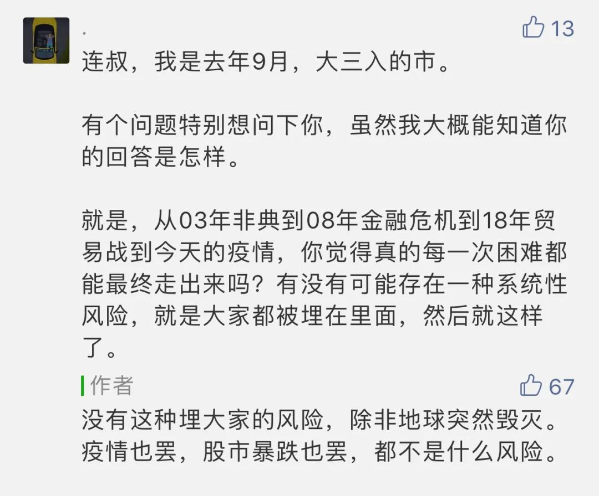

  

马远，寒江独钓图  

  

这几天全球股市，如果它是一个人，那精神极度不正常，一下抑郁到极点，一下躁狂到极点。  

  

周一美股触发熔断，欧洲股市也录得2008年金融危机以来最大跌幅。全球已经一体化，彼此影响，谁也无法独善其身，一个坏消息出现，全球所有市场必受影响。

  

昨天早上，有位读者提出一个经典问题：

  

  

是的，每一次危机都能走出来，走出来后都会发现是小事。

  

这个结论非常容易证明：如果每一个市场的暴跌都得引发其他市场的暴跌，美国跌完欧洲跌，欧洲跌完亚洲跌，亚洲跌完美国又要开盘了。那么，就会无穷跌下去，全球股市很快就会跌得趋近于零市值。这显然是不可能的。暴跌的连锁反应必然会在某处中止。

  

昨天中国股市开盘，果然下跌，一度跌1.26%，投资者垂头丧气。但随着领导人视察武汉的消息公布，这意味着中国疫情基本结束，要拼经济了，市场开始反转，全天最后涨1.82%，投资者又变得眉开眼笑。周二美国股市在周一的抑郁之后变得躁狂，道指暴涨1200点，或4.89%。

  

你说，一天之内，或者两天之内，真实的经济能有这么大的起伏吗？股市的起伏其实是人心态的起伏，是百倍千倍放大后的贪婪与恐惧。所以，它并不适合普通人投资，人的心理很难承受这种震荡，理性迅速消失，抑郁时抛售，躁狂时追进，交易又极其容易，重复几次，本金亏光。杠杆率高，借钱炒股，一天之内破产不是新鲜事。很多无法接受房价可能下跌的人（主要是男人），拒绝买房，却在股市里亏得不亦乐乎，这足以说明人是多么的非理性。

  

投资史证明，危机都不是什么事，理性的人必须知道这个事实。

  

1918年西班牙流感，全球三分之一人口感染，死了1000万人，出乎意料的是，股市涨幅可观。  

  

1963年肯尼迪总统遇刺，它给一代美国人带去心理阴影，标准普尔500指数在刺杀事件当天（11月22日）下跌2.7%，而第二天，残忍地上涨了4.5%，牛市继续。

  

新冠疫情，和上面的事比，小儿科。

  

资本最理性、最冷静，只要经济持续增长，什么危机都是小事，暂时影响几天行情而已。欧洲史上最有名的投资家，罗斯柴尔德的名言是：当街上血流成河时，才是该买入的时候。说得有点夸张，但是想想看，毁灭性的二战也无法阻止人类的经济继续向好，你就知道，人类的知识无限增长，已经打开了经济无限增长的可能，没什么危机能阻止这点，除了地球爆炸。

  

在地球爆炸之前，人类如果掌握了星际移民的知识，那么，地球爆炸都不是什么大事。

  

推荐：[今天的股市与未来的经济](http://mp.weixin.qq.com/s?__biz=MjM5NDU0Mjk2MQ==&mid=2651637234&idx=1&sn=ad20e268fbd535fe3f48513746b5a395&chksm=bd7e41ec8a09c8fa6cadbd389ab42ddfa97873d1dc699f83e48baf01eb2e078c591244602a93&scene=21#wechat_redirect)  

上文：[我更理解特朗普的焦虑了](http://mp.weixin.qq.com/s?__biz=MjM5NDU0Mjk2MQ==&mid=2651637769&idx=1&sn=f2e1572cd99837ae937f56707ff30040&chksm=bd7e4c178a09c5018f9542a82d545792f46577296046412e6c4b2671b8fc1475b7a652b54c3c&scene=21#wechat_redirect)
