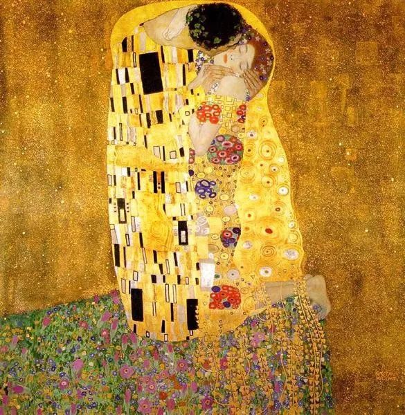

克里姆特，吻

  

连叔好：  

  

我是一个即将步入而立之年的男生，不知道是幸与不幸，我恰好也喜欢男生。与所有到了这个年纪被催婚的异性恋一样，因为疫情被困家中的这段时间，成了他们逼迫相亲的绝佳时机。

  

父母都来自农村，受到的教育也有限，我又是独生子，所以我向他们出柜的勇气几乎为零，也万万不会为了做自己，使他们陷入绝望伤心的境地。于是，摆在我面前的只有两条路：

  

一、坚称自己不打算结婚，一个人可以过得很好。这当然也同样会令他们担心、无助，甚至有一部分的伤心是因为他们自己（没有孙子可以抱）。

  

二、找一个lesbian形婚，但这是我目前无暇顾及的事情，因为我还没有找到我的灵魂伴侣。更别提后续的许多麻烦事。

  

无论走哪条路，即将三十的我都觉得身心俱疲，陷入无法走出的困境。很想知道，无法出柜的同性恋还能有其他的选择吗？

  

此致，

  

祝您一切顺遂。

  

盖茨比

  

* * *

  

盖茨比：

  

很开心看到你的底线是不想伤害任何人。不想伤害父母，也不想伤害自己。有这底线，人生犯大错的可能性小很多。很多人具有不伤害他人的善良，但没有不伤害自己的坚强，最后往往选择伤害自己讨好他人，放弃自己的观点、放弃自己的利益、甚至是人生，这样的一生，没什么意思，相当于没有存在过。

  

我们坚持自己的观点，认为那样才能更好地解释世界，并让自己活得更好，是不是为了说服别人？表面上是，别人认同我们，这让我们得到满足。但本质上并不是，我坚持，因为那才是我自己，这就像猪肉罐头，必须是猪肉，换成牛肉，也是罐头，也有肉，但它就是另一种东西。我要馒头，你硬给包子，说都是面点，还加了馅，可我也会生气。

  

我坚持自己的观点，并押上自己的一生，得之我幸，失之我命。这才是对自己的观点负责，这样负责的人，也会顺带造福身边的人，至少不让人反感吧。只有软弱的人，才会不停地强迫他人和自己一样。

  

同性恋，无论它是观点还是偏好，是先天还是后天，都不重要，重要的是，那最合适你。在中国，同性恋至少不会受到迫害，社会的包容度挺不错了。中国是个世俗社会，没有宗教极端力量，有这个好处。这时候要避免少数的矫情，我是少数，所以大家要更关心我，更爱护我，让我活得好一点。没什么人是容易的，多数的异性恋就容易吗？一样很辛苦的。

  

你认识到父母的认知极限，不用自己的性向去震撼他们，并想极力满足他们对传统家庭模式的想象。这个选择温暖且务实。但这就意味着你必须接受更麻烦的生活，找一位女同形婚——毫无疑问，这也是婚姻，婚姻就是契约——这婚姻可缓解两对家长的焦虑，也可让你们逃脱逼婚的压力；在现有的法律限制下，有了婚纸这张法律文件，更容易有孩子，真喜欢孩子，会接受抱养的，爱与血缘并无必然联系。

  

这样一通复杂的操作，不伤害所有关心你的人，就是麻烦一点。不过，也得为异性恋一辩，我们的婚姻也有大把麻烦事，任何一种类型的爱，都很麻烦，爱增加生活的变量，复杂度呈几何级数增长，怎能不麻烦？

  

认为爱只有欢愉，没有麻烦，那是对爱的大误解，用这种误解去追求爱，必然成为逃避者，最后伤害爱。爱上一个人，随之而来的就是麻烦事，房子麻烦，挣钱麻烦，家务麻烦，孩子麻烦，双方老人麻烦；你不想麻烦，则对方只能更麻烦。

  

你化名“盖茨比”，想必也读过最伟大的（爱情）小说《了不起的盖茨比》（我对这部小说的评价，可参阅今天文末的推荐文章）。穷小子盖茨比的爱情观就是不怕麻烦，爱上了富家女黛西，那没什么可说的，去挣大钱，大到征服纸醉金迷的纽约。盖茨比的麻烦难度，可比你的形婚大多了。

  

不怕麻烦，去当自己爱人的盖茨比，这才是爱应该有的勇气。

  

祝开心。

  

连岳

  

推荐：[我爱你，但你不许屈就我](http://mp.weixin.qq.com/s?__biz=MjM5NDU0Mjk2MQ==&mid=2651635089&idx=1&sn=4d0e7e3b45b9c3d4da51048d4c1699b7&chksm=bd7e398f8a09b099e816d6ec4476d1bb9ee2dd15555987b676d21e259fefd5d98df220af4be8&scene=21#wechat_redirect)  

上文：[不鸟](http://mp.weixin.qq.com/s?__biz=MjM5NDU0Mjk2MQ==&mid=2651637595&idx=1&sn=a2f16783598d3e09439a3bf494440050&chksm=bd7e43458a09ca533314950f621bfcfb2f9a1541da44ca4c45a07a893dda37343a92bce50dff&scene=21#wechat_redirect)
