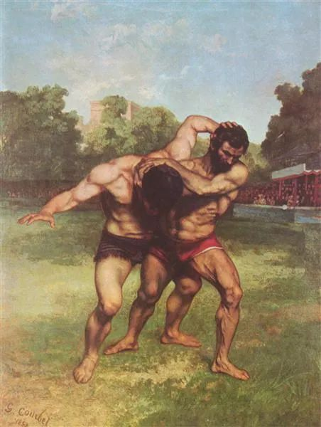

  

Gustave Courbet，The Wrestlers

  

科比曾谈过如何教育女儿，我觉得很有价值。  

  

大意是他对女儿说，你要当猎豹，不要当羚羊。

  

女儿说，我想当羚羊。——可能更多的小朋友，尤其是小姑娘，更喜欢羚羊，它们温柔、美丽、惹人怜爱。

  

科比说，那好吧，不过，我希望你当那只跑得最快的羚羊。

  

作为一个好胜的杰出球员，科比知道世界的本质是优胜劣汰，适者生存，他也有勇气接受这点。这是理性的，它唯一的缺点就是不好听，显得太冷酷，所以聪明一点的人，都不太愿意直接说出这个观点，以避免受到攻击。他们自己一定会按这个原则行事，无论命运安排他们当猎豹还是当羚羊，他们都尽力跑得最快，跑得最快的猎豹才能抓住羚羊，跑得最快的羚羊猎豹才抓不住。

  

更多人的思维是感性的，受不了羚羊被捕食的场景，尤其是这个场景有特写、展示丰富的细节、慢放、再加上悲情的背景音乐，他们就认为猎豹是邪恶的，进化论无法接受。

  

一个人成长的过程，一个人慢慢了解世界的本质，就是从感性走到理性的过程，在它们之间取得平衡，没有感性，人是机器，没有理性，人是低等动物，这都不是幸福的生活。

  

感性与理性的平衡，更多地体现为抑制感性，因为人不缺感性，人对信息的第一反应就是感性，理性的思考链条长一点，辛苦一点，理性反而需要激发。

  

羚羊被猎豹吃掉很可怜，没有一只羚羊应该被猎豹吃掉，这是感性。如果这样的话，那么猎豹全得饿死，很可怜，这个推理就是理性。感性与理性平衡的结论是：我们不应该擅自打扰这个生存竞争，跑得最慢的羚羊被跑得最快的猎豹吃掉，这是自然运转的正常现象，我们看了于心不忍，但它是正常的，无解的，只能接受。

  

人每天也在接受挑战，我们也像猎豹一样辛苦，像羚羊一样无助。我们做的一切努力，都是在这挑战中生存。我们锻炼，控制体形，那是知道，疾病时时在攻击免疫系统，如果太衰弱，一次轻微的感冒就能夺走生命。我们努力工作、储蓄、维持现金流、理性投资，那是知道，经济会有黑天鹅，可能出乎意料地剧烈波动，财务不健康的人，在那个时刻就会破产。

  

有人说得好，我愿意去同情那些失败者，虽然这同情也没什么用，只是让我自己感觉好些，可是，我绝对不允许自己沦为被人同情。这想法挺好，同情别人不是为了换取对自己的同情，对自己严厉一点，别那么多愁善感，尽力跑快一点就是了。

  

推荐：[工作难找，工作也好找](http://mp.weixin.qq.com/s?__biz=MjM5NDU0Mjk2MQ==&mid=2651632066&idx=1&sn=34ee5c348a5e671628cd735613fcbd6d&chksm=bd7e35dc8a09bcca382e0b2db0432a3934c31109aac2082c85836808636767f1e3127f9be16a&scene=21#wechat_redirect)  

上文：[是的，我们每一次危机都能走出来](http://mp.weixin.qq.com/s?__biz=MjM5NDU0Mjk2MQ==&mid=2651637793&idx=1&sn=9e7e44f878d83f33a0178e3faae0dbe9&chksm=bd7e4c3f8a09c529dfa3446bd079d95f682dce003aba978cafca0f52aed3b34fdb5780c40670&scene=21#wechat_redirect)
