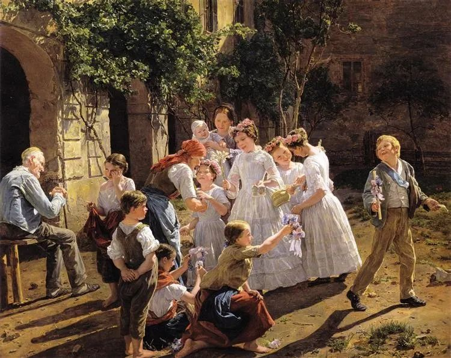

  

Ferdinand Georg Waldmüller，Morning

  

疫情就要结束，生活必须正常。对我们来说，体现的一点就是恢复阅读长征。今天来解读乌莎·戈斯瓦米（Usha Goswami）教授的《儿童心理学》。  

  

心理学最令人着迷，可以说无人不喜欢。这很好理解，因为我们都想了解自己，我们复杂得让自己感到迷惑。我们心理保有无限能量，可又时时跳出来阻拦自己。我们是自己的密友，我们也是自己的死敌。

  

传统的心理学著作，比如我推荐过的卡耐基的《人性的弱点》、勒庞的《乌合之众》，你也可以说它们是哲学书，是文学书，他们凭借自己过人的感受、观察与描述能力，将人人心里有的隐秘想法写出来了，相当有价值。我就一直认为，我青少年时期读到《人性的弱点》，是我成长的一个关键，用乌莎·戈斯瓦米教授的话来说，我理解了世界是可以“善意归因”的，用善意对待人的弱点，自己的及他人的，一个更温暖的世界就徐徐展开。

  

但这些杰作并不是科学著作，心理学长期以来，也不被认为是科学。正如你所见，目前在这个领域，也有非常多怪力乱神打着心理学的旗号，它们往往很有诱惑力，似乎给你一个概念，万能钥匙一般，你就可以解锁人类的所有心理。这可迎合人的偷懒心理，瞬间生产无数“心理学家”，但也让心理学蒙污。

  

乌莎·戈斯瓦米教授的《儿童心理学》，是一部科学著作，里面没有感人的故事，没有深刻的警句。但我向你保证，它很感人，很深刻，只不过，它是用科学方法描述出来的。借助新的技术手段，比如脑成像方法，比如通过测试唾液中的肾上腺皮质醇发现压力的高低，可以确定因果关系，结论也可重复，可检测。儿童是不是天生有同情心？卡耐基用感人的故事告诉你有，但乌莎·戈斯瓦米记录的实验，却用科学方法证明这点，看了更信服，你若不信，当然可以自己重复这个实验去验证。

  

《儿童心理学》记录了一个又一个高明的实验，叹为观止。实验设置是非常难的，比如如何证明儿童有无天生的种族偏见？心理学家就找到了办法。我和连太喝茶时，很多时候也在各自看书，她听到我对这本书最多的、最单调的评价就是：这真是一本宝藏书！每看到一个聪明精巧的实验，我都忍不住赞叹：宝藏啊宝藏。其中的每一个实验结论，都可以演化成一部著作的主题。

  

你看这本书里，千万不要只看结论，跳过实验的描述部分，那才是精华，是大乐趣。即使你刚开始不习惯这本书，也要强迫自己习惯。这本书会为你带来许多新方法、新观察、新技术，当然，它们都会变成新词汇。心理的健康发展，前提是大脑有足够的输入，美国高收入家庭的儿童，平均每小时听到487个词，低收入家庭的儿童，数字是178个。你爱阅读，尤其是这种拓展知识边界的阅读，那么，你的孩子听到的词语就更多。这也是《儿童心理学》一再强调的，儿童的心理与发展，陪伴者极其重要。

  

祝你在这本书里理解儿童时的自己，然后你更能帮助现在你身边的儿童，乃至所有人。

  

（上一次解读的是[《数学》](http://mp.weixin.qq.com/s?__biz=MjM5NDU0Mjk2MQ==&mid=2651636932&idx=1&sn=71df6ed366846e71a623fb53264d913e&chksm=bd7e40da8a09c9cc3514de82db258f36c30c748634eed557ee74d8647d7666ff5196b90135ac&scene=21#wechat_redirect)，下一次将解读《领导力》）
