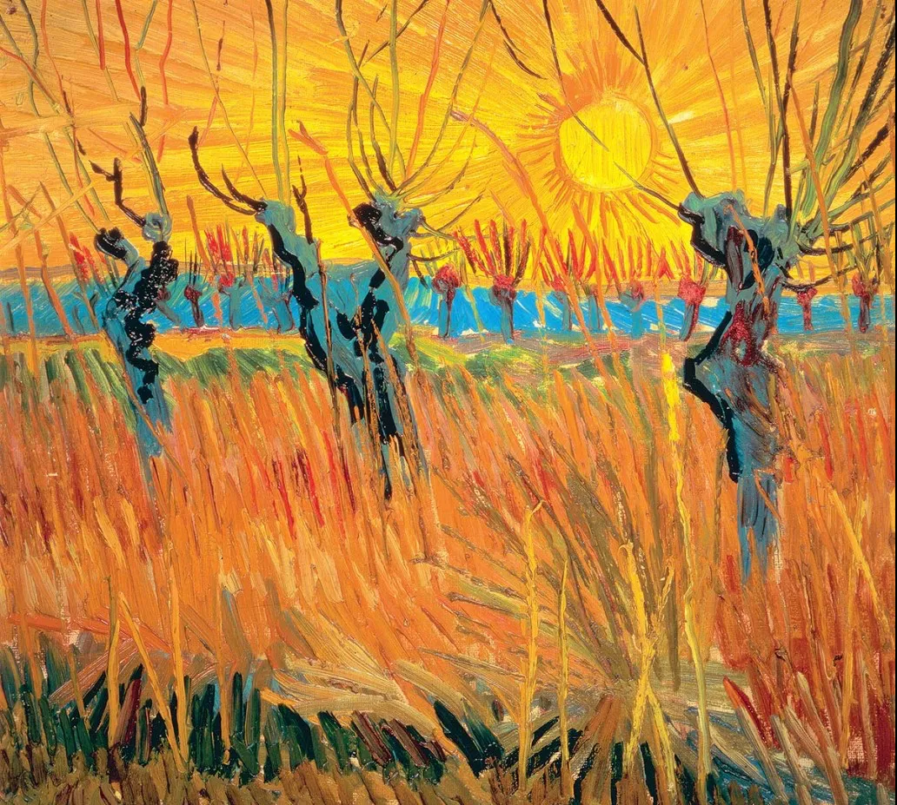

  

Vincent van Gogh，Willows at Sunset

  

每家都有一根主心骨，在疫情期间，他的责任是什么？  

  

那得看疫情期间最大的挑战是什么。

  

在我看来，最大的挑战，不是工作与学习，它们都以某种方式全部或局部恢复了。最大的挑战是信息的甄别。

  

信息传播的一个特点就是人们更爱听谣言，它刺激、戏剧性强、迎合恐慌与愤怒情绪，传播者又能产生“先见之明”或者“有良心”的幻觉，谣言是无法消除的，除非人性没有弱点。

  

一家之主最大的责任是尽可能识别谣言，不让它们伤害家人的精神与情绪，让他们在混乱时生出安定。

  

绝大多数谣言的识别，都很容易，比如近几天，很多家庭群中，都有人相信粮食将有危机，必须开始囤粮，下面这种场景出现在不少家庭中：

  

  

有些地方确实已经出现抢购粮油的情况。

  

你是一家之主，面对“囤粮”信息，可以做两个工作：

  

一是确定有没有粮食危机，够吃就不会有危机。

  

中国现在有多少粮食？这从政府工作报告，国家统计局，很容易查到。中国多年的粮食产量超过6.5亿吨，去年全年粮食总产量66384万吨，为历史最高水平，也居世界第一。国家储备粮也保持在6.5亿吨。往宽松算，一年消耗5亿吨粮食。去年粮食产量加上存粮，就够吃两年多了。再说了，受疫情影响最小的就是农业，土地今年还将产出粮食。粮食危机并不存在，完全没有囤粮必要。

  

求证虽然这么容易，但95%的人是不做的。多数信息确实也不重要，无须求证，大脑的资源有限，事事不信，寸步难行。可是一则信息引发了家人恐慌，一家之主就必须去求证。

  

经济学家费雪的儿子小费雪是个投资家，他的一条厄运原则值得学习：如果厄运在30个月内不会发生，你就不必担心。这条规则与媒体圈、政界及良心界的策略相反，这些人总要吓你：你现在过得好，但是厄运总会降临。

  

奇怪的是，愿意听小费雪的人少。很有可能，你用数据告诉父母不必囤粮，他们并不服输，仍然要囤，这时候，你要做的是第二个工作：不要为了正确而正确，不要由于爱上正确进行不必要的辩论。

  

不听真相，可能是个面子问题，表面上不听，但实际上已经听了。你会发现，明天他们就不再提囤粮了。你的目的已经达到，他们表面上认不认，并不重要。

  

他们坚持要囤粮，爱正确的人可能会生气，我都告诉你没事了，你还这么做。别生气，他们囤粮，买几百斤米面放在家里，花不了多少钱，能换来他们心安，也花得不冤，由他们吧。

  

危机发生时，如果我们能影响家人的情绪，是一家之主，就有安定家人情绪的责任。经过我，恐惧变小变没了，信心变有变大了。推而广之，企业的主人，国家的领袖，何尝不是如此呢？

  

推荐：[换换我们的底色](http://mp.weixin.qq.com/s?__biz=MjM5NDU0Mjk2MQ==&mid=2651637926&idx=2&sn=d59e25a9d5521d31b594f5e7c6698092&chksm=bd7e4cb88a09c5aef67e6352a83e04ddd7e716fd42e2b60bd123b2baa4b0000f1998824e5042&scene=21#wechat_redirect)  

上文：[投资者更爱国](http://mp.weixin.qq.com/s?__biz=MjM5NDU0Mjk2MQ==&mid=2651638132&idx=1&sn=1f09eceb23b985ed1d94b04020421a24&chksm=bd7e4d6a8a09c47c1845bea5c1e0643052169c2a5c01ec1b082df7c01d05cc45d0a48afd6110&scene=21#wechat_redirect)
