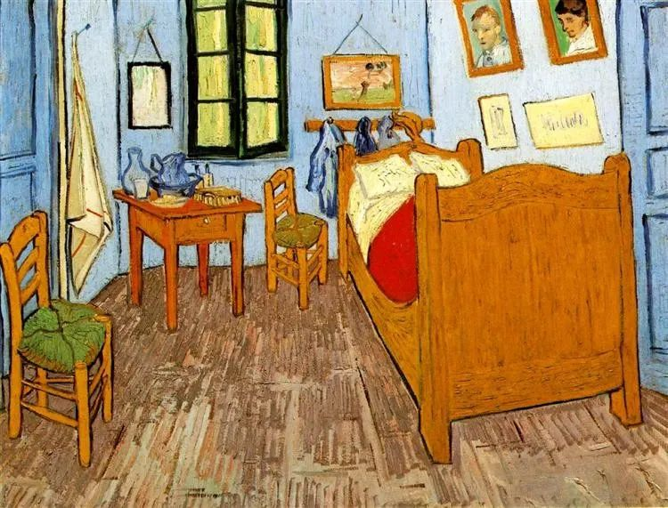

Vincent van Gogh，Bedroom

已经在还房贷的人，将面临一次选择，是否要将固定利率转换为浮动利率。

这次选择以后不可更改，选固定则固定利率到还款结束，选浮动则按照初始的差额调整。有选择困难的人，可能很烦恼。

选择房贷利率转换为浮动的话，你现有的利率与银行五年期贷款利率之差，即为将来浮动值，可正可负。如果是负数，比如-0.4%，利率调整时则减去-0.1%，可以少还一点利息。如果是正数，比如0.4%，那你得多还一点。

不少人的房贷利率比五年期贷款息率更高，选择浮动，暂时得多还一点钱。但很多人认为，利率是长期下行的，经过几轮调整，最终还款数肯定会少一些。

其实，我个人倾向于保持原有的固定利率。一是你看了上面的文字头会疼，增加选择烦恼；二是将来二三十年的事情，谁也说不准，认定利率永远下降？未必。

但可以安慰你的是，无论你做任何选择，都不会错，最后所得可能也差不多。只要你已经在还房贷，尤其买的是热点城市的房子（体现为人口与资金持续增长），那么，你已经在享受此生可能最大的一次福利。

房贷利率上下浮动一点，那是小钱。房贷的好处不是体现在这里，房贷赚的是通货膨胀的钱，或者说，房贷让你免于被通货膨胀抛下车。同等条件下，你10年前开始还房贷，即使开始几年辛苦，现在也毫无感觉，那点钱占收入比例不高了。相反，10年前拒绝买房，要攒钱全款买一套的，现在首付款可能还不够。

在古典经济学看来，尤其是奥地利经济学派，通货膨胀是邪恶的，在一张白纸上印上数字，成本趋近于零，却可以用它来买实实在在的商品与服务，这不就是欺负存钱的老实人吗？

但让这些经济学家气得哇哇叫的是，巧妙的通货膨胀，每年节制地放一点水，那就人人喜欢通货膨胀：政府有印钞机，收益最大，所以政府最不怕负债；有资产者，水涨船高，更加富裕；负债者，债务压力变轻；而工薪阶层，那些固定收入者，潜在的受害者，由于名义上的收入增加了，钞票的面值变大了，也会开心。再加上技术日新月异，很多商品的价格名义上也不停下降，抚慰了人心。大家都开心的事，即使是坏事，也会大行其道。

通货膨胀，已经是政治学与心理学范畴的概念。政府的高下，表现在通胀术上，笨蛋政府，恶性通胀，把自己搞垮；聪明的政府，有所克制，甚至在放水时万众欢呼。理解了这个事实的人，就知道持有好房产的重要性，只有这样，你才能在持续的通货膨胀中保有自己的真实财富。

知道洪水要来，谴责洪水已经没有意思，造船才是首要任务。能多造几艘，当然更好。

推荐：[“观念贱民”](http://mp.weixin.qq.com/s?__biz=MjM5NDU0Mjk2MQ==&mid=2651626017&idx=1&sn=5a7c8f28b6a01748b82175cd23ffce9f&chksm=bd7e1e3f8a0997290a8a1690df74e2c3573b0642f0d5deacf65b7e26fbccc5635e2309e3605b&scene=21#wechat_redirect)

上文：[延揽人才，对外开放，对内更要开放](http://mp.weixin.qq.com/s?__biz=MjM5NDU0Mjk2MQ==&mid=2651637643&idx=1&sn=5faa3be004f35488276eb59a54de0bec&chksm=bd7e43958a09ca834a2f61ae86be6e9811a635533a405b1be95ca95dac6040a52f12bf521615&scene=21#wechat_redirect)
