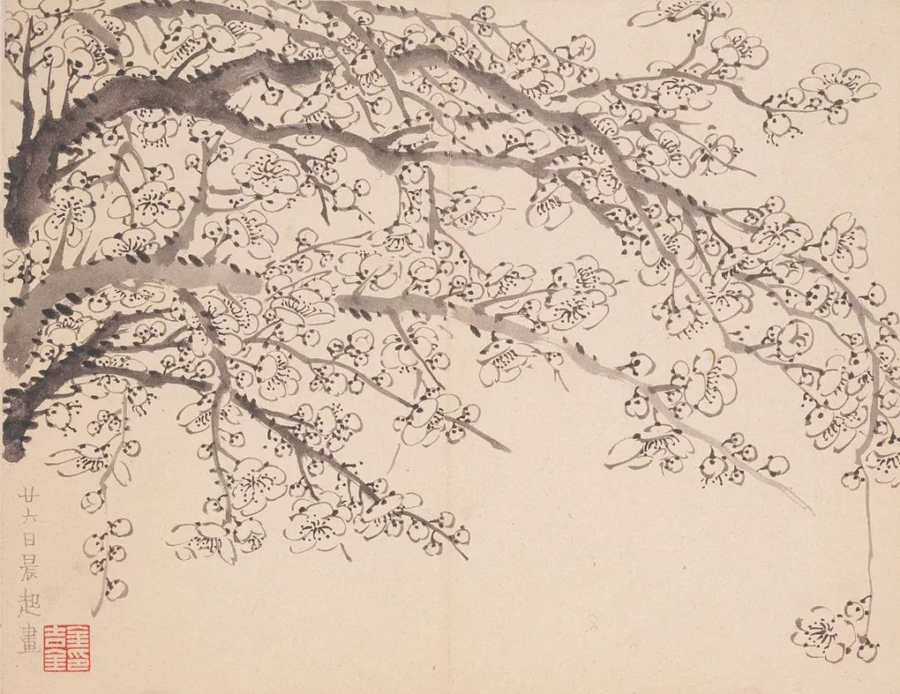

  

金农，墨梅  

  

人的有些道德准则天生就有，没有文化背景的区别，比如关注公平、喜好帮助他人、厌恶伤害他人。这就是所谓的“天理”，已经得到心理学家的证实。人之初，性本善，现在看来是有科学依据的。一切法律与准则，都得符合这天理，否则，就令人不安与反感。  

  

世界需要拯救时，有些人会显得特别高贵，比如疫情发生以来，许多医务人员毫无畏惧，奔赴一线，这就是“喜好帮助他人”的天性在起作用。此时，整个舆论对医务人员也特别友好，不一定是势利，也未必持久，这表现只是符合人先天的道德准则：我们会感激那些高贵的拯救者。

  

昨天（3月5日）国务院出台了“补助向一线防疫医护人员倾斜”的政策：“要进一步落实好关心关爱医务人员各项措施，临时工作补助、一次性慰问补助、卫生防疫津贴等要及时发放，向与患者直接接触的接诊、筛查、检测、转运、治疗等一线医务人员特别是救治重症患者的医务人员倾斜，不得按行政级别确定发放标准。”

  

这政策出得很及时。前几天，出现过行政级别高的管理者拿的补贴高过一线医务人员。观感非常差，即使是合法合规。现实生活中，行政级别高的人，平时的工资、补助，高过普通医务人员，这容易接受，大家努力，想级别高一点，很大的目的是收入与地位可以高一点，说出来俗气，可它是最真实的激励。但在这防疫的特殊时期，它却变得不合理了，不停有一线医务人员牺牲的消息，行政级别高的人却拿更多的补助，这种对比真是触犯“天理”，拿出再多规章都没有用。此时，出台政策向一线倾斜，不按行政级别来，做事有依据，会让大家都松口气，行政级别高的人，贪官污吏也只是一小部分，有尊严感的人更多。

  

芒格曾说过，他很喜欢美国海军的一条规矩。船长工作极度疲惫后，需要休息一下，暂时把船交给有能力的大副，海上环境突然变得恶劣，大副让船搁浅了，这显然不是船长的责任。美国海军的做法是结束船长的海军生涯，你是船长，出了事你就得负责。

  

当过律师的芒格认为，法学院可能不同意这条规矩，但它的效果却很好，这让所有船长都明白，你无法甩锅与辩解，必须全力以赴，出了事，要有尊严地接受后果。 

  

补助向一线防疫医护人员倾斜，不与行政级别挂钩，就类似于上面的美国海军规则。有了这政策，在防疫期间，行政级别高的人，就得有自觉，不追求补助，即使你负的责任更大，做的事情也不少，出事你要顶，拿钱你得让。你必须全力以赴，你必须有尊严。这种政策符合人人心中的“天理”，疫情总会发生，下一次发生，这种政策就该自动触发，不仅有利于防止争功诿过，还能激发人的高贵情怀。

  

推荐：[人们将会对医护人员更好吗？](http://mp.weixin.qq.com/s?__biz=MjM5NDU0Mjk2MQ==&mid=2651637454&idx=1&sn=28d4749193059084946302f25b632ace&chksm=bd7e42d08a09cbc6f1d63ebe1f0cafe9d09287557419cd80f4facaa6f7859f544b33e3da23cb&scene=21#wechat_redirect)  

上文：[理解儿童，就是理解自己](http://mp.weixin.qq.com/s?__biz=MjM5NDU0Mjk2MQ==&mid=2651637685&idx=1&sn=1bf899226075e34f3e73109eeb3d8fd8&chksm=bd7e43ab8a09cabdcfc4331bd8af31fb962b14a8e7c9ee6bfca349a439f3f39f33b85c88ed82&scene=21#wechat_redirect)[人](http://mp.weixin.qq.com/s?__biz=MjM5NDU0Mjk2MQ==&mid=2651637454&idx=1&sn=28d4749193059084946302f25b632ace&chksm=bd7e42d08a09cbc6f1d63ebe1f0cafe9d09287557419cd80f4facaa6f7859f544b33e3da23cb&scene=21#wechat_redirect)
