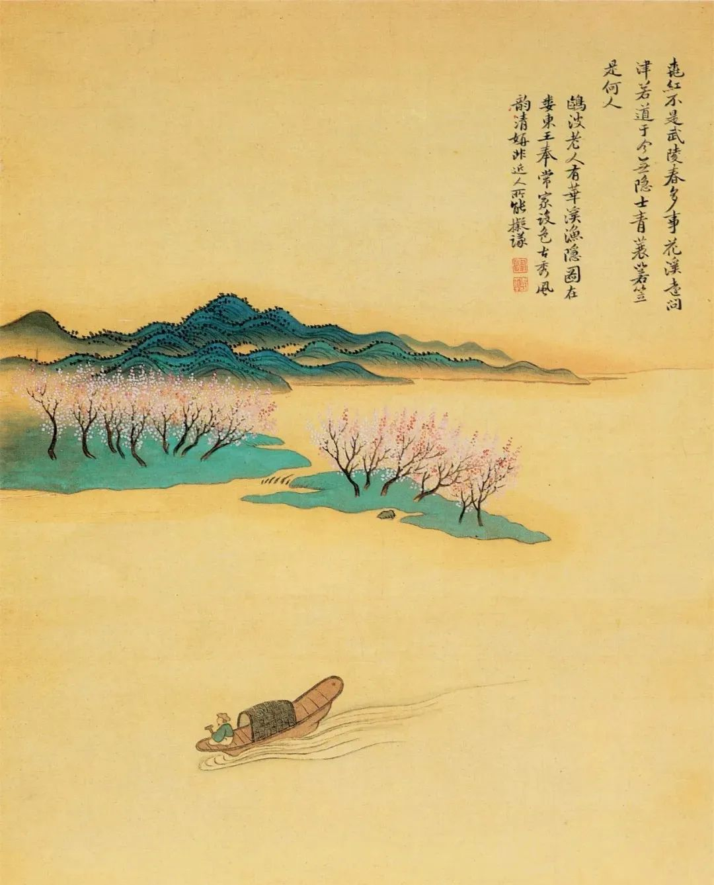

恽寿平，仿古山水图

  

我爱漫步，最近更加着迷，周末每天不间断地走20公里。  

  

今天的工作忙完，我就得出发。恰好是摄食日，灌满我的小酒壶，不时喝一口，衣上征尘杂酒痕，假想我是陆游。

  

解释一下摄食日。就是我吃东西的日子。明天就是禁食日，除了喝水，一点东西不吃的日子。一日摄食，一日禁食，这个ADF饮食法转眼也坚持半年。都可以不用“坚持”这两个字了，身心愉悦，让我不这么做才辛苦。

  

说回漫步，我平时每天也得走1个多小时，是专心走，挑最合适的鞋子，不带手机。阿基米德的灵感来自泡澡，而我的来自漫步。无论是公司的经营，还是文章主题，和连太边走边聊，想法就逐渐成熟。

  

前几天有位朋友为某事焦虑，我一看，那不是事，只不过被巧妙的煽情包装成了事，不可能发生，就是发生了也不值得过多关注。但对一个习惯性焦虑的人，跟他说这些没用，他反而更焦虑。我说，建议你出门走一走，仙岳山山顶的石径，杜鹃花正好，可能是厦门岛内最漂亮的山路，来回走一趟，1个多小时，不要带手机，专心看树看花，看云看鸟，回家就好了。  

  

他惊呼，不带手机，重要的事情发生怎么办？  

  

我说，你没那么重要，世界也没那么重要；不带手机漫步，能更清楚地知道，焦虑来自于我们自以为是，来自于我们失去耐心。  

  

我们经历的，基本是小事，我们做的，也基本是小事，最重要的，是有一些我们自己喜欢的小事，天天重复它，价值藏在这些微小行动中。  

  

长按二维码可关注  

  

今天是第121期“下周很重要”，再次写下你喜欢做的微小行动，再次重复它们。  

  

推荐：[人不需要成为超人，人本身就是超人](http://mp.weixin.qq.com/s?__biz=MjM5NDU0Mjk2MQ==&mid=2651637838&idx=1&sn=404bfef34b7dc19c1aa26ea54d447091&chksm=bd7e4c508a09c54620c1d8ec4b1f8a083e8627bdc18fdf003409b6f4f52d1243b788c1eab7c8&scene=21#wechat_redirect)  

上文：[说说澳籍“拒隔离跑步女”被限期离境](http://mp.weixin.qq.com/s?__biz=MjM5NDU0Mjk2MQ==&mid=2651637942&idx=1&sn=df582e12066b3c12efe28341d06f3461&chksm=bd7e4ca88a09c5bea56779a2ada38b6021b4c0d19cea144d3deabf90c0f94b03a26c2a4fc1ad&scene=21#wechat_redirect)
