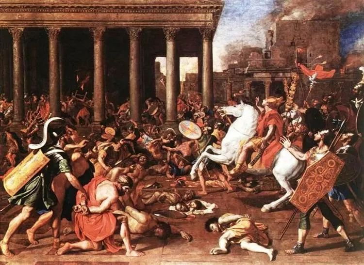

Nicolas Poussin，The destruction of the Temple

600万犹太人被德国纳粹屠杀，占欧洲犹太人口三分之二，世界犹太人口三分之一，这是上个世纪人类最著名的仇恨事件。  

  

仇恨是人类行为的一个范式，像爱一样，仇恨也会一再重复。规模有大有小，但其结构总是相似的，理解仇恨是认知的重要组成，这样才能预防仇恨发展到不可收拾的地步。

  

2019年，内地人体验到了被极度仇恨的感觉，原来香港人的主流是如此无差别地恨我们，恨到可以随意殴打内地人和不同意见者，恨到放火杀人而无道德压力。慢慢找原因，可能就是香港的教育、舆论与知识分子，几十年一再重复一个主题：内地就是一个体制邪恶，人民愚昧的人间地狱。这个主题可以在任何情境下自洽：内地贫穷，那当然是邪恶与愚昧的报应啦；内地富裕，那邪恶与愚昧的力量就更大，更要排斥。

  

被许多香港人仇恨，只会让内地人伤感，并不足以引发恐惧，大不了不去香港就是，对生活没有任何影响。但是如果把力量对比颠倒，香港人多达10亿以上，内地人是少数，而且必须生活在香港人当中，被歧视、辱骂、殴打还是政治正确，那就是上个世纪犹太人的处境，这样你就可以理解仇恨的力量与可怕。

  

希特勒再有煽动力，纳粹再有战斗力，都不足以引发大屠杀。仇恨犹太人一定要具有强大的民意，甚至具有了道德优越感。莎士比亚的作品里，有贬低犹太人的成分。伏尔泰，启蒙运动倡导者，也宣称犹太人为劣等民族。纳粹的反犹法案，很多条文的立法依据，来自1215年教皇英诺森三世的一次会议决议。

  

换言之。犹太人被屠杀，是必然的悲剧，这是长达千年以上仇恨教育的结果，是公元1世纪就埋下的伏笔，犹太教与基督教在那时开始分裂。在之前，犹太教与基督教并无明显分界线，公元1世纪，两教对传统的解释出现分歧：犹太教认为摩西是正统，耶稣是荒唐的窃教者；基督教认为耶稣完善了宗教，犹太教徒忘恩负义。

  

公元70年，罗马人毁坏耶路撒冷圣殿，加剧这一分化，基督教徒解释为这是上帝弃绝犹太人，犹太教徒认为这不过是父亲式的惩罚，绝非弃绝。基督教开始系统性地出现反犹的“歧视教义”。

  

在排他性的宗教争端中，谁都要真诚地相信自己正确，认错意味着宗教的死亡。在这场残酷的争端中，基督教以其压倒性的影响力，成为舆论战的赢家。

  

而犹太教徒以一种“只要你没有杀光我，我就不会输”的奇特坚韧，也没有输。虽然他们的历史极为凄凉，自公元70年失去耶路撒冷，他们就没有祖国，一直作为不受欢迎的“劣等民族”，被极度歧视，以至于出现自恨者（从这点可以解释为何最恨中国人的，是同为中国人的香港人，他们极力想摆脱中国人身份，以迎合他们心目中的优等民族），但主流犹太人似乎却习惯了在仇恨环境中成长，诠释了高度的“文化自信”，恪守自己的生活习惯、文化传统，一代代人阅读他们的宗教典籍，最聪明的人成为拉比，回答教徒们的各种问题，将宗教教义与当下的生活结合起来。

  

在集中营里，著名拉比奥什里偷偷撕下各种纸，在上面回答问题。

  

上帝背弃了我们，我们在集中营里，多数要死掉，我们还要照例祷告，感谢“没有让我们成为奴隶”的上帝吗？面对这个绝望而尖锐的问题，奥什里答道：赞美上帝，并不是因为他赐予我们身体自由，而是他赐予我们精神自由，我认为，在任何时候都不应否认这种神恩。相反，尽管我们身在集中营，更应诵读神恩，向敌人表明，我们这个民族在精神上是自由的。

  

很多犹太人在走进毒气室里，口中念诵着“我相信”或“以色列，你要听”，坦然赴死。我即使不是犹太教徒，看到这些，都眼睛潮湿，受到巨大震撼与感召。犹太人的祖国，在漫长的历史中，并不是领土，而是他们对自己文化的认同，你可以杀掉我，但你无法征服我。

  

这种“文化自信”，除了让自己的种族幸存，最后等来与基督教的和解，可能也是犹太人在各领域有优异表现的心理动力，其他不说，自诺贝尔奖设立以来，几个最有说服力的硬科学奖项，他们拿了20%的化学奖，25%的物理学奖，27%的生理与医学奖。

  

人类这种经常犯蠢的物种，好不容易知道无法通过仇恨与屠杀推销自己的信仰、观点与生活方式，要守护这个用血换来的常识。更要知道，和平、包容、尊重自己的优秀文化，是非常有价值的生存环境。而自恨者多了，将摧毁这环境。

 ****▼**** 点 **阅读原文**, 购买《犹太人与犹太教》
