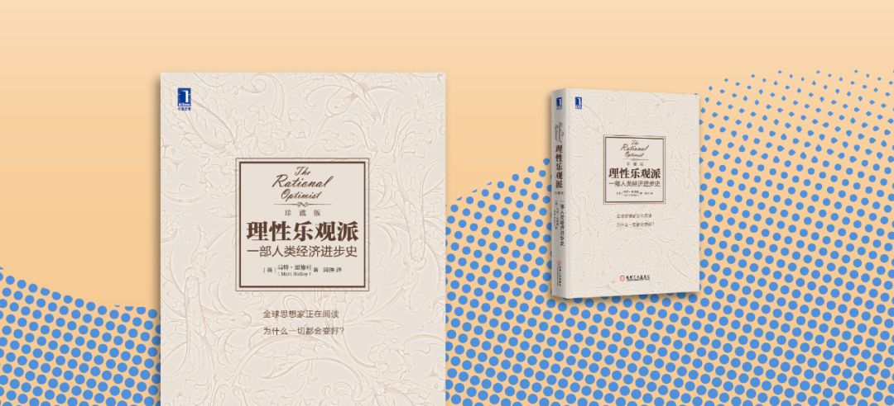

  

我们的底色普遍是悲观的。人本来不该如此，这可能是教育带来的负效果。  

因为教育，我们脱盲，甚至上了大学，成了专家，但因为教育，我们也变成了一个悲观主义者。

人口危机，城市化的危害，能源危机，市场的危害，资本的危害，新技术的可怕，人性的可怕，这一切，几乎都是教科书灌输的。我不是指中国的教科书，而是指全球的教科书。

这一切灌输都是错的。

所以，建议你读一本书，《理性乐观派》。

聪明好奇一点的初中生，就能读懂。能早读尽早读，不要像有些读者到了中年、老年，才来感叹：《理性乐观派》改变了我。当然，不怪这些中老年读者，毕竟，在他们年少时，并没有这样一本书。而且一个人到了中老年，观念的改变更为辛苦了，坏观念寄生在人的大脑里，它慢慢控制人的语言与行为，让你产生错觉：人们都这么认为，怎么会错呢？

马特·里德利(Matt Ridley)的《理性乐观派》，全书的主旨就是：朋友，让我用数据来告诉你，你的一切悲观都是错的。不要愁眉苦脸，不要摆忧国忧民的pose，那是浪费你的人生，世界好得很，未来更美好。

《理性乐观派》，这本书怎么分类？

科普？历史？人文？经济？

都是。

我认为，它还是一本心理学著作，一本最好的励志书。  

总之，看一本相当于看6本，看完神清气爽，重新做人。

而且，这本书一点不厚啊，不过300来页，再慢，一个星期足够了，就算从来没有阅读习惯，硬啃这本书，一天读10页，也做得到，一个月也读完了。

读完后，你的底色就换了。很多错误的观念消失了，就像折磨你多年的慢性病治好了。你将成为一个理性乐观派。乐观不再是天生的属性，而是思考的后果，是知行合一的通透，是指导决策的原则。悲观是什么？是无知。

 ****▼**** 点 **阅读原文**, 购买《理性乐观派》
