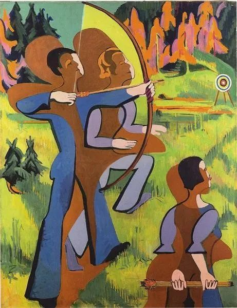
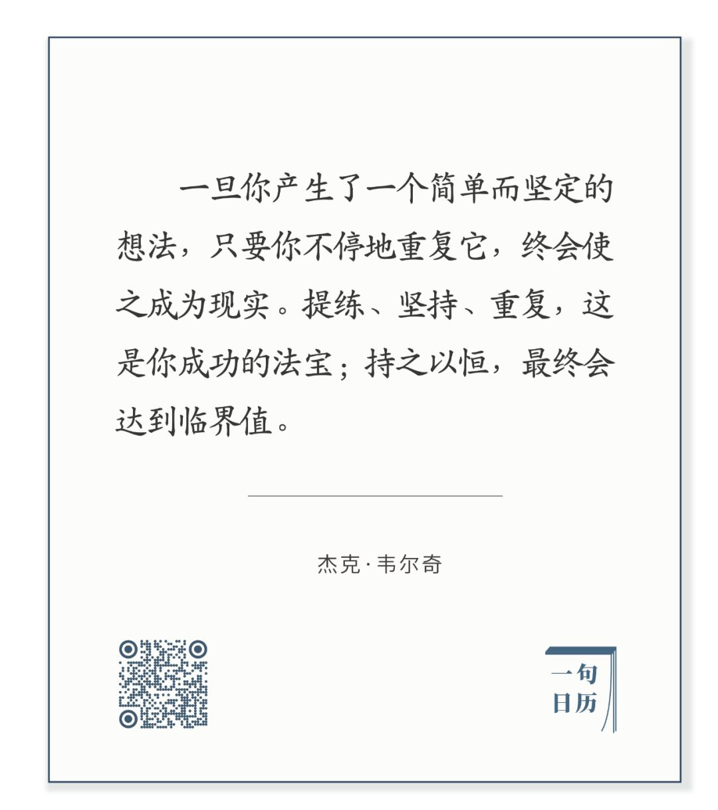

  

Ernst Ludwig Kirchner，Archers

  

厌烦，在人生中，很长时间你是这态度。可能从上学开始，因为学习伴随着大量的挫折、失败和批评，自然产生的想法是：哪一天能不做作业就好了！  

  

终于到了可以不做作业，我们又得日复一日地工作，挣钱养家、买房买车、监督孩子做作业。你知道，那个有时候愁眉苦脸不耐烦的孩子，脑子里的想法是：哪一天能不做作业就好了！

  

哪一天？没有那一天。

  

人生的每一天都在做作业。如果我们觉得它苦，那厌烦感就伴随一生，最大的苦，是你觉得它苦，而你又不得不苦。人生是主观的，一直要到那一天，你突然发现，日复一日的作业，它在传递价值，苦有了滋味，就像你发现苦瓜好吃。这时候，你反而会给自己布置作业，在自我进化史中，你发现价值那刻，就像人类第一次会用火，从此保存它，用柴用煤用气喂养它。  

  

人生是价值发现之旅，你不发现价值，它就强加一个糟糕的价值给你，使你厌烦，越是亲近你的人，你越觉得他们是负担，你最厌烦自己，然后是家人，最后是世界。  

  

而发现了价值，传递价值又是必然，就像火必然给人温暖，你自己最受益，然后是家人，最后是世界。正如了不起的CEO韦尔奇所说的：

  

长按二维码可关注  

  

什么是企业家？就是能把你的价值观传递出去，变成产品与服务的人。不停的重复，不再是厌烦，就像韦尔奇所说的，他在企业内部巡回发表一次又一次的演讲，讲到自己疲惫，但是并不会停止与厌烦，因为这是一个价值观塑造的过程，只有员工们都接受了新价值，企业的变革才会发生。  

  

当人决定过好每一天的生活，他晚上回到家，会疲惫，但他已不再厌烦。他知道，这重复的一天，做了差不多同样的事，读了差不多同样多的书，同样的拥抱，同样的陪伴，但是爱、责任与实现，都在不停地累积。

  

我的日常，不再是别人布置的作业，而是我价值的依托，正如我的脉搏，来自我的心脏，坚定、持久、一生不息。  

  

今天是第119期“下周很重要”，写下你简单而坚定的任务，简单而坚定地完成它。  

  

推荐：[不鸟](http://mp.weixin.qq.com/s?__biz=MjM5NDU0Mjk2MQ==&mid=2651637595&idx=1&sn=a2f16783598d3e09439a3bf494440050&chksm=bd7e43458a09ca533314950f621bfcfb2f9a1541da44ca4c45a07a893dda37343a92bce50dff&scene=21#wechat_redirect)  

上文：[说说“补助向一线防疫医护人员倾斜，不与行政级别挂钩”](http://mp.weixin.qq.com/s?__biz=MjM5NDU0Mjk2MQ==&mid=2651637701&idx=1&sn=7d794023bd47d80c4cb2c23fbc1a5f34&chksm=bd7e43db8a09cacd34eb9dc6e3962803a03bc8c371a35fd53a469fc3b720f0bb56e84acfa6b5&scene=21#wechat_redirect)
