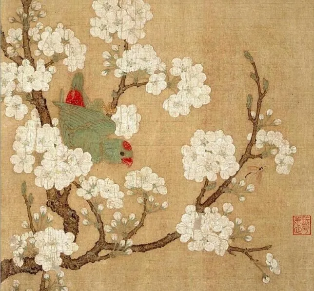

  

黄居寀，杏花鹦鹉图  

  

我推荐书的速度加快了，引起一些读者的焦虑，自己的阅读速度跟不上。

  

完全没必要焦虑。这是阅读最怕的两点之一。阅读变成单纯的刷数量，一本书拿来，是追求迅速读完。这就像一顿大餐，你想10分钟吃完，没必要，大餐享受的是过程，有停顿，有谈话，细嚼慢咽，吃两三个小时，这是匹配它的速度。

  

阅读最怕的另一点，就是不阅读。很多人阅读力弱，无法将一本书看完，甚至有些写作者都是如此（别意外，真的），这世界很友好，混着不难，甚至不阅读的人，假装读了很多书，也不难。但装总是害自己的。聪明人最后都会阅读，阅读主要是提升自己的能力，改善自己的生活，是自然而然的需求。

  

一般人每天工作，照顾家庭，可供阅读的时间并不多。一个月读一两本书就行了，平均到每一天，就是15页至30页左右，把书带着，有空就翻几页，不难完成，每本书，解决你一点工作生活的疑问，提供一个思考的角度，用起来，你就会越读越爱，越爱越快。就像你练长跑一样，开始只能跑400米，又绝望又焦虑，但只要每天跑一跑，跑力增长很快。

  

你的阅读力可能最后和我一样快，虽然很难，毕竟我是职业阅读写作者，我也练了几十年，我还双语阅读，但这些都不是什么难事。当然我的意思不是我们非得比速度，那就焦虑了。我的意思是，一个人持续阅读，就会越来越快，因为阅读能解决问题，对它有依赖。

  

慢慢开始已经成功一半，专一把你手上那本书读完，弄皱搞脏，染了茶渍酒渍，到处涂抹记号，都没有问题，书现在是最便宜的东西，不是历史上的稀缺品，把它读旧读坏，证明你投入，证明它有用。大不了再买一本新的，不就一份快餐的钱吗？

  

今天是第122期“下周很重要”，下周建议你把手头的书读完，众声喧哗，信息洪水，专注于一本书，则会瞬间静音，安定地生智慧。

  

推荐：[足轻重的小事](http://mp.weixin.qq.com/s?__biz=MjM5NDU0Mjk2MQ==&mid=2651637963&idx=1&sn=642f98efe9e083b32ebc5248c172f524&chksm=bd7e4cd58a09c5c3916d94c1ae6599bf1b48fd184899a726fad5c9751ec938b74f7bf09e67c1&scene=21#wechat_redirect)  

上文：[我最喜欢谁的意见？](http://mp.weixin.qq.com/s?__biz=MjM5NDU0Mjk2MQ==&mid=2651638068&idx=1&sn=ea0d37e928a0300ef85d0ca1cc70ca18&chksm=bd7e4d2a8a09c43c09ebce22e5694eb2acb7b065ca7ef6b076f7ad79af5380d0e5617de39690&scene=21#wechat_redirect)
