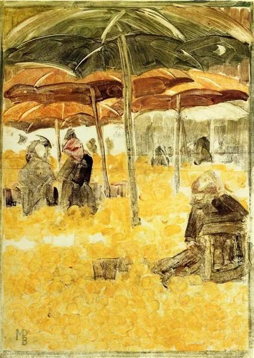

Maurice Prendergast，The Orange Market

  

连叔：  

  

从大一看您的公众号到现在已有两年有余，您的冷静慎思让我觉得身边多了一位很可靠又很渊博的长辈，温暖、安心。每当我遇见当下一些无法想通的问题时，我便会翻阅您以前的文章，通过读别人的故事、您的解答，来找到自己的答案。可我最近出现了以我的能力不可解的问题，心中一团乱麻，越想寻求一个最优解，却越被困在死胡同。我只好鼓起勇气给您写了第一封信，希望没有叨扰到您，盼您回复，为我指明方向。 

  

现在我是一名大二下的学生，不出意外的话是21年12月准备考研。家人虽支持但应是没有经济能力支撑我的，同时我因为生活费不够充裕还被欲望支配，开通了白条和花呗，欠了大约有1w5，有债务在身，每每看到这些债务我都后悔不堪，想要尽快还清债务。这些债务都是我虚荣的因，种下的果。 

  

我没敢跟父母说，也没想跟他们说，因为他们现在都有自己的债要还，处在水深火热之中，连我学费都是助学贷款，生活费也都给不了。

  

所以我打算休学，休一年半，在2021年9月复学，期间在外打工攒钱，还清债务的同时还有一些经济基础，能更好的为考研做准备。

  

因为债，我认为我必须休学，可是我休学一年半，回学校变成大三19届的学生，因为缺了大二下剩下的课。我不确定自己能否很好的完成学业。回到学校住的地方会不一样，身边的人也会不一样，万一我不能好好相处适应呢。

  

还有一种可能是变成大二上20届的学生，重新读一遍大二，24年毕业。那时的我已经24岁了。是不是有点太老了？我好害怕。

  

我想参加22年12月的研究生考试，23年毕业，却又担心本科的学业给我拖后腿。

  

我心里又有一个念头说，打破旧我就是痛苦的，也许24岁就目前来看是老了，但十年后，33岁和34岁也差的不多嘛。

  

我好纠结，还是不知道我这样休学的决定对不对。我的钱也要还不上了……

  

我感觉自己是个罪人，为什么要欠这么多钱，连叔是不是连你都看不起我。我的心感到好渺茫。

  

请您骂醒我吧。

  

一位深陷泥潭的大学生

  

* * *

  

一位深陷泥潭的大学生：

  

最紧急的事情出现时，先解决它，而不是想着之后的衍生事件。一是这样浪费时间，二是紧急事情解决后，衍生事件也就不会发生。

  

你的紧急事件是告诉父母你欠了钱。深陷泥潭的他们听了，可能会痛苦，可能会生气，也有可能帮不了你，但是他们有权利知道。再弱的父母，孩子向他们求救，都会有被信任的感觉，这也能唤起他们内心的责任感，能让他们更努力、更振作一些。相反，当他们以后知道孩子危难关头也不愿意向他们求救，他们会觉得自己被彻底否定，毫无价值。

  

或许你会说，我能给他们一个漂亮的休学理由，不让他们知道我的真实困境。没错，很多人是这样做事的。但这不正是虚荣吗？你也知道，是虚荣让你陷入泥潭。是时候放弃虚荣了。

  

年轻人容易虚荣，这是孩童时游戏状态的延续，以为假装了就有实质。这是还不知道世界的运行规则，你的学识，你的财富和你的地位，是装不出来的，不接受这规则，强行装，那就得一个小债务接着一个大债务，一个谎言接着一个谎言，一个幻想接着一个幻想。虚荣的人，总是以为下一个美妙的计划就会弥补之前的一切损失。再虚荣一次就会成功，他们总是这样以为，不过，每增加一次虚荣，都让他们得到的资源更少，判断力更弱，更容易上当受骗，甚至会去维护骗术。我见过太多人这样毁掉一生。在一切人生行为的定价中，虚荣代价最高。

  

向父母坦诚你的债务，这就是放下虚荣。从此对虚荣就有了免疫力，这1万5千，也算有收获。没有一个正经人会看不起年轻人穷或出身低，相反，他们会高看一眼那些正视自己不利处境的年轻人。

  

1万5千块钱，不算大问题，你的父母应该能够找到办法。万一他们连这点信用与实力都没了，那你想想看，在家族中，你最尊敬的长辈是谁？向他求助。这是你第一次正式使用你的信用，制订确实可行的还款计划——应该是你工作后才有能力。这个难关度过后，学业之余，你可能需要打点工，挣到自己生活费后，尽量争取还一点钱，1百2百都行，这是维护信用，获得尊重。这是你的立身之本。

  

本科毕业后，就赶紧出来工作，研究生教育，对你来说，还是买不起的奢侈品。别人都是研究生，我不顾自己的条件不允许，也非得读一个，这也是虚荣，只不过很容易包装成上进心，自欺欺人。到你经济状况改善以后，攒足了几年的学费与生活费，那时还是特别想读研究生，再去考。

  

再过10年20年，你可能一天都能赚1万5千块钱，成长为能力很强的人。那时，你将想起现在1万5千块债务对你的打击，并感谢自己从中得到了教训，受用一生。

  

祝开心。

  

连岳

  

推荐：[谈好白开水之爱](http://mp.weixin.qq.com/s?__biz=MjM5NDU0Mjk2MQ==&mid=2651638450&idx=1&sn=c013da0ec7b797e8295a14f3cada0463&chksm=bd7e4eac8a09c7ba744447bb5586bd15c2549b0fc59114c5d81ad6a05e8aa41a5a4e4bcdef4a&scene=21#wechat_redirect)  

上文：[如果你不想做，你会找一个借口，如果你想做，你会找一个方法](http://mp.weixin.qq.com/s?__biz=MjM5NDU0Mjk2MQ==&mid=2651638573&idx=1&sn=77cd29b8e28623493925cdec07e04a49&chksm=bd7e4f338a09c62503ad97a0c72d793e557bbd2d2b52f0ea017d825388387ea0a2671e4fd79e&scene=21#wechat_redirect)
