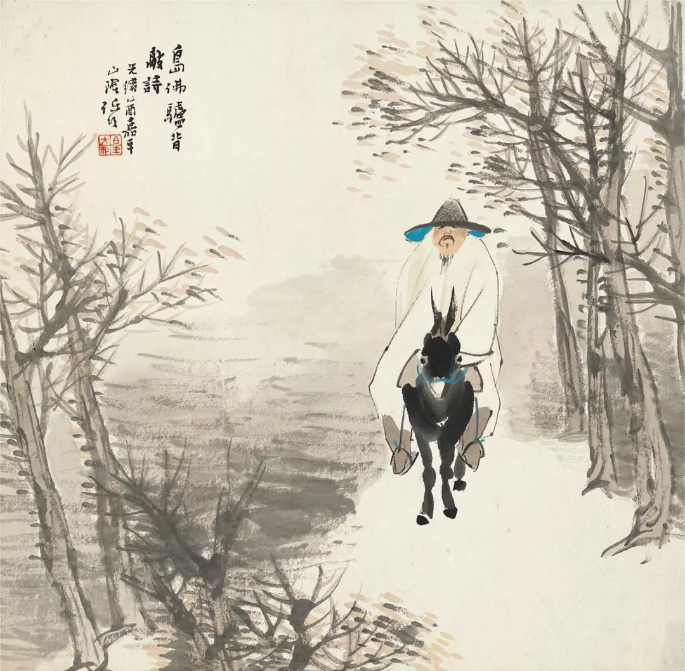

  

任伯年，驴背敲诗图  

  

有人问到如何及时得到信息？其实在当下是信息过载，信息不怕得不到，而是如何甄别的问题。我们现在一天得到的信息，比孔子老子一辈子都多，我们对世界、对人性的认识，有他们深刻吗？  

  

今天是农历四月初八，佛诞日，若说信息处理，这位2千5百多年前的天降伟人，还是我们最好的老师。他不是追求信息更多，而是追求人不被信息洪流带着走。黑塞在《悉达多》里，有生动的描述，悉达多的本事无非就是斋戒、等候与思考，如此简单重复而已。又比如，打坐证明对身体与心理都有帮助，也更多与佛家联系在一起，它追求的是静止，专注于呼吸，过滤掉信息。但是，却能平静心态，激发创造力。每天可以坐几分钟，让大脑彻底放空。

  

只要抓住本质的信息，枝节并不重要，过多关注枝节甚至会干扰自己判断。最典型的就是这几个月的防疫。本质信息有两个：一是生命权高过一切，人死了什么都没有了，所以病死数，病死率是最核心的衡量标准；二是经济复苏很重要，防疫是为了尽快恢复经济活动。知道这两个本质中国是做得最好的，那天天去刷枝节信息已无必要。专注把自己的工作做好就是了。以后疫情如何发展，也不必太担忧，既然中国被疫情突袭都应对得好，那么将来也不会差。

  

你的信心还应该加强，经此这几个月证明，中国从民众到政府，这个文明系统进化得比我们想象中的强，任何一个部分弱，都很难迅速控制疫情并恢复经济活动。这颠覆了很多人的认知，如果我们是被颠覆中的一个，那应该感到开心，我们难道不希望中国变好吗？不希望它最好吗？

  

所以，只要抓住本质信息，它会一步步带你得到结论。不然的话，就会淹没于枝节信息，不停固化自己的偏见。就像各国的防疫数据摆在那里，传统的欧美强国，防疫没有中国好，经济恢复没有中国好。对有偏见的人来说，这不可能发生，欧美怎么会输呢？中国这个落后国家，政府土鳖，民众极左，一定得输。所以到现在，也到处寻觅符合自己胃口的枝节信息去进行所谓的反思与追责，想到痛苦时，还得喝顿大酒把自己感动到哭。虽说人有选择的自由，但这又何必呢？活得开心一点，诚实一点，不好吗？这次防疫就是赢了欧美，说明中国已经是一个先进的国家，政府不土鳖，民众很文明，承认这点，很难吗？对有些人来说，确实很难，欧美的政客和精英，没有半代人一代人，不会承认这点。但我觉得中国的有些知识精英，应该快一点放下偏见，毕竟活在中国，你看得到，摸得到，不然，就容易浪费自己的人生。

  

明天开始就五一长假了，疫情之后的五天时间，别有一番滋味，我建议少关注一点社交媒体，把信息摄入量大幅减少。专注地陪陪家人，享受生活，读一本书，这才是最本质的信息。

  

推荐：[理解儿童，就是理解自己](http://mp.weixin.qq.com/s?__biz=MjM5NDU0Mjk2MQ==&mid=2651637685&idx=1&sn=1bf899226075e34f3e73109eeb3d8fd8&chksm=bd7e43ab8a09cabdcfc4331bd8af31fb962b14a8e7c9ee6bfca349a439f3f39f33b85c88ed82&scene=21#wechat_redirect)  

上文：[好俗气，好的俗气](http://mp.weixin.qq.com/s?__biz=MjM5NDU0Mjk2MQ==&mid=2651638653&idx=1&sn=db0f8ab2c93a4d5f84ff3048d88f6f3a&chksm=bd7e4f638a09c6750695b17f5945c8e456fa6f75b362d95a869081b7dba035f1c29fe069f74a&scene=21#wechat_redirect)
