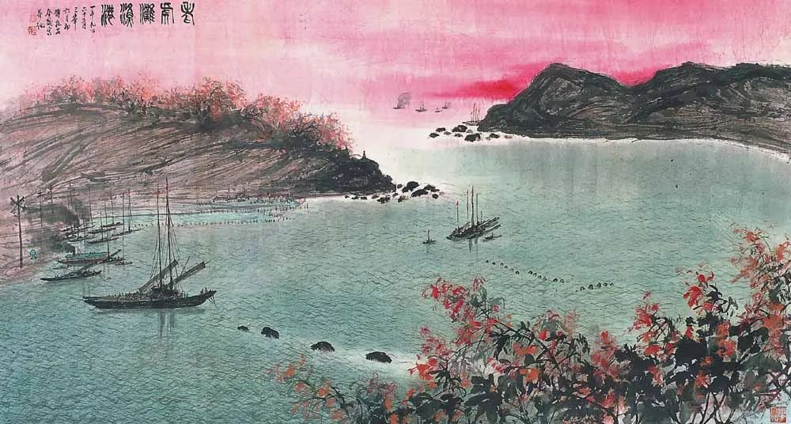

傅抱石，老虎滩渔港

  

这几天清明假期是在老家长汀县城度过的，回去的一个目的是想看看县城现在的情况如何。与我想象的完全不同。真是所谓的现场有神灵。以为自己非常了解的地方，也没办法想当然得出结论。  

  

我的常居地厦门，防疫措施仍然很严，进入小区，还在一遍遍测体温，走在空旷的公园，也有工作人员提醒要戴好口罩。与此同时，政府又在鼓励生产与恢复消费，号召公务员带头进餐馆、逛商场。公共交通、景点在节假日与周末实行免费制度，期待人流再现。有依旧紧张的信号，也有正常生活的信号。

  

我认为，正常生活的信号重要得多。防疫的目的不就是为了正常生活吗？中国目前是世界上最安全的地区，这就是防疫的成就。最安全当然不是一点风险都没有，我们要等到没有任何风险才敢正常生活，这想法本身就不正常，风险就是生活的一部分，生活某种程度上就是走一步看一步，有远见的人可能走一步看三五步，尽量防风险，但不可能0风险。

  

县城一般情绪相对浓烈，开心时比发达城市更开心，恐慌时比发达城市更恐慌。但此次不同，一到县城，完全是正常生活的场景，商铺都在营业，车水马龙，人们神情淡定，几乎没人戴口罩。好的餐馆，已要提前数天预订。大舅子去订一家热门餐厅，热门到菜价比同行贵20%，他觉得人家包间可能不够大，服务生马上回一句：嫌小可以不来。卖方市场的得意已经回来了。大舅子心里有气，但还是得乖乖下定。当然，第一盘东坡肉上来，肥肉不散，瘦肉不柴，入口即化，就觉得这气该受，再说了，也不是我受气。

  

至于县城的工厂，有几十家马力全开生产防疫物资。

  

过于警惕的人看到这种县城生活，一定会说，大家还是得多呆在家里呀，不要聚餐呀，出门就要戴口罩呀。这些话完全正确。但我觉得，家乡人们的选择更为正确，在整个防疫期间连一例疑似病例都没有的地方，选择正常生活是更理性的、更经济的、更迫切的。这是中国防疫提供的健康基础。但健康并不是最终追求，一个身体健康的人，他如果没信心，不生产，他的生活也就失去意义。一个群体如此，那更糟糕，意味着经济崩溃，社会倒退。

  

不过，信心比较难建立，经过灾难的人，精神的创伤总是需要一点时间愈合。所以，看到生机勃勃恢复正常的县城生活，我还是挺开心的，这既是防疫的成就，也是拼经济的基础。

  

经济才是最终的决定因素。这点特朗普非常清楚，在中国人看来，他最近的言行像个疯子，防疫漏洞百出不说，他的重心反而放在鼓励人们工作，甚至要求各大体育联赛恢复，根本就是草菅人命。但这是精算过的，经济垮台，失业率飙升，寅吃卯粮的美国人迅速破产，他的连任就没了。增加大家感染风险，额外死一些人，比起总统宝座，又算得了什么，再说了，这么做支持率还上升，何乐而不为？只要能够继续当总统，死再多人，他也可以自吹自擂，把锅甩给中国是必然选项，疫情之后的缠斗，还长着呢。

  

在拼经济这战中，因为控制住了疫情，中国有宝贵的时间窗口，个人、家庭与企业已有机会回血，如果因为过于胆怯，以至于丧失信心，不事生产，放弃了经济，那是浪费机会，也是不负责任。

  

推荐：[赢了道理，输了爱人，那并不是爱](http://mp.weixin.qq.com/s?__biz=MjM5NDU0Mjk2MQ==&mid=2651634268&idx=1&sn=512a8932b13e316a06b33f9a64cdb5e1&chksm=bd7e3e428a09b75413205912ce967e49445acf7ccf5049c9921f0770af943f372620953ada7a&scene=21#wechat_redirect)  

上文：[把人生用在正当的地方](http://mp.weixin.qq.com/s?__biz=MjM5NDU0Mjk2MQ==&mid=2651638114&idx=1&sn=38b6077b8ea06439a461947115684c9f&chksm=bd7e4d7c8a09c46af366247e00417a67dacb3fcf3291bb18f8ab32681a17fab86cfb849fc847&scene=21#wechat_redirect)
