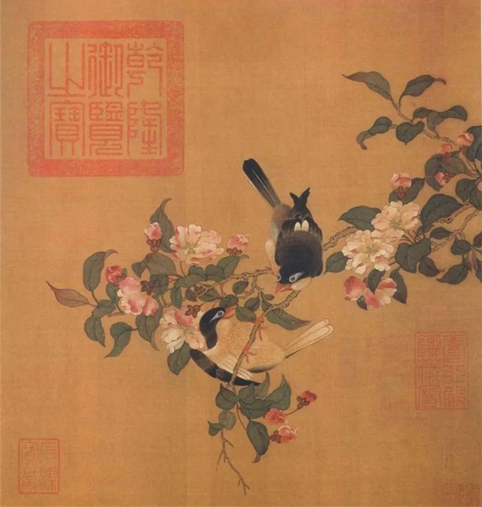
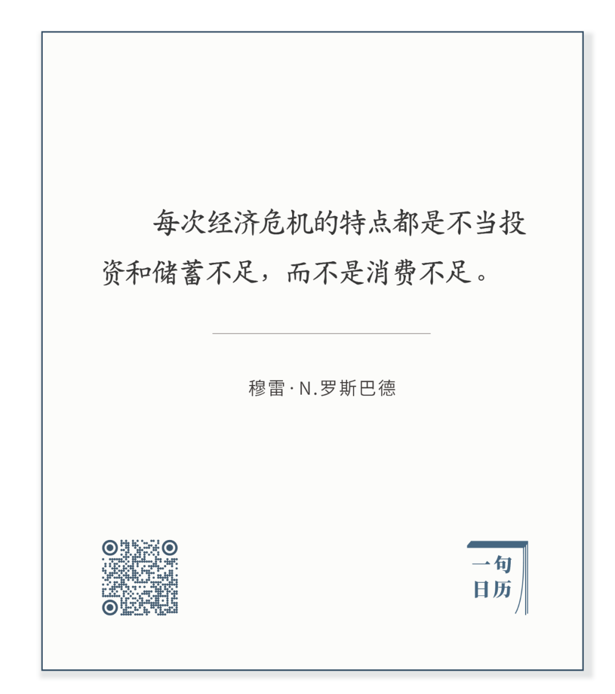

  

徐崇嗣《春鸣图》

  

大国之间，尤其是中美，不会有传统意义上的战争，开枪放炮，拼尽最后一丝资源。那很愚蠢，正如罗素先生所说，战争不是决定谁正确，而是决定谁剩下。  

  

战争是调动一国（方）所有资源以供损耗，拼命长。从这个角度来看，新冠病毒防疫，就是一场变形的战争。

  

有些聪明人已经意识到了，比如基辛格，早在4月3日，他就发表文章称“新冠病毒大流行将永远改变世界秩序”，文中更以战争为喻：“新冠肺炎全球大流行的超现实气氛，让我想起了在第二次世界大战突出部战役期间，我作为第84步兵师一名年轻人的感受。”

  

基辛格只是温和描述，超然地得出自己的判断。其他许多西方精英极力给中国找不痛快，甚至为以后所谓的赔偿进行铺垫，那是他们也意识到，这是一场战争，持续杀伤对方是第一位的。从各为其主的角度来看，不得不佩服他们在关键时候的警觉与执着，关起门吵吵囔囔，打开门一致对外。

  

不过，这都是口水仗，只要中国人不普遍自我矮化，不认不该认的罪，他骂他的，你做你的，能有什么损失？

  

疫情可能还要延续不短的时间，有人以为中国不妙，我觉得是看错了方向。在这种消耗战中，中国并不会输。

  

一是自我矮化的人变少了。比如原来中国有一大批人，坚定相信欧美医疗免费，无论写多少经历和经济学论文，从感性到理性证明那不可能，他们还是坚信，并且咒骂中国医生收入太高，中国医疗太贵。现在他们知道了，欧美的医疗在防疫时，可以毫不犹豫地牺牲掉老人与穷人，没什么免费这回事。又比如一大批中国精英，坚信欧美的民主制度是人类制度的终结，是最好的，现在可以看到，党争可以完全无视防疫的科学性，用人命来捞自己的选票，还有思考能力的人，多少会有所怀疑与反思吧？

  

如果说上面的理由还太形而上，那么，多数中国人形而下的生活方式可能是消耗战中胜出的决定性因素。

  

中国人现在的家庭形态，事实上已经多元，从单身、丁克、同性、到小家庭大家庭，但形态上如何变化，底层逻辑却基本没变：把财务安全看得很重要，勤奋工作，量入为出，爱储蓄，会投资，负责任。这种生活方式在经济繁荣期没什么优势，潮水高涨，涨到胸口，大家都上浮，看不出谁没穿裤子。

  

但是萧条一来，中国人朴实的、有耐力的、未雨绸缪的生活方式，就不怕消耗战。这种生活方式，本来不是中国特有的，美国人也是靠这种生活方式发家的，但是发到世界第一以后，在强大的感觉和福利的幻觉中，他们慢慢忘了这点，变得不再储蓄，依赖福利，寅吃卯粮。手停口停，怎么经得起消耗？

  

你手里有钱，你就不会有危机。个人如此，家庭如此，国家更是如此。正如下面这位美国大哲所说：

长按二维码可关注  

  

经历这次危机，打这场特殊的战争，其实有好处，它让我们更珍惜自己的生活方式，深刻理解几条天理的生命力：自尊自立，勤奋工作，认真负责，多多赚钱。它们的重要性，不输给高科技，不输给航母核弹，是最具有决定性的因素。只要中国人世世代代不背弃这种生活方式，就不会输掉任何危机和战争。  

  

推荐：[尤其今年，从个人到国家，生产力竞争才是一切](http://mp.weixin.qq.com/s?__biz=MjM5NDU0Mjk2MQ==&mid=2651638016&idx=1&sn=f5ac1f43613091895b4f8e3eec79bd60&chksm=bd7e4d1e8a09c408fd7393a4a04e9a24ede85274381eb10ebf3286c8b78c96213a633646510a&scene=21#wechat_redirect)  

上文：[萧条与应对](http://mp.weixin.qq.com/s?__biz=MjM5NDU0Mjk2MQ==&mid=2651638251&idx=1&sn=79e10681f3bf65908d21afaa30ddd178&chksm=bd7e4df58a09c4e3823f4e9d05809d56b1b4e4c56a15c96544fd2677b8f24f7881e0be47b7bc&scene=21#wechat_redirect)
