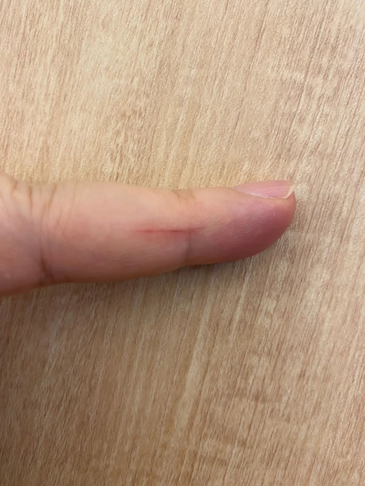

  

  

上图是我的一根手指，上面有一道细细的血痕，它拜一张纸所赐，纸刀之力。  

  

你可能也有同样的经历，突然发现手指的血痕，没有严重到渗出一滴血，却是肉眼可见的划痕，开始不知它从何而来，细细思量，发现它是某一张纸的袭击，在翻一页书时，角度与力度合适，柔弱的纸在那一瞬间，有了刀刃的锋利，在你皮肤上留下伤害，过了十来分钟，你才觉得轻微的疼痛。

  

书翻得越急，纸刀越可能伤你。

  

为写这篇文章，我进行了阅读急行军，将凯文·凯利的KK三部曲再过一遍，共1400页，今天凌晨3点读完，所以，这篇文章推送给你之后，我要去补个觉。

  

在推荐一本（套）书之前，我一定要再过一遍，工作量很大。不过我喜欢，感谢这压力，让我必须将自己喜欢的书再过一遍，这些好书，每读一遍，都有新的收获。

  

1952年出生的凯文·凯利是我的偶像之一，我希望自己像他一样老去，像他一样永远不老。

  

年轻时，凯文·凯利是一个疏离者，从大学辍学，在亚洲漫游8年（主要是印度，也到过中国），他认为自己是受了东方智慧启发；回美国，则骑着自行车横穿整个国家。一无所有，默默观察，从蚁群到人群，从野草到飞鸟，是一个尽量克制物欲的苦行僧，1992年，他参与创办《连线》杂志，成为网络时代的代言人，从科技边缘跳至科技中心，1994年，杰作《失控》出版，成为看到未来的预言帝，之后出版了《科技想要什么》及《必然》，构成了KK三部曲。

  

网络时代，最是喜新厌旧，当一个人听不懂年轻人说什么时，他在知识上就死了。跟得上，时间是助手；跟不上，时间是杀手。

  

凯文·凯利的独特价值，在于他不是传统的人文知识分子，这类知识分子，思考的基础，更多来自情感，从小说，散文，诗歌之中引用资料，信息之茧早早吐成，然后不停固化与美化，自我感觉良好，却非常容易过时，不过，在他们看来，不是自己落后于时代，而是时代的后退。这说不上错，只是智力的死亡早于肉体的死亡，慧命短于肉命。

  

而凯文·凯利，我称之为科技人文知识分子，人文的一块他有，他的书，有些优美如诗，大地与星空，野火与四季，他有唐朝诗人一样的敏感。但人不能停在唐朝，那就否认了进化。他的书，是进化史，是科技史，是生长的当下。科技即乐观，传统人文知识分子担心的失控，正是科技人文知识分子赞美的力量，传统人文知识分子恐惧的科技，正是科技人文知识分子渴望的养料。

  

凯文·凯利代表知识分子的进化，他像那些看透事物本质的知识分子一样，不死。正如柏拉图亚里士多德不死，正如释迦牟尼不死，正如老子孔子不死。一切求知的人都应如此，知识不是停止，知识是加速的进化，这也是生命的本质。一个人知道这点，以天地万物，以最新知识为养料，日日进化，慧命不会短于肉命，慧命或可长于肉命。

  

今天是第124期“下周很重要”，写下你的进化目标。

   

推荐：[培养偷看一眼未来的能力](http://mp.weixin.qq.com/s?__biz=MjM5NDU0Mjk2MQ==&mid=2651638068&idx=2&sn=f31972ec1e450824b51cc2f007428d9b&chksm=bd7e4d2a8a09c43cfea4f2d19b178a144e0588cee1926fc23531fe76c4e586bc7d4474f163ab&scene=21#wechat_redirect)  

上文：[怕什么，跟着走](http://mp.weixin.qq.com/s?__biz=MjM5NDU0Mjk2MQ==&mid=2651638402&idx=1&sn=f1e649d14208dafc260a566d70129c05&chksm=bd7e4e9c8a09c78a121595b304fe9379ac19e0f7baece36e4c95ad2bf68961f9653bf9db4c02&scene=21#wechat_redirect)
