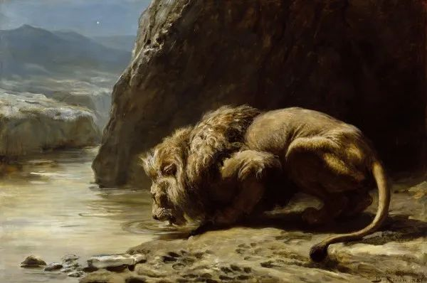

  

Briton Riviere，The King Drinks

  

人不应该主动去制造危机，但是危机既然已经发生，我们反而可以抽离出来，观察自己与他人的反应，这可以告诉我们一些最本质的答案，让我们知道人生中不可或缺的因素是什么。正如丘吉尔所说的，永远不要浪费一次好危机。  

  

新冠肺炎危机发生时，人们普遍的反应不过是这几件“小事”：自己的家人不要得病；财务撑得住；工作保得住。还有一件大事：希望自己所在的国家及全世界迅速战胜疫情，恢复常态。

  

这个小事和大事，就藏着人一生的幸福密码，把它破解一下，就知道幸福是容易的。它只是一些常识，只要你维护住，幸福就必然发生。幸福并不需要特别聪明地解决难题。

  

第一是身体健康。现代人最大的健康隐患是肥胖及缺乏锻炼，你把BMI控制在健康范畴，每天保持一定的运动量（散散步即可），这点就解决了。这需要饮食上的克制和适量的饥饿。

  

第二是财务健康。这不需要很厉害的投资技巧，现代金融的快捷，按一个确认可以转走所有财产，它反而需要避开“厉害投资术”的诱惑，上一次大当就得破产，财务经不起这样的清零重来。

  

所以，不管经济起起伏伏，最适合普通人的财务健康就是去供一套房子，无论在哪里，努努力，都买得起房子的，不过是大小的差别。这样把你的钱锁住，也省得你胡思乱想，以为自己很厉害，把钱败光。真厉害的人，怎么可能连自己的房子都没有？先从一套房子证明自己。

  

能量大，供房耽误不了你。能量小，一辈子只能供套房，那也可以保证你有相对高的生活水准，有房子住了，其他花费并不贵。下班回到家里，炒几个菜，喝一杯小酒，和家人聊聊天，天天睡得好。这样的生活不是很香吗？这样过一辈子，世界也没有亏欠你，在此之前，没有几代人有这样的安稳日子。自视甚高的年轻人（主要是男青年）一定要想清楚这点，从小能量开始，才能达到大能量。

  

至于工作。这个世界不缺工作的。只要不虚荣、不怕麻烦、眼里有活，你一定能够保住工作，你一定能够找到工作。

  

经济烈火烹油时，容易忽略这些常识，危机能够让这些常识回归，痛过一次，惊过一次，再忘很难，在下一次危机到来时，你就可以从容应对。可以确定的是，总会有下一只黑天鹅，只是不知何时，不知何地，它就会飞来吓大家一跳。

  

这些小常识守好，也有利于自己理解大常识，那就是我们要对这个世界抱以善意，一个人有事没事憎恨自己生长的土地，成为自恨者，你不可能发现这里的机会，你也更难得到善意的回报。你可能看过《傅雷家书》，其中最触动我的一个细节是，处境已经不好的傅雷交代傅聪，即使暂时失意与痛苦，也永远不要与自己的母邦为敌。傅聪遵守了，没有陷入仇恨。这是超越个人恩怨的大智慧，但愿每个人都有。

  

大常识有，小常识守得住，你不怕任何黑天鹅。

  

推荐：[赤子教育，永恒的教育核心](http://mp.weixin.qq.com/s?__biz=MjM5NDU0Mjk2MQ==&mid=2651634641&idx=1&sn=10833dc3e7d519c88d0391d8e9d5dcee&chksm=bd7e3fcf8a09b6d9b904514a14d95d1e66f65e7a808a2e1c00ac8e14b88bfa85351b82261e60&scene=21#wechat_redirect)  

上文：[朋友圈大分裂，我的朋友观](http://mp.weixin.qq.com/s?__biz=MjM5NDU0Mjk2MQ==&mid=2651638360&idx=1&sn=b9bf9fe01efb2f0576278b2624572d5e&chksm=bd7e4e468a09c7503ba1d1dc6b088a8be7aee2be7ffe6cae693deb5c3ea60b726e5006819ced&scene=21#wechat_redirect)
