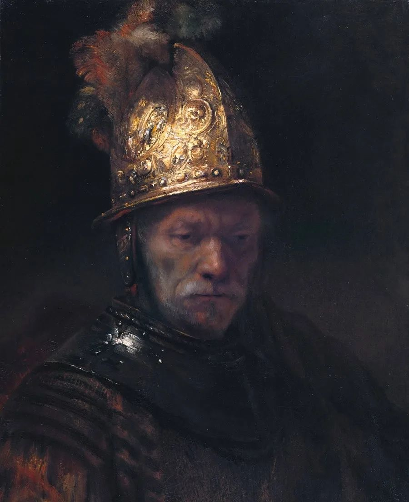
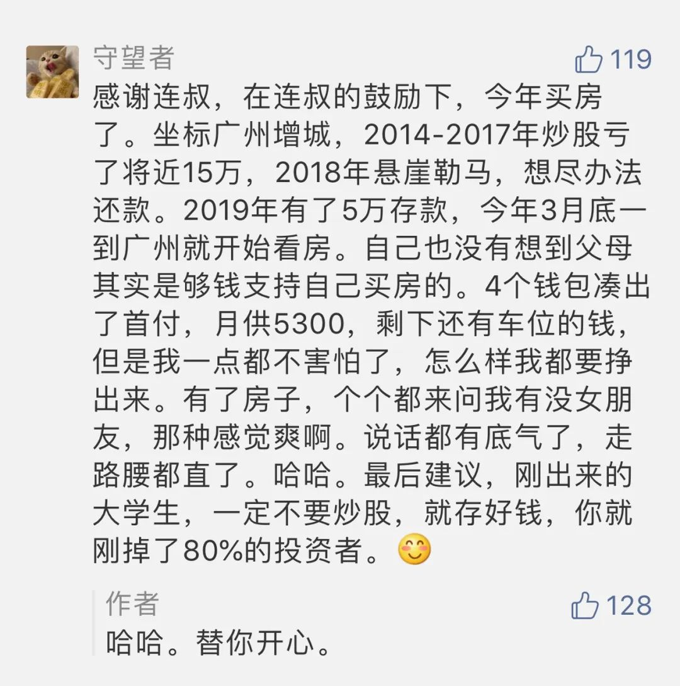

  

Rembrandt，Portrait of a Man with a Golden Helmet

  

人的一切行为都有追求的结果。春种，追求秋收。投资，追求盈利。  

  

没有耕种者追求歉收，没有投资者追求亏损。但歉收与亏损总难避免，不好的结果总会出现。这时候的聪明人就会调整自己的行为，他并不浪费一个不好的结果。而笨蛋，却会一再重复错误的行为，以期得到正确的结果。这是进化能力的区别。

  

因为有了袁隆平们的努力，现在很多一辈子执着于错的人，也活得下去。虽说世界这么宽容了，但人也没必要非得浪费粮食与一生，还是要学习根据结果改正错误的认知与行为。就像邓小平先生所说的，不管白猫黑猫，捉住老鼠就是好猫。你原来讨厌黑猫（某人，某行为，某观念，某制度），但它捉住了老鼠，结果是好的，你就要改变态度，承认它是好猫，不再讨厌它。只有这样，我们的行为才会不停朝着理性进化，避免教条主义，成为坏行为的奴隶。

  

治大国与烹小鲜，道理是一样的。我们处理好自己的小生活，也不容易，也要有行为趋向理性的调整能力，能够尊重结果。就像这位朋友做的：

  

  

有这调整能力，犯错不可怕。你很快找得到正确的方法。然后不停重复正确的方法，直到结果提醒你需要调整。如此循环上升，一只猫捉老鼠越来越厉害。

  

有房子在婚恋市场就受欢迎，这似乎很俗气，它却是好俗气。无论你是男青年还是女青年，有房子，就像嘴里叼着老鼠的猫，人家马上知道，你更可能家境好，能力强，做事靠谱。

  

有些方法与标准，我们年轻时可能觉得土鳖，但它总是有用，一直捉得到老鼠，反而应该发现它的价值，它也是进化筛选出来，往往能够让我们调整的效率更高。比如很多年轻人不爱的相亲，很残酷，很势利，纯拼硬件，不玩虚的。其实我觉得应该去体验，它的价值就在于残酷而势利，马上让你知道短板又不浪费时间，没房子被嫌弃？那证明你需要你一套房子，多好的铁拳教育，一拳就打醒。即使不去相亲，知道从古至今，大家都爱财产，爱房子，爱好生活，顺应这个好俗气标准，人生也能少走很多弯路。别人不会因为你会胡扯，能狡辩，就给你钱，你一定是创造了价值才有钱，当你守不住价值，钱也会离你而去。

  

富是最俗气的标准，但它并不可怕，富而不骄，富而好礼，就从大俗走到大雅。有富这个大俗，大雅更容易生存。小至个人，大到国家，求富裕，是最不容易犯错误的道路，只要捉住老鼠，别人迟早得承认你是只好猫。越早知道这点越好。

  

推荐：[邓小平何以成为邓小平](http://mp.weixin.qq.com/s?__biz=MjM5NDU0Mjk2MQ==&mid=2651638360&idx=2&sn=718afca27076978620d55c68644de5a7&chksm=bd7e4e468a09c7500e5eacda834fc1a4410a25a027a95ff74181a526d2e77d1ebe7e2708df1e&scene=21#wechat_redirect)  

上文：[一切发财梦都应有罪推断](http://mp.weixin.qq.com/s?__biz=MjM5NDU0Mjk2MQ==&mid=2651638636&idx=1&sn=350203b0233d03db58184df6de6c4cdd&chksm=bd7e4f728a09c664388cf63b92f17e8a3eb792710e9d46290f0bba45647f031e34378b1bdea2&scene=21#wechat_redirect)
