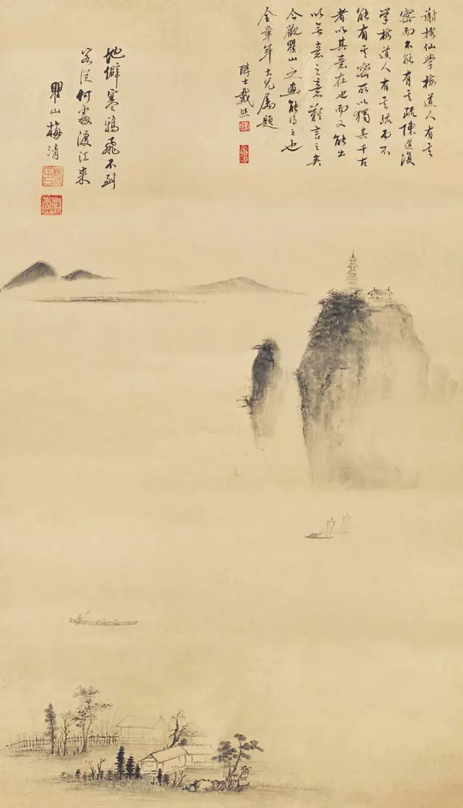
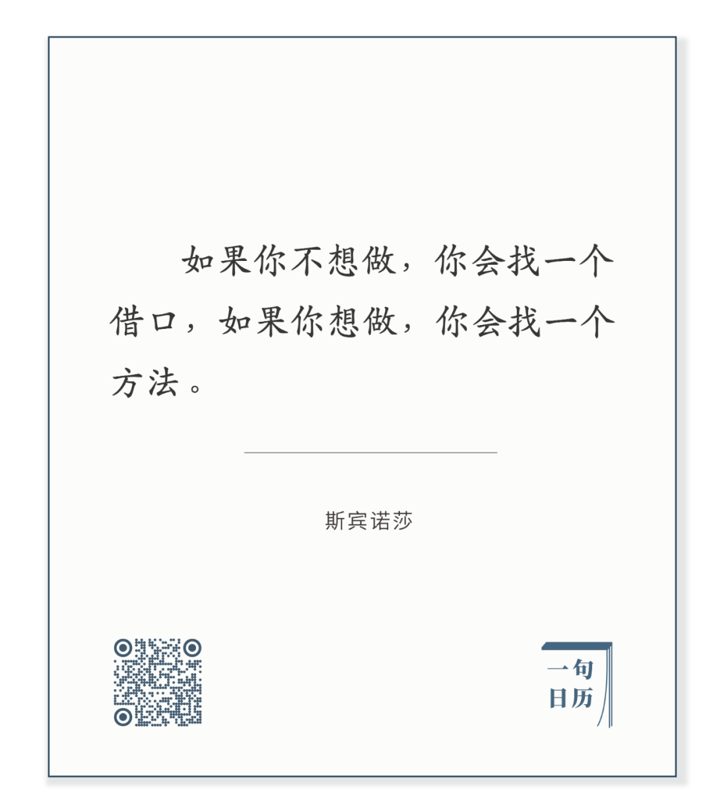
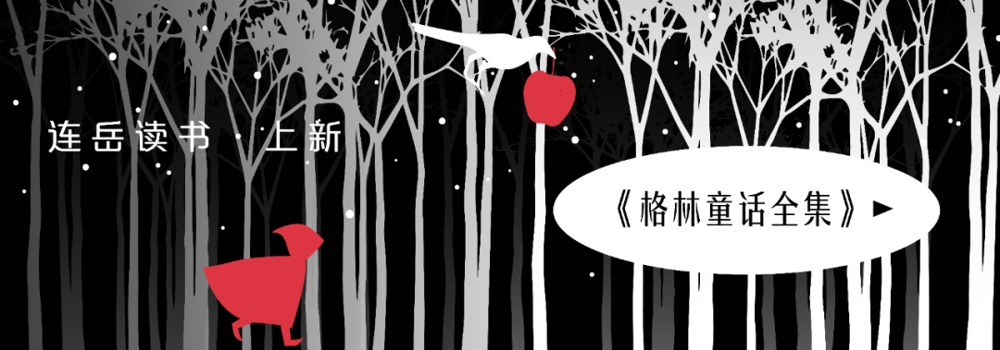

梅清，客从何处渡江来

  

昨天深夜，有读者朋友突然失控暴食后来留言，表达的内容你猜得到，无非是对自己失望、懊悔、以及暗示进一步自暴自弃。  

  

这种经验我有。富足时空里的人都有。但这种经验是新的，就像用电与用手机的经验是新的。在漫长的进化史中，营养稀缺，暴食必然产生快乐与满足。事实上， 人之所以暴食就是回忆远古的进化乐趣。但是现代的理性马上抑制了原始的乐趣，这将产生过多的脂肪，于健康不利，也不符合现代审美标准。

  

这是现代人的美食悖论：我们听从本能的快乐招唤，最后得到理性的挫败。这个悖论如此普遍，如此折磨人，他一定有个解决办法。这是人的知识来源之一：我是我的资源，我是我的学生，我对我提出难题，我解答了我的难题。

  

正如斯宾诺莎所说：

长按二维码可关注

  

让我们逃避的难题后面，都有个解决办法。我现在一点也不怕美美地吃一顿，事实上，今天是周末，晚上就要和好朋友吃饭。

  

面对美食，我现在一定是放松的、尽情地当好老饕。因为我找到了解决现代人美食悖论的方法。那就是复原祖先的饮食情境：他们饱食后的下一顿、第二天、甚至第三天，往往没有足够食物，只能饿肚子。我们饱食后就饿一顿，或者饿一天，摄入的营养全部消耗掉，生理与心理都不再有负担。

  

能饿，是大本事，是释迦牟尼才有的本事。黑塞的杰作[《悉达多》](http://mp.weixin.qq.com/s?__biz=MjM5NDU0Mjk2MQ==&mid=2651637134&idx=1&sn=cd4edab7c20a41963fb5c0b826f163df&chksm=bd7e41908a09c8865a83a211307257674c70a7d8f36974bafc7bb076582ce1821e64395fedcb&scene=21#wechat_redirect)里，有人问悉达多：你有什么本事？悉达多说我能斋戒。那人说：这有什么用？悉达多说：有大作用，饿的时候我不会慌张。我们美食之后用饿消解，是悉达多方法2.0，吃的时候我不会慌张。

  

能饿，则偶尔失控暴食时不再有失望、懊悔及自暴自弃，你更容易生出这个决心：下一顿、下两顿不吃就是了。因为吃得饱，你更容易习得饿的技能。你得到了双倍的快乐：美食的和斋戒的。烦恼化为菩提。

  

今天是第125期“下周很重要”，不如像悉达多一样，把饿一次列入计划。

  

  

  

推荐：[像他一样变老，像他一样不老](http://mp.weixin.qq.com/s?__biz=MjM5NDU0Mjk2MQ==&mid=2651638426&idx=1&sn=56accf3bf266bd36d5d3595f1347015e&chksm=bd7e4e848a09c7927703d5ce27f8f3c6ad3b78858baa2404606b18e8abf16474c254f466b647&scene=21#wechat_redirect)  

上文：[生孩子是不是赌博？去掉赌性长智慧](http://mp.weixin.qq.com/s?__biz=MjM5NDU0Mjk2MQ==&mid=2651638553&idx=1&sn=097debd05ecb0133c7331c052981cada&chksm=bd7e4f078a09c611e02644bb429cef7ba32454b3dd2bb11cafd0074b62134e6a20e9ec1893e4&scene=21#wechat_redirect)
