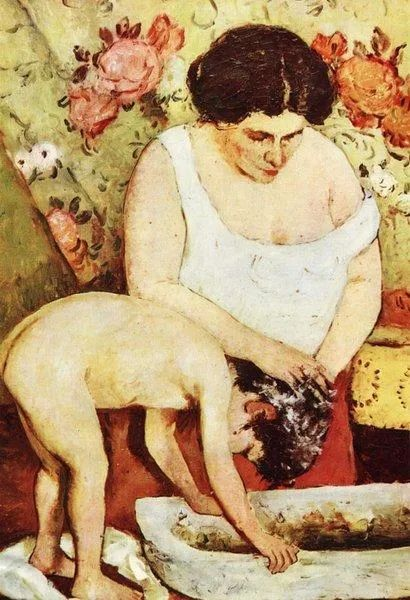

  

Stefan Luchian，Hair Washing

  

有两个读者朋友提到的故事，值得讨论一下：  

  

“堂叔的独子20出头，前年折腾帮人信用卡套现欠下网贷10万，没敢告诉父母。本想自己打工还，一年后发现打工仅够维持自己开销，进而想境外务工还。被债务人催债，自缢在和他人相约去境外的异乡宾馆里。从此，堂叔堂婶日日开着小货车走街串巷卖小玩意儿，一刻不敢在家多待。亲戚朋友劝说趁着身体还好，领养一个女娃，老了好歹有人照应。答自己生的孩子都养不好，不敢了。”

  

看这种事不是让你害怕，它终究是小概率事件，总的来说，人的求生意志总是强的。只是我们要明白，人在成长过程中，总会碰上几个坎，要有几次深夜痛哭。为这种事做好准备，小概率事件就会更小，甚至不可能发生。毕竟，人是观念的产物，有了正确的观念，正确的行动随之产生。有了正确的防疫观念，人们就会戴口罩，勤洗手。

  

面对成长可能出现的风险，预先植入好观念就很重要。像下面这位读者朋友提到的“学会求助”：

  

“去年的3月，公司有个小姑娘忽然自杀（工作上她很有些才华），身边的亲朋好友都陷入震惊中，事后我们才得知，当时的她深陷网贷（可能是高利贷），她是独生女，平时家里对她基本百依百顺，但她却选择对谁都没有说，直到自己无法应对.......至今，无论是她父母还是她最亲密的好友仍然对她当时“为什么不告诉我这件事”无法释怀。她走后，家里还是帮她清还了所有的欠款，但人已经没了，本来再过2个月，她就满24岁了。孩子，你的路还长，‘学会求助’也是一门必修课，在今后的人生中，你还会遇到各种各样的困难或挫折（如失恋、失业.....），不要在乎面子，一定要学会向身边的人求助，为挣扎出泥潭做各种努力。但记得，等你终于‘重获新生’，回报这些帮助过你的人。”

  

把事情倒回来想，具有“可求助性”就是好家长的重要特征（也是一切重要人物的重要特征），成为这样的家长，孩子向你求助的意愿就高，他的安全性将提升。

  

四点建议：  

  

一、父母根据性格，做好分工。既防止溺爱，也避免冷酷。一个稍微偏红脸，一个稍微偏白脸。一个人若严厉，一个人就更多抚慰。当然，是同一原则的不同表述，而不是互相拆台。常有父母，孩子的问题没解决，他们自己先当场吵成一团，传递的信号暴烈且矛盾，孩子徒增烦恼，也就不再求助。有意识、有默契做好这分工的父母，并不多，有这分工合作的预案，就领先不少。

  

二、不要无休止地抱怨与批评世界。每天都有错误的人、错误的事，只盯着它们，99%以上美好的人事就忽略了。你或说，我批评得很对，我的道理对，我的逻辑对。如果你这么厉害，那就更危险了，在孩子的眼里，一点错都会揪出来上纲上线，他怎么敢因为自己犯的“巨大错误”向你求助？人难免抱怨与批评，但要符合比例原则，你的放松、欣赏与温柔要占99%以上，这样才能变成一个乐观的人，这样你的孩子才能乐观，乐观的本质就是认为办法总比困难多。

  

三、认真生活，世俗的成功值得你追求。尽自己能力，得到更多尊敬、更高地位和更富足生活。总有些文化或有些人，会攻击与否定这点，为你的无所作为提供理论与情绪支持，不要上当，到你一无所有时，他们的嘲笑声最大。世俗的成功是一个人能量的体现，这能量可以帮助他人，尤其是你的孩子，你的能量越大，他越愿意向你求助。父母退缩与边缘化，孩子变坚强的难度更大。就是四大皆空当和尚，也要发愿当大和尚，释迦牟尼放弃一切，但没有放弃修行。

  

四、给孩子找到备用求助者。这就像诸葛亮事先给三个锦囊，关键时候拆开就有指示。孩子如果需要迂回求助，他知道去找谁，或是家里的长辈，或是父母的某位密友，这种信任关系，在成长过程中，父母要有足够的暗示与明示，相关者建立默契。迂回求助，可化解尴尬，可过滤焦虑，是很好的缓冲。从这个角度看，父母的朋友圈质量高，孩子就更安全。都是些狐朋狗友，去哪里找备用求助者？

  

孩子可能有危险，所以我更强大；孩子可能要求助，所以我有“可求助性”，这是典型的共同成长，共同进化。珍惜这个风险提示，它并不是吓你，而你提升你。

  

推荐：[阅读为什么是最聪明的选择？](http://mp.weixin.qq.com/s?__biz=MjM5NDU0Mjk2MQ==&mid=2651633284&idx=1&sn=09765045a716d2f66d9220d49abd26e1&chksm=bd7e329a8a09bb8cd9cf76c6826d7738047c9e0b94ade1f54ea519bac602088564b34533487d&scene=21#wechat_redirect)  

上文：[一切人生行为的定价中，什么最贵？](http://mp.weixin.qq.com/s?__biz=MjM5NDU0Mjk2MQ==&mid=2651638598&idx=1&sn=5030908490e02d3e0aa1c2ae5cd12c09&chksm=bd7e4f588a09c64e281d8c9a72f8faf3e561ae3b19f31db5c2d5cc6bf91bd31d38ba464edc9f&scene=21#wechat_redirect)
